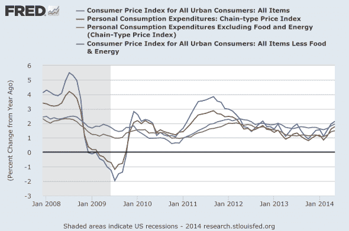
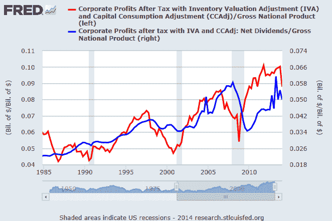

<!--yml
category: 未分类
date: 2024-05-18 03:37:34
-->

# Humble Student of the Markets: "Ending in tears" doesn't mean the market goes down right away

> 来源：[https://humblestudentofthemarkets.blogspot.com/2014/06/ending-in-tears-doesnt-mean-market-goes.html#0001-01-01](https://humblestudentofthemarkets.blogspot.com/2014/06/ending-in-tears-doesnt-mean-market-goes.html#0001-01-01)

This is the second part of a two-part post. In part 1, I outlined the risks to the equity market (see

[This will end in tears, but when?](http://humblestudentofthemarkets.blogspot.com/2014/06/this-will-end-in-tears-but-when.html)

). The markets are getting frothy. The combination of too much complacency, which leads to excessive risk appetite, and diminishing margins of safety will magnify the downside effect of any negative catalysts. However, the existence of such a high risk environment doesn't mean that stock prices go down right away.

In part two, I examine the likely bearish triggers for risky assets such as stocks. In summary, there are four broad categories of risks to the US equity market:

*   Geopolitics
*   US politics
*   Inflation scare
*   Earnings growth scare

Stripped to the basics, stock prices respond to either changes in earnings multiples (P/E ratio) or changes in earnings growth expectations (the E in the P/E ratio). The metric for each of these risks is whether there are any possible developments that could be equity unfriendly, i.e. will the development either affect P/E or E?

**Geopolitical risks: Well contained**

There are three main sources of geopolitical risks that the market is focused on right now:

*   Middle East
*   Russia/Ukraine
*   South China Sea

Despite this geopolitical risk, investors have to ask themselves, what does any of this have to do with the market? Will it affect oil production in the region? No - ISIS has shown itself to be disciplined and interested in cash flow to fund itself so investors can count on little or no interruption in oil production. While the market may engage in minor sell-offs from developments in the Middle East, I can`t envision much that would have a substantial effect on either the P/E ratio or E of the stock market.

The last major source of geopolitical risk comes from a possible outbreak of hostilities in the South China Sea. China has been engaged in simmering conflicts with many of its neighbors, Japan, the Philippines and Vietnam, just to name a few. Notable exceptions have been the Koreas and Taiwan, which has enjoyed warmer relations with the Mainland in the last few years.

In order to soothe any potential panic over possible Chinese military flare-ups with her neighbors,

[Bloomberg](http://www.bloomberg.com/news/2014-06-29/as-china-flexes-muscle-obama-frets-over-rival-s-weakness.html)

reported that President Obama recent stated that he would prefer to see the peaceful rise of Chinese influence in the region (emphasis added):

> “We welcome China’s peaceful rise,” Obama said in a recent NPR interview. “In many ways, ***it would be a bigger national security problem for us if China started falling apart at the seams***.”

There are worse alternatives, much worse:

> The U.S. has a great deal riding on the outcome. China is the single largest holder of U.S. debt with $1.3 trillion in Treasury securities, and Sino-U.S. trade last year topped $562 billion, up 38 percent from five years earlier. In an extreme scenario, major turmoil could spark massive refugee flows or even endanger control of China’s estimated 250 nuclear warheads, said Lieberthal, a senior fellow at the Brookings Institution.
> 
> “That’s not a future you want to contemplate,” he said.

Here is my take on the geopolitical risk in the region. The Chinese are playing the long game and they recognize that they are not in a position to actively push back against an American ally (Japan, Philippines) just yet. Vietnam, on the other hand, is a different story as it has no strong allies. Watch for more developments in the simmering China-Vietnam dispute in the near future.

In terms of market impact, what would be global growth implications of rising tensions between China and Vietnam? Would the P/E or E effect on US or global equities be any different than if Botswana and Zimbabwe went to war?

**US political risk rising**

The US midterm elections are coming up and we have seen little political impact from the pre-election rhetoric. The only discernible effect so far has been the surprising loss by Republican Eric Cantor to his Tea Party backed opponent Dave Brat. There are two likely fallouts from this development:

1.  The risks to the renewal of the Export-Import Bank charter, which the new Republican House Majority Leader Kevin McCarthy has stated he will not support.
2.  Further risks of a government shutdown should Tea Party activists gain the upper hand.

The demise of the Export-Import Bank would be negative for capital goods companies such as GE, Caterpillar and Boeing, but the downside from such a development would be limited to companies in the sector. It would be difficult to see more than a 3-5% hiccup in the major market averages to the elimination of the Ex-Im Bank.

Market bulls should be consoled by the fact that gains by Tea Party activists were halted in Mississippi as the Establishment GOP candidate Thad Cochrane defeated Tea Party challenger Chris McDaniel. Nevertheless, political analyst

[Greg Valliere](http://www.businessinsider.com/eric-cantor-loss-debt-ceiling-fight-2014-6)

believes that the Cantor defeat spells the death of immigration reform and a tough fight on the debt ceiling next spring.

Next spring? That's a problem for after the election and next year! The immediate market impact is likely to minimal.

Unless we see more unexpected US political developments, I see no signs of a major bearish trigger from this quarter.

**Rising inflation = Rising interest rates**

The third market risk comes from upward pressure on interest rates from rising inflation. If interest rates were to rise, P/E multiples are likely to contract and, everything else being equal, therefore put downward pressure on stock prices.

In short, rising inflation and inflationary expectations are a definite threat to stock prices. There is no doubt that measures of inflation are starting to rise. The question is, "How long before the Fed starts to react to rising inflationary pressures?"

Cardiff Garcia of

[FT Alphaville](http://ftalphaville.ft.com/2014/06/27/1888702/us-inflation-has-climbed-now-what/)

put the issue into perspective: With the Fed`s target of a 2% core PCE inflation rate, Garcia highlighted the following comment from the Dallas Fed:

> The Dallas Fed writes that its “rule-of-thumb forecast for headline PCE inflation over the coming 12 months is just the current 12-month trimmed mean rate. We thus expect headline PCE inflation to average 1.7 percent over the next 12 months, little different from its current 12-month rate”.

In other words, don`t expect policy makers to get overly excited about getting near the 2% target. What about the dangers of overshooting the inflation target? More here from Garcia:

> Greenspan averaged 2.5 per cent PCE inflation and 3.1 per cent CPI inflation throughout his entire tenure. And that’s on the low side of post-war Fed chairs. Volcker allowed it to fluctuate between 2 and 4 per cent even after he had famously pounded it into submission from the terrifying levels of the 1970s and early 1980s.
> 
> More recently, both core and headline PCE have been below 2 per cent since the middle of 2012.

In other words, don`t worry so much about rising interest rates.

Jeff Miller of

[A Dash of Insight](http://dashofinsight.com/weighing-week-ahead-fed-behind-curve/)

 recently had some very sensible words about the Fed and inflation (emphasis added):

> I have been extremely accurate in my Fed forecasts, but I am not claiming any prizes. It has not been difficult. I simply read information carefully and understand that it is a committee at work. Here are the key takeaways. You will disagree. You will hate them all. Keep reminding yourself that even if you are right and Yellen is wrong, you will lose on your investments. The Fed has the power. Figure out how to use the knowledge to your advantage.
> 
> 1.  The Fed is attempting to increase inflation. They seek 2% on the PCE index. This runs about 0.5% cooler than the CPI.
> 2.  The Fed does not measure inflation through commodity prices.
> 3.  The Fed believes that 2% is price stability. They think that traditional measures overstate inflation. They do not subscribe to ShadowStats (and neither do any of the people they respect). They also see a touch of inflation as easier to fix than deflation. They bias is toward stimulus.
> 4.  ***The Fed will tolerate as much as 2.5% inflation (on the PCE index) for a time.***
> 5.  The Fed has a dual mandate – inflation and employment. It does not protect savers or emerging markets. Learn to live with it and ignore pundits who think this is important.
> 6.  The Fed sees food and energy as noisy components of inflation – wild movements that do not relate to the dual mandate. If food prices are up because of a drought or disease in hog herds, how could this be controlled by raising interest rates? Middle East geopolitics and oil? Same question. These price changes are certainly real, but they are volatile and not relevant for policy. 
> 7.  The Fed does not shift policy based upon small monthly changes in data. Longer trends are demanded.

> ***The conclusion is that Fed policy is on a relatively stable course, but data dependent.*** The market does not like this, since the preference is for certainty.

Some time in the future, inflationary pressures will rise to a level where the Fed will feel compelled to act. That day is not likely to be in the near future. The immediate risks of P/E ratio contraction are low.

**Earnings growth scare**

I believe that the most serious risk to the bullish scenario comes from a possible growth scare.

[Mark Hulbert](http://www.marketwatch.com/story/has-the-beginning-of-the-end-of-the-bull-market-begun-2014-06-25)

recently highlighted a decline in corporate profitability that could foreshadow slowing EPS growth, which would be highly negative to US stock prices:

> Here’s the sobering data: According to the latest calculations of the U.S. Department of Commerce, corporate profits in the first quarter of this year represented 8.8% of gross domestic product. That’s the lowest level in nearly four years, and represents a big drop from the 10%-plus profitability that prevailed in the last quarter of 2013\.
> 
> Those who focus on corporate profitability have worried for some time that such a decline was imminent. That’s because, in the past, profit margins have exhibited a strong tendency to “revert to the mean,” according to James Montier, a member of the asset allocation team at Boston-based GMO. In other words, margins in the past have eventually declined whenever they rose significantly above their long-term average, and vice versa.

There has been much debated over the issue of sky high net margins. I have highlighted analysis from BoAML (via

[Business Insider](http://www.businessinsider.com/baml-profit-margins-2014-eps-2013-5)

) that high net margins are mainly the result of low tax rates and low interest costs.

There has also been insightful analysis from

[Philosophical Economics](http://philosophicaleconomics.wordpress.com/2014/05/25/profit-margins-dont-matter/)

that the profitability measure used by Hulbert, corporate after-tax profits to GDP, doesn't matter. What investors should focus on is ROE, or at least ROCE.

> As you can see, the two terms have risen to record highs together. Relative to the historical average, the Profit/GNP term is elevated by around 383 bps. But of that amount, 252 bps is already accounted for in a higher Dividend/GNP term. To achieve an equilibrium at current Profit/GNP levels, then, all that is needed is an additional net 131 bps of reduced Saving/GNP from the other sectors of the economy. That’s a relatively modest amount–a small increase in the government deficit relative to the average could easily provide for it, and almost certainly will provide for it as baby boomers age over the next few decades.
> 
> So there really isn’t any problem here. Corporations will earn whatever amount of profit they earn. If they can’t find useful targets for reinvestment, they will distribute the profit as dividends (or buybacks–which get ignored here because of the way NIPA calculates “saving”), in which case the balance of payments condition set forth in the Kalecki-Levy equation will be satisfied.

In other words, corporate profitability shouldn't matter. If they can't find useful investments, they just re-distribute the profits either as dividends or buybacks.

Here's what should worry the bulls. Both profitability (red line) and distributions (blue line) have ticked down. For the time being, Street consensus EPS growth continues to march upwards.

[Brian Gilmartin's latest weekly forward EPS analysis](http://fundamentalis.com/?p=3811)

shows "year-over-year growth rate of the forward estimate rose to 8.69% this past week, versus 8.60% last week". Consensus YoY EPS growth rate is continuing to rise, which is bullish.

EPS can continue to grow even if corporate profitability falls as long as the number of shares outstanding declines from share repurchases. Indeed, share buybacks have been growing steadily from 2009 and has reached new highs. Nevertheless, this may not be a problem as 

[Ed Yardeni](http://blog.yardeni.com/2014/06/stock-buybacks-charge-up-bull-excerpt.html)

observed that there are definite incentives for companies to buy back their own shares in the current environment (emphasis added):

> As I have often observed in the past, ***corporations have an incentive to borrow in the bond market and use the proceeds to buy back shares when their earnings yield exceeds the corporate bond yield***. That’s been the case since 2004 thanks to the Fed’s easy monetary policies under both Alan Greenspan and Ben Bernanke, and now Janet Yellen.
> 
> Buybacks are a form of financial engineering since they boost earnings per share whether a company’s fundamentals are improving or not. They’ve certainly contributed to the bull market’s great run in an economic environment that has been widely described as “subpar.”
> 
> When the next recession hits, corporate cash flow will decline and investors are likely to be less willing to buy corporate bonds. As a result, buybacks will dry up as they did during 2008, exacerbating the eventual bear market in stocks.

Here is the problem.

[Bloomberg](http://www.bloomberg.com/news/2014-06-26/buyback-plans-signal-drop-in-u-s-repurchases-chart-of-the-day.html)

reports that buyback announcements have start to decline. If profitability is falling and so are buybacks, what will drive EPS growth?

**Bullish or bearish? It depends on your time horizon**

So where does that leave me? My inner long-term investor, whose time horizon is 5-10 years and a single tick is one quarter, is very cognizant of the high risk environment for stock prices. He is more concerned today about the return

***of capital***

than return

***on capital***

.

By contrast, my inner investor (6-24 month time horizon) and inner trader (1 week-1 month time horizon) are a nervous bulls. They recognize that investors are taking on excessive risk and it will not end well one day (see 

[This will end in tears, but when?](http://humblestudentofthemarkets.blogspot.com/2014/06/this-will-end-in-tears-but-when.html)

). In addition, Macro Man highlighted the degree of frothiness in the high yield bond market with the following factoid:

> Did you know that the one year Sharpe ratio of the Iboxx US$ high yield index is roughly 8? As the chart below illustrates, the rolling 1 year Sharpe of the HY index has approached that level 3 previous times since the crisis (never having been anywhere close to it before the crisis, mind you.) On each occasion, the risk adjusted return moved swiftly lower.

On the other hand, most of the immediate risks are well contained for the time being. The greatest latent risk comes from a growth scare from the combination of declining profitability and falling share buybacks - a double whammy that could serve to blindside US equity investors. While we may be seeing early top-down sides of an EPS growth slowdown, we need to see some bottom-up evidence before taking action. I am therefore carefully watching the corporate guidance coming out of Earnings Season.

For now, the Fed and the ECB are throwing parties and there is no reason to enjoy them. Risk appetite continues to trend upwards. This chart of the high yield bond ETF compared to 3-7 year Treasuries (which I believe is a much better comparison because of the similarities in

[duration](http://en.wikipedia.org/wiki/Bond_duration)

) shows that the relative uptrend, or risk appetite, to be intact:

My vote in the

[TickerSense Blogger Sentiment Poll](http://tickersense.typepad.com/ticker_sense/2014/06/june-30th-blogger-sentiment-poll.html)

is bullish, but I am a nervous bull. I am maintaining my bullish view but be watching carefully for signs of EPS growth hiccup and diminishing global risk appetite.

*Cam Hui is a portfolio manager at [Qwest Investment Fund Management Ltd.](http://www.qwestfunds.com/) (“Qwest”). The opinions and any recommendations expressed in the blog are those of the author and do not reflect the opinions and recommendations of Qwest. Qwest reviews Mr. Hui’s blog to ensure it is connected with Mr. Hui’s obligation to deal fairly, honestly and in good faith with the blog’s readers.”

None of the information or opinions expressed in this blog constitutes a solicitation for the purchase or sale of any security or other instrument. Nothing in this blog constitutes investment advice and any recommendations that may be contained herein have not been based upon a consideration of the investment objectives, financial situation or particular needs of any specific recipient. Any purchase or sale activity in any securities or other instrument should be based upon your own analysis and conclusions. Past performance is not indicative of future results. Either Qwest or I may hold or control long or short positions in the securities or instruments mentioned.*