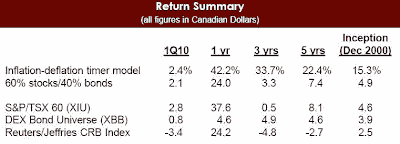

<!--yml
category: 未分类
date: 2024-05-18 00:35:23
-->

# Humble Student of the Markets: 1Q Inflation-Deflation Timer review

> 来源：[https://humblestudentofthemarkets.blogspot.com/2010/04/1q-inflation-deflation-timer-review.html#0001-01-01](https://humblestudentofthemarkets.blogspot.com/2010/04/1q-inflation-deflation-timer-review.html#0001-01-01)

The first quarter of 2010 is over and it's time for a report card on the

[Inflation-Deflation Timer model](http://www.qwestfunds.com/publications/newsletters_pdf/newsletter_november_2009.pdf)

.

The table below shows the performance of the model ending March 31, 2010\. Returns for the first quarter came in at 2.4%, which is slightly ahead of the 60% stock/40% bond benchmark. Longer term returns were more encouraging. The returns of the model were significantly ahead of benchmark for all longer period time frames of 1, 3, 5 years and from the inception date of December 31, 2000.

This model is designed to perform roughly in line with a 60/40 balanced fund benchmark during normal times, but outperform during period of market stress. I am pleased that with the latest figures which indicate that the model appears to be performing as designed.

The full review can be found

[here](http://www.qwestfunds.com/publications/trend_watch_pdf/april_1_issue.pdf)

.