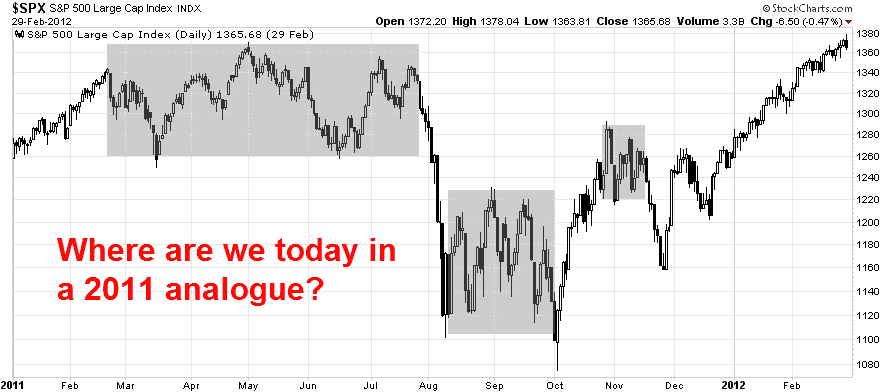

<!--yml
category: 未分类
date: 2024-05-18 03:25:23
-->

# Humble Student of the Markets: 2011 all over again?

> 来源：[https://humblestudentofthemarkets.blogspot.com/2015/02/2011-all-over-again.html#0001-01-01](https://humblestudentofthemarkets.blogspot.com/2015/02/2011-all-over-again.html#0001-01-01)

**Trend Model signal summary**

Trend Model signal: Risk-on (upgrade)

Trading model: Bullish (upgard)

The Trend Model is an asset allocation model which applies trend following principles based on the inputs of global stock and commodity price. In essence, it seeks to answer the question, "Is the trend in the global economy expansion (bullish) or contraction (bearish)?"

My inner trader uses the trading model component of the Trend Model seeks to answer the question, "Is the trend getting better (bullish) or worse (bearish)?" The history of actual (not backtested) signals of the trading model are shown by the arrows in the chart below. In addition, I have a trading account which uses the signals of the Trend Model. The last report card of that account can be found 

[here](http://humblestudentofthemarkets.blogspot.com/2015/02/trend-model-jan-2015-report-card-19-in.html)

.

**Update schedule**

: I generally update Trend Model readings on 

[my blog](http://humblestudentofthemarkets.blogspot.com/)

 on weekends and tweet any changes during the week at @humblestudent.

**A low-confidence buy signal**

On Friday, the SPX staged an upside breakout to an all-time high. A similar breakout was observable in European equities, as measured by the Euro STOXX 50\. While the SPX breakout was accomplished on diminished volume and the 5-day RSI is overbought, these warning signs are not necessarily fatal to an advance as all-time highs are generally interpreted bullishly.

These market developments have moved the Trend Model a risk-on reading and a trading buy signal. If I were to operate strictly by the book of the Trend Model`s discipline, I should be wildly bullish, but I continue to have nagging doubts about the current bullish signal for the following reasons:

*   **Macro environment:** The macro environment is highly headline driven with binary results, especially in Europe. This creates a high degree of volatility and uncertainty.
*   **Fundamentals**: Valuations are stretched and the fundamentals continue to deteriorate, as forward EPS are still declining.
*   **Technical**: I am seeing signs of negative divergences, particularly in a number of breadth indicators.

**Greece: A repeat of 2011?**

The current macro environment is somewhat reminiscent of 2011\. Then, the markets were beset by uncertainty over Greece and a political impasse in Washington. The summer of 2011 saw endless summits and emergency eurozone meetings of ministers - until the ECB came to the rescue with its LTRO program.

Today, Greece is in the headlines and we seem to be bound for endless meetings and summits yet once again. The UK is holding an election on ~~April~~ May 7, with uncertain results that could lead to an ungovernable Britain, or worse still, the specter of Brexit from the EU. In addition, the markets are nervous over the timing of the Fed`s rate hike, which could put additional strain on global markets.

As a result of the uncertainty, the markets chopped around in 2011 in trading ranges. It then either broke down or rallied upwards, depending on the headline news which were highly unpredictable and binary in nature. If 2015 is 2011, then the big question becomes, "Where are we in the 2011 analogue?"

There is little point in saying much about Greece, as the situation is highly fluid and anything can happen. We are seeing lots of screaming and shouting, abyss-like deadlines just around the corner and emergency meetings galore. While I continue to believe that the latest crisis will be resolved in a benign manner (see my previous post

[The (European) parents fight and the kids hear everything](http://humblestudentofthemarkets.blogspot.com/2015/01/the-european-parents-fight-and-kids.html)

), we need to keep in mind the following constraints that different parties operate under :

*   The new Syriza government in Athens needs to brandish its anti-austerity credentials to survive. Indeed, its popularity has risen in the polls:

*   The EU recognizes that if it were to bend too far to Greece, it would encourage anti-European parties in other member states.
*   Greece is getting little sympathy from other Club Med countries. See this [statement](http://www.reuters.com/article/2015/02/06/us-eurozone-greece-portugal-idUSKBN0LA15Q20150206) from Portugal with the tone of "we took our medicine, now take yours". The Irish have also [taken a hard line on Greece](http://t.co/WpY7pLmRcJ). The chart below shows the official exposure to Greece by country. The average exposure is 3.4% of GDP and I have highlighted the countries with exposure at 4% of GDP or more. It may be very well and fine to talk about the Germans paying for Europe, but I have highlighted, but is it realistic to ask Estonia, Malta, Slovakia and Spain to pay for Greece?

The collision of these forces will necessitate some grandstanding and brinksmanship that will undoubtedly create lots of up-and-down market volatility in the days and weeks to come. Don`t expect this European drama to end quickly.

**Will Brexit risk spook the markets?**

My greatest concern for Europe isn`t Greece, which is a sideshow, but the UK. I raised the point before (see

[2015: Bullish with scattered periods of volatility](http://humblestudentofthemarkets.blogspot.com/2014/12/2015-bullish-skies-with-scattered.html)

). The upcoming election on

~~April~~

 May 7 could create political instability in Britain and make it virtually ungovernable (via

[The Telegraph](http://www.telegraph.co.uk/finance/comment/jeremy-warner/11254181/Political-instability-is-the-big-market-nightmare-now.html)

, emphasis added):

> Yet perhaps the biggest cloud on the immediate horizon is the one implied by Mr Cameron’s warning – that of political instability. Nowhere is this more apparent than in Britain itself. Whatever your views on Britain’s Coalition government, it has, against most predictions, proved a remarkably stable political construct, which – given manifest challenges – has also achieved a commendable degree of economic stability.
> 
> This is unlikely to be the case after the general election on May 7\. Political leaders in the UK do occasionally manage to shift the dial in the last few months of campaigning, John Major in 1992 being the most recent example.
> 
> But it’s a rarity, and in any case, the old bi-polar rules of politics no longer apply. Unless something dramatic happens to change things, we can be pretty sure that the polls as they stand are roughly where they will finish.
> 
> ***This would give rise to two possible governments, neither of which would be at all appetising or would last for very long – a Conservative-led minority government with support from Ukip and Irish Unionists, or some kind of cobbled-together Left-wing coalition of Labour, SNP, Lib Dem and Greens.***

Current Tory prime minister David Cameron has vowed that, should he be re-elected, he would hold a referendum before the end of 2017 on whether the UK should remain in the EU. The latest report from the

[FT](http://www.ft.com/intl/cms/s/0/1e32aff2-af90-11e4-a418-00144feab7de.html#axzz3RZlxqRC5)

indicated that UK Conservatives look at bringing forward EU referendum to 2016 should they win the election.

While Greek GDP amounts to a rounding error as a percentage of EU GDP, France, Germany and, to a lessor extent, Britain are the heart of Europe. Should Britain leave, the fallout would be catastrophic and create political and economic shockwaves akin to the fall of the Berlin Wall. Yet, this development doesn't seem to be on the radar screen of the market - and it's unlikely to be in too many people's spreadsheets. Recently, the

[FT](http://www.ft.com/intl/cms/s/0/01082e4c-a2f8-11e4-ac1c-00144feab7de.html#axzz3RS4bWT5n)

warned "If Britain goes: Political shock likely to pull the UK apart":

> If Britain votes to leave the EU the political shock is likely to reverberate for years, throwing into question not only the UK’s place in the world but also the very survival of its own national union.
> 
> What are the political ramifications of Brexit? The first is that the referendum, which David Cameron has promised to hold by the end of 2017, will split his Conservative party — one of the world’s most successful election-winning machines.

The conclusion:

> The stakes could scarcely be higher. Britain’s general election on May 7 will be watched with particular interest in other national capitals. For Britain, Brexit could be just the start of a process that redefines the country in the 21st century.

The latest poll results from

[electionforecast.co.uk](http://www.electionforecast.co.uk/)

indicates that a majority government is unlikely and a coalition government comprising of two parties should not be the base case scenario either. The latest odds show a 37% chance that there is no possible two-party coalition, which indicates a highly fractured government:

As we approach the UK election, watch for the market to start pricing in a Brexit scenario - and that won`t be pleasant for risky assets at all.

**Market expectations vs. the Fed, who wins?**

The third major macro risk is in the US, where Fed Chair Janet Yellen will be testifying before Congress February 24-25\.

[Tim Duy](http://economistsview.typepad.com/timduy/2015/02/on-the-fed-credibility-gap.html)

summarized the issue as the market believes in a secular stagnation scenario, while the Fed doesn`t:

> The Fed's expected policy path, and any desire for an even more aggressive policy path pushed by some market participants, is at odds with a secular stagnation scenario. But it appears something similar to that scenario is price into bond markets. If the Fed is not open to such a scenario, they risk tightening too aggressively and turning an expansion that should last at least four more years into one with only two left.

Based on the signals given by Fed officials so far, a June interest rate liftoff seems to be in the cards, but market expectations are that the Fed will not raise rates until late 2015 or perhaps 2016\. Should Yellen "correct" market expectations in her Congressional testimony or if the markets get "corrected" it its perceptions when the FOMC minutes are released on Wednesday, it has the possibility to send stock and bond prices into a tailspin.

**Fundamentals still deteriorating**

Another reason for me to doubt the Trend Model`s bullish signal is the poor performance of equity fundamentals. To repeat, stock prices advance if either the E in the PE ratio rises, or the PE ratio expands.

The latest report from

[John Butters](http://www.factset.com/websitefiles/PDFs/earningsinsight/earningsinsight_2.13.15)

of Factset indicates that forward EPS estimates are still falling and the first half of 2015 is looking ugly. With 391 of the SPX having reported (and therefore Earnings Season largely over), we have seen an extraordinarily negative guidance ratio. 63 companies have issued negative guidance for Q1, compared to 11 with positive guidance. In the last week, we have seen 11 companies with negative guidance, compared to 1 with positive guidance.

EPS growth rates continue to decline. Estimated YoY Q1 2015 EPS growth rates came in -3.6% (vs. -3.1% last week) and -0.7% for Q2 2015 (vs. -0.4% last week). As the chart below shows, bottom-up derived EPS estimates for 2015 and 2016 continue to decline on a weekly basis (annotations in red are mine).

In addition, analysis from Bespoke indicated that we may be entering a period of negative seasonality from the US macro data. Historically, the Citigroup US Economic Surprise Index, which measures whether economic releases are beating or missing consensus estimates, has displayed a negative seasonal pattern every Spring. Should the macro data continue to follow this pattern, it may create headwinds for forward EPS estimates.

Against this backdrop of weak EPS expectations, Ed Yardeni also showed that stocks aren't cheap. The chart below shows that as the market advances in the face of falling EPS estimates, forward PE ratios have risen to levels not seen in the last 10 years. The Fed initiation of a tightening cycle will only add pressure for PE ratios to contract.

**Technical headwinds**

I also have some technical concerns, mainly due to a number of negative divergences exhibited by some breadth indicators. The middle panel of the chart below shows the SP 1500 advance-decline percentage, which is smoothed by a 20 day exponential moving average. The bottom panel shows the percentage of stocks in the SPX showing a buy signal on the point and figure chart. The combination of the negative divergence in these two indicators, the SP 1500 A-D and % SPX bullish, have signaled weakness in the past. The last time these indicators showed a negative divergence was (surprise!) the sideways consolidation period in early 2011.

As well, a number of short and medium term indicators from

[IndexIndicators.com](http://indexindicators.com/)

are flashing warning signs. For example, the chart below shows the % of stocks in the SPX with an RSI-5 above 70 (green line). The signal from this very short-term indicator could be interpreted in one of two ways. On one hand, the series of lower lows and lower highs are indicative that, even though the market has gone to all-time highs, this indicator is still relatively low and not overbought and therefore stocks could go higher. On the other hand, it is telling a story of a loss of momentum and negative breadth divergence, which is bearish.

The chart below of the average 14 day RSI in the SPX also tells the story of lower lows and lower highs - another negative divergence.

This chart of the stocks above the 20 dma also shows a negative divergence and loss of momentum. I could go on, but you get the idea.

In addition, while the NASDAQ and Russell 2000 also rallied to new highs on Friday, the inability of the Dow Jones Industrials and Transports to hit new highs creates concerns. It raises the issue highlighted by

[Mark Hulbert](http://www.marketwatch.com/story/the-dow-theory-is-now-flashing-a-sell-signal-2015-02-03)

of the Dow Theory sell signal, which has been flashed by two of the three Dow Theory strategists that he follows.

**Waiting for bullish confirmation**

Every day, investors and traders have to make decisions based on incomplete or contradictory data. You can create a model and stick to its discipline, but you also need to conduct periodic "sanity checks" to recognize the limitations of the model. My reservations about the Trend Model buys signal is the result of that "sanity check". This is a very tricky market that may not be conducive to the use of trend following models, which are

[all washed up](http://humblestudentofthemarkets.blogspot.com/2015/01/all-washed-up.html)

until macro trends re-emerge and re-establish themselves.

What to do?

My inner investor remains nervous, but he is sticking to his benchmark asset allocation of stocks and bonds. He is not getting more aggressive, nor is he getting more defensive.

My inner trader remains short this market. He is well aware of the concerns over the limitations of the Trend Model, but he is also cognizant of the power of the Trend. All-time highs are rarely bearish events.

Which is correct, the discipline of the Trend Model, or the "sanity checks" of the bearish influences that the model doesn't capture? I have no idea. My inner trader is therefore waiting for further confirmation of stock market strength next week. Should the market break further upwards, he will cover his shorts and reverse his position to the long side.

**Disclosure:**

Long SPXU

**Correction:**

The UK election is May 7, not April 7.