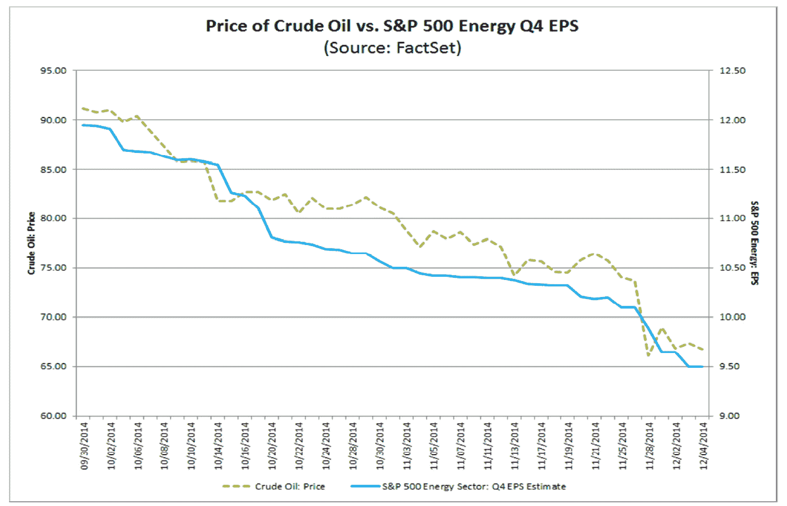

<!--yml
category: 未分类
date: 2024-05-18 03:27:42
-->

# Humble Student of the Markets: 2015: Bullish skies with scattered periods of volatility

> 来源：[https://humblestudentofthemarkets.blogspot.com/2014/12/2015-bullish-skies-with-scattered.html#0001-01-01](https://humblestudentofthemarkets.blogspot.com/2014/12/2015-bullish-skies-with-scattered.html#0001-01-01)

**Trend Model signal summary**

Trend Model signal: Risk-on

Trading model: Bullish

The Trend Model is an asset allocation model used by my inner investor. The trading component of the Trend Model keys on changes in direction in the Trend Model - and it is used by my inner trader. The actual historical (not back-tested) buy and sell signals of the trading component of the Trend Model are shown in the chart below:

**Update schedule**

: I generally update Trend Model readings on 

[my blog](http://humblestudentofthemarkets.blogspot.com/)

 on weekends and tweet any changes during the week at @humblestudent. In addition, I have been trading an account based on the signals of the Trend Model. The last report card of that account can be found 

[here](http://humblestudentofthemarkets.blogspot.com/2014/12/trend-model-report-card-30-nov-381-1.html)

.

**The equity market analytical framework**

Last week I allowed my inner trader to take the stage (see

[My trading plan for December](http://humblestudentofthemarkets.blogspot.com/2014/12/my-trading-plan-for-december.html)

) and this week my inner investor will take to the podium. However, I will have a brief trading comment in light of the stock market downdraft seen in the last week.

My inner investor's main analytical framework for US equities is:

1.  How are forward earnings evolving?
2.  What is the outlook for the US economy? What are the chances of a recession, which would induce an equity bear market?
3.  What are the risks? 

My main conclusion is that investors were spoiled in 2014 as stock prices went up more or less in a straight line, but the 2015 stock market, though appearing bullish, will see bouts of gut wrenching volatility.

**How quant models respond to shocks**

John Butters at Factset has neatly illustrated the importance of forward EPS to stock prices with this chart (annotations in red are mine). Forward EPS has tracked stock prices closely in the last 10 years and there is no reason to believe that they won't continue to do so. 

Past episodes of market weakness has been associated with stalling forward EPS growth, which is what we are seeing now. However, the downdraft is going to be temporary for a couple of reasons. First of all, we are seeing most of the negative effects of falling oil prices first. Much of the downward revisions have been attributed to falling Energy sector estimates, which has tracked the price of oil (via

[Factset](http://www.factset.com/insight/2014/12/earningsinsight_12.5.14#.VIxEorl0zPY)

):

On the other hand, the positive effects of falling oil prices have not been quantified by the Street yet. During the Asian Crisis, I can recall sitting in a meeting to assess its effects in light of what we were seeing in our quant models. One of our EM portfolio managers said that estimate revisions were not moving yet because analysts know that earnings are bad, they just have no idea how bad so they are not revising them yet. In the current instance where oil prices have cratered, the Street knows that the effects are good because of lower input prices and higher consumer spending, they just have no idea how good yet. As a consequence, EPS estimates are not rising.

The chart below from Factset (red annotations are mine) show that we are mainly seeing only the negative effects of the oil price drop, as SP 500 EPS estimates have been dragged down mainly by resource sectors (and Telecom, which has a tiny index weight), while EPS estimates for the other sectors are flat to slightly up. Expect the positive effects to start filtering through in the weeks ahead.

**The economy is not the stock market, but...**

The second question in my analytical framework is to gauge the health of the American economy. While economic growth does not correlate well with the stock prices, it does bear a major influence on the corporate earnings and revenue outlook. This chart shows how closely tied the employment picture, as measured by initial claims (inverted), to the SPX.

The US economic picture is one of steady improvement, which can be summarized by the comment from

[Bespoke](http://www.bespokeinvest.com/thinkbig/2014/11/25/q3-gdp-revised-up.html)

about the Q3 GDP report, which showed positive internals:

> Looking at the internals of the report, there were broad upward revisions to key areas that were slightly weak last quarter, including consumption, fixed investment, and inventories. We previously said that inventories were due for an upward revision after a very weak initial reading, while we expected net trade - especially imports - to be revised upwards, negatively impacting total growth. The rest of the revisions, which we did not expect, were positive: higher consumption and higher investment. As a consequence, domestic final private demand, which strips out trade, government, and inventory changes, jumped half a percent, coming in at a healthy 2.48%, while final demand registered a 4.02% increase.

While Q3 GDP was unusually high and Q4 will likely see a negative snapback, the general outlook remains positive. Indeed, we saw a clue of the positive effects of falling fuel prices when retail sales and consumer sentiment surprised to the upside last week. Indeed, the Citigroup US Economic Surprise Index is ticking up.

The combination of a steadily growing economy with falling energy prices should result in rising EPS estimates in the very near future. I therefore look for stock prices to continue their climb into 2015.

**Lower oil price boosts growth**

Falling oil prices should also be a net positive for global growth. 

[Business Insider](http://www.businessinsider.com/ubs-gdp-impact-of-10-decline-in-oil-2014-12)

 recently highlighted the UBS estimates of the effect on GDP growth.

If we were to focus on the US, UBS estimates that a $10 decline would boost US GDP growth by 0.1%. Assuming that oil prices stabilize at $70-80, the current fall from about $105 would translate into incremental GDP growth of 0.3% for the American economy.

Historically, an oil price drop caused by oversupply has generally been bullish for equities (via 

[Ambrose Evans-Pritchard](http://www.telegraph.co.uk/finance/oilprices/11260918/Oil-drop-is-big-boon-for-global-stock-markets-if-it-lasts.html)

):

> Tumbling oil prices are a bonanza for global stock markets, provided the chief cause is a surge in crude supply rather than a collapse in economic demand.
> 
> HSBC says the index of world equities rose 25pc on average over the twelve months following a 30pc drop in oil prices, comparable to the latest slide. Equities rose 19pc in real terms.

**Key risks**

Despite the bullish outlook for stock prices, no review is complete without some assessment of the risks. In 2015, there will be plenty of risks that will likely induce much higher volatility in asset prices. Here is what I am watching, in order of likelihood:

1.  What happens to interest rates?
2.  The ups and downs of European theatre
3.  The specter of British political instability
4.  Geopolitical instability in oil producing countries.

**The Fed expects higher volatility**

2015 will be the year when the Fed starts to normalize interest rates and move off ZIRP. In a must-read

[speech](http://www.newyorkfed.org/newsevents/speeches/2014/dud141201.html)

, New York Fed President William Dudley stated that not only is a mid-2015 rate liftoff more or less baked-in, the Fed will be watching if the markets freak out when short rates rise:

> When lift-off occurs, the pace of monetary policy normalization will depend, in part, on how financial market conditions react to the initial and subsequent tightening moves. If the reaction is relatively large—think of the response of financial market conditions during the so-called “taper tantrum” during the spring and summer of 2013—then this would likely prompt a slower and more cautious approach. In contrast, if the reaction were relatively small or even in the wrong direction, with financial market conditions easing—think of the response of long-term bond yields and the equity market as the asset purchase program was gradually phased out over the past year—then this would imply a more aggressive approach. The key point is this: We will pursue the monetary policy stance that best generates the set of financial market conditions most consistent with achievement of the FOMC’s dual mandate objectives. This depends both on how financial market conditions respond to the Fed’s policy actions and on how the real economy responds to the changes in financial conditions.

If the reaction is relatively gradual, then the Fed will continue its normalization policy. On the other hand, it may moderate its interest rate trajectory if volatility is too high (note he said nothing about their reversal). Keep in mind that the volatility pain threshold for the Fed is probably higher than the pain threshold of a lot of traders (emphasis added):

> Because financial market conditions affect economic activity only slowly over time, this suggests that we should look through short-term volatility and movements in financial markets. ***We should not respond until we become convinced that the movements will likely, without action on our part, prove sufficiently persistent to conflict with achievement of our objectives. Often, financial markets can be quite volatile and move a lot without disturbing underlying economic performance.***

The Fed expects higher volatility in 2015\. So should investors.

**More European theatre**

In addition to likely Fed induced volatility, investors should expect volatility from the eurozone in 2015\. In the near-term, we have the uncertainty introduced by the Greek Presidential election. If the current head of the government, Antonio Samaras, can't muster enough votes for his candidate, it will mean early parliamentary elections and the current polls show the leftist Syriza party in the lead. This is what happened when the Syriza leader Alexis Tsiprias roadshowed party policies.  (via

[FT Alphaville](http://ftalphaville.ft.com/2014/12/11/2068721/syriza-in-the-bond-market/)

):

Ever present is the ECB will-they-or-won't-they QE guessing game as the tensions between Draghi and the Bundesbank linger. I believe that the more serious problem in Europe is the lack of action by member states on reform (via the

[FT Brussels Blog](http://blogs.ft.com/brusselsblog/2014/12/10/leaked-eu-summit-conclusions-draghi-left-hanging/)

):

> The dance had become so routine that we at the Brussels Blog were thinking of giving it a name, the Eurozone Two-Step.
> 
> Ever since the eurozone crisis first rocked international markets nearly five years ago, European Central Bank chiefs – first Jean-Claude Trichet, then Mario Draghi – sent a very clear message to the currency union’s political leaders: we can only act if you act first.
> 
> The deal was never explicit, but both sides knew what was required. The ECB’s first sovereign bond purchase programme in May 2010 came only after eurozone leaders created a new €440bn bailout fund; its €1tn in cheap loans to eurozone banks in early 2012 only came after political leaders agreed to a new “fiscal compact” of tough budget rules.

Now one partner of the eurozone two-step, the eurozone governments, are stalling reform initiatives:

> Back in October at a eurozone summit, Draghi was able to get a little-noticed statement out of the assembled leaders committing them to another “Four Presidents Report”, a reference to the blueprint delivered in 2012 that set a path towards further centralisation of eurozone economic policy. The report helped kick-start the EU’s just-completed “banking union.”
> 
> Progress on that 2012 blueprint has since stalled, however, and at his last summit press conference, then-European Council president Herman Van Rompuy said the new “Four Presidents Report” would be delivered at the December EU summit, which starts next Thursday. Many in Brussels saw this as the quid for Draghi’s quo – once the leaders agreed to another blueprint for eurozone integration, Draghi would have a free hand to launch QE.
> 
> But according to a leaked draft of the communiqué for next week’s summit, Draghi may have to deliver his quo without a eurozone quid. The text (which we’ve posted here) makes clear that leaders have no intention of delivering a new blueprint any time soon.

Bottom llne:

> This means Draghi won’t have the normal political cover he needs to make a bold decision early next year – a problem only compounded by the European Commission’s decision last month to put off the day of reckoning for France and Italy over whether they will face sanctions for failing to live up to the EU’s crisis-era budget rules.

This kind of uncertainty will undoubtedly spook markets. But make no mistake, regardless of what the Greeks, Draghi, Weidmann, Merkel et al say, the major players are all wedded to the idea of a united Europe (see

[A history lesson, why Europe should try to be more Canadian](http://humblestudentofthemarkets.blogspot.com/2014/11/a-history-lesson-and-why-europe-should.html)

and

[Lest we forget, or why you don't understand Europe](http://humblestudentofthemarkets.blogspot.com/2014/08/lest-we-forget-or-why-you-dont.html)

). Even the leftist Syriza party in Greece has stated that they would like to remain in the euro.

Just remember this. Mom and Dad fight and the kids hear everything, but the parents remain committed to each other and they will find a way past the crisis. In the short-term, however, the combination of sputtering European growth, uncertainty over ECB policy and political turmoil in Greece will likely spark more market volatility in 2015.

**British political instability**

While most Europeans on the Continent are committed to a united Europe, the British do not have the belief system and the greatest political threat to the EU originates from the other side of the English Channel. One of the tail-risks that I have not seen on the market radar screen is the threat political instability in Britain. Jeremy Warner of

[The Telegraph](http://www.telegraph.co.uk/finance/comment/jeremy-warner/11254181/Political-instability-is-the-big-market-nightmare-now.html)

 warned about this risk in light of the election to be held on May 7, 2015:

> Yet perhaps the biggest cloud on the immediate horizon is the one implied by Mr Cameron’s warning – that of political instability. Nowhere is this more apparent than in Britain itself. Whatever your views on Britain’s Coalition government, it has, against most predictions, proved a remarkably stable political construct, which – given manifest challenges – has also achieved a commendable degree of economic stability.
> 
> This is unlikely to be the case after the general election on May 7\. Political leaders in the UK do occasionally manage to shift the dial in the last few months of campaigning, John Major in 1992 being the most recent example.
> 
> But it’s a rarity, and in any case, the old bi-polar rules of politics no longer apply. Unless something dramatic happens to change things, we can be pretty sure that the polls as they stand are roughly where they will finish.
> 
> This would give rise to two possible governments, neither of which would be at all appetising or would last for very long – a Conservative-led minority government with support from Ukip and Irish Unionists, or some kind of cobbled-together Left-wing coalition of Labour, SNP, Lib Dem and Greens.

[Anatole Kaletsky](http://blogs.reuters.com/anatole-kaletsky/2014/11/21/britain-may-turn-into-europes-most-politically-unpredictable-country/)

 sounded a similar warning about fringe parties dominating UK politics in the post-electoral landscape. The choices for Britain would be unpalatable and the markets would not like that outcome at all (emphasis added):

> ***Britain could become literally ungovernable after the election, with no single party or coalition of parties able to form a majority government.*** Current public opinion polls predict that neither the Conservatives nor the Labour Party will win enough seats to form a majority government — even in a coalition with Liberal Democrats.
> 
> Conservative-Liberal and Labour-Liberal majorities may both prove arithmetically impossible because of the rise of previously insignificant fringe parties. The Scottish Nationalists look able to boost their six seats in Parliament to anything between 20 and 50, largely at Labour’s expense. The United Kingdom Independence Party is threatening dozens of Conservative incumbents. Meanwhile, the Liberals are almost certain to lose about half their 56-seat representation. As a result, a ruling coalition may have to include not just two parties but three or four, including fringe nationalist groups.
> 
> ***The Scottish National Party is sure to demand another Scottish independence referendum as its price for supporting a coalition, while the UK Independent Party will likely insist on Britain’s withdrawal from the European Union.*** It is hard to imagine either Labour or Conservatives agreeing to such terms.
> 
> This means that a government may have to be formed without a majority in Parliament. While minority governments are quite common in continental Europe, the British Parliament has only once failed to produce a government majority — during a brief interlude in 1974 under Harold Wilson. It created seismic upheavals in Britain’s adversarial politics.

Political chaos would ensue:

> A multiparty coalition or minority government, even if it can be patched together in post-election haggling, will probably collapse within a year or two. Whether the next prime minister turns out to be Cameron or Labour’s Ed Miliband, he will be seen as a short-term caretaker, passing only non-controversial measures.
> 
> At some point in 2016 or 2017 at the latest, the opposition parties are almost certain to unite in a vote of no confidence on some major issue — bringing down the government. This would force a new election in spite of the theoretical requirement that Parliament should serve a fixed five-year term.
> 
> The near-certainty that whatever government emerges in May will fall within a year or so, raises the third and most troubling business issue. ***A snap election in 2016 or 2017 is most likely to produce an overtly euro-sceptic government, committed to taking Britain out of the European Union.***

At worst, the specter of a Brexit vote would loom over Europe. At best, Westminster politics would become Italian. The markets wouldn`t like that kind of political roller-coaster ride at all.

**Geopolitical instability from low oil prices**

While the first three risks that I outlined are relatively high probability events whose outcomes are uncertain, there is one major geopolitical macro tail-risk that I am watching carefully. The intent of the Saudi decision to maintain production is said to try and squeeze relatively high-cost US tight oil and gas production, but it may have the unintended consequence of missing its target and destabilizing OPEC and other EM governments, according to

[Ambrose Evans-Pritchard](https://www.blogger.com/:%20http://www.telegraph.co.uk/finance/oilprices/11263851/Saudis-risk-playing-with-fire-in-shale-price-showdown-as-crude-crashes.html)

:

> In the meantime, oil below $70 is already playing havoc with budgets across the global petro-nexus. The fiscal break-even cost is $161 for Venezuela, $160 for Yemen, $132 for Algeria, $131 for Iran, $126 for Nigeria, and $125 for Bahrain, $111 for Iraq, and $105 for Russia, and even $98 for Saudi Arabia itself, according to Citigroup.

What happens if the regime change occurs and the west has to put boots on the ground in Nigeria, Libya or Algeria? Are those kinds of scenarios in the market?

> Opec may not be worried about countries such as Nigeria, but even there a full-blown economic and political crisis could turn the north into a Jihadi stronghold under Boko Haram.
> 
> The growing Jihadi movements in the Maghreb – combining with events in Syria and Iraq – clearly pose a first-order security threat to the Saudi regime itself.
> 
> The Libyan city of Derna is already in the hands of the Salafist group Ansar al-Shariah and has pledged allegiance to Islamic State. Terrorist movements in the Egyptian Sinai have also rallied to the black and white flag of IS, prompting Egypt’s leader Abdel al-Sisi to call last week for a “general mobilisation” of all leading Arab and Western powers to defeat the spreading movement.
> 
> The new worry is Algeria as the Bouteflika regime goes into its final agonies. “They have an entrenched terrorist problem as we saw in the seizure of the Amenas gas refinery last year. These people are aligning themselves with Islamic State as part of the franchise,” said Mr Newton.
> 
> Algeria exports 1.5m bpd of petroleum products. Its gas exports matter more but the price of liquefied natural gas shipped to Europe is indirectly linked to oil over time.

The one key tail-risk that I have not heard discussed is Mexico, which shares a border with the United States? Already, the Mexican Peso has plunged to levels that challenge Lehman Crisis lows:

Notwithstanding what has happened in the energy market, political instability is rising in Mexico with protests that some analysts have compared to an Arab Spring (via

[Business Insider](http://www.businessinsider.com/ioan-grillo-mexicos-arab-spring-is-here-2014-12)

):

> Mexico's biggest protests in years began two months ago in response to the Sept. 26 attack on students by corrupt police and drug cartel gunmen. Demands have widened to include the resignation of President Enrique Peña Nieto. Protesters also rage against pervasive corruption, violence and disappearances suffered during years of narco bloodshed. The movement has even led to solidarity rallies in the US.
> 
> Political analysts are trying to figure out what the movement represents and where it could lead.
> 
> Some are comparing it with “Occupy” in the US and the “Indignados” (the outraged) in Spain: Fed-up Mexicans are spreading their messages using social media and have few visible leaders.

[John Ackerman](http://america.aljazeera.com/opinions/2014/11/mexico-pea-a-nietoprotestsdemocracy.html)

of the Institute for Legal Research of the National Autonomous University of Mexico warned:

> If the situation continues along the present course, Mexico may soon follow the path of Peru during the auto-coup of Alberto Fujimori in 1992 — all while the Obama administration looks on. Unless the citizens of the United States rise up in support for and solidarity with their Mexican neighbors, the country could fall prey to a new U.S.-backed dirty war against students and activists similar to the repression during the 1970s and 1980s, which took hundreds of thousands of lives in Guatemala, El Salvador, Nicaragua and Honduras. There is still time to act before North America today becomes a copy of Central America 30 to 40 years ago.

**Choppiness, but no bear market**

I don't want to be a doomster or fear-monger. While I have laid out a number of dire scenarios, you should not necessarily interpret them as bull market killers. The US economy remains in the mid-cycle phase of an expansion and such a scenario should be equity positive. The key question to ask of any risk is, ”How will this event affect the outlook for earnings, interest rates or global financial system stability?” If the answer is, ”Not very much”, then the likely outcome is some sort of corrective action in a stock market bull trend.

Even if the Fed were to miscalculate and raise interest rates either prematurely or too quickly, history tells us that the initial stock market reaction has been relatively positive (via

[A wealth of common sense](http://awealthofcommonsense.com/happens-stocks-bonds-fed-raises-rates/)

):

In short, my inner investor remains cautiously bullish on equities for 2015, though with higher levels of volatility. Choppiness and gut-wrenching corrections, yes, but don't expect a bear market to start.

**Inner trader: Too late to sell**

Finally, I have a brief trading comment. My inner trader was caught off-guard by the swiftness of the the sell-off. The Trend Model had flashed an unconfirmed trading sell signal on Tuesday and I usually wait a couple of days before acting on trend following signals as they have a habit of reversing themselves. But the short-term trading model was signaling oversold conditions consistent with a market bottom at the close Tuesday (see

[Why today (Dec 9) was like the October bottom](http://humblestudentofthemarkets.blogspot.com/2014/12/why-today-dec-9-was-like-october-bottom.html)

) and Thursday (see

[Here for a good time, not a long time](http://humblestudentofthemarkets.blogspot.com/2014/12/here-for-good-time-but-not-long-time.html)

).

As the closing bell rang on Friday, my most consistent bottom-calling models were flashing buy signals. As seen in the chart below, the combination of an inversion of the VIX term structure and TRIN greater than 2 forms a powerful buy signal that was 100% in the last two years. In addition, the VIX Index had closed above 20, which is a level that is consistent with trading bottoms.

In retrospect, my inner trader wished that he could have caught the downdraft, but by the time he received confirmation of the downtrend, it was too late to sell and it was time to buy. Nevertheless, there remains a high level of event risk next week, with the FOMC meeting and Greek election on Wednesday (see the discussion at 

[Here for a good time, not a long time](http://humblestudentofthemarkets.blogspot.com/2014/12/here-for-good-time-but-not-long-time.html)

).

My inner trader therefore remains modestly long equities at this point and nervously hoping for a rally in the early part of the week.

**Disclosure:**

Long SPXL