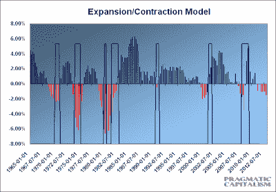

<!--yml
category: 未分类
date: 2024-05-18 04:13:54
-->

# Humble Student of the Markets: 3Q earnings a test of the recession calls

> 来源：[https://humblestudentofthemarkets.blogspot.com/2011/10/3q-earnings-test-of-recession-calls.html#0001-01-01](https://humblestudentofthemarkets.blogspot.com/2011/10/3q-earnings-test-of-recession-calls.html#0001-01-01)

In addition to the well-known

[ECRI recession call](http://businesscycle.com/reports_indexes/reportsummarydetails/1091)

, since then I have seen a number of other commentators calling for a recession. There is, of course, the permabears Nouriel Roubini's statement that

[recession is a certainty](http://www.businessinsider.com/dr-doom-roubini-says-recession-is-a-certainty-will-these-stocks-outperform-2011-10)

and Albert Edwards' pointing to

[ominous signs from the ISM data](http://pragcap.com/ism-new-orders-minus-inventories-points-to-steep-contraction)

.

More nuanced are the attempts by Cullen Roche of

[Pragmatic Capitalism](http://pragcap.com/more-unfortunate-math-behind-our-economic-plight)

to model a balance sheet recession:

> The output from this model shows a rather stunning lead time over the last 7 recessions (to my surprise, it appears that our current predicament is not quite as unique as one might originally believe – it is only far larger). The model leads every recession by several quarters with the exception of the early 90′s recession which was shallow by any metric.
> 
> The current data does not bode well for the U.S. economy. Based on this model, the U.S. economy is likely to begin officially contracting in 2012 as the balance sheet recession continues and government spending slows. The good news is that the model is not predicting a contraction that is deep like we saw in the tumultuous 70′s. The bad news is that our government does not understand that we have been in one long balance sheet recession this entire time and as private sector credit growth continues contracting (or flatlining), they will be required to offset the lack of growth via higher than normal budget deficits. You can see that the current recession was well on its way to becoming a disaster like the 70′s until Q1 2009 when the deficits exploded. The problem currently, is that the Federal budget deficit is likely to remain high in 2012, but then peel off to a level of 4.5% of GDP in 2013 (again using CBO estimates and assuming no further stimulus of any kind). That’s worrisome as I have estimated that the BSR will persist into 2013 without a surprise resurgence in private sector credit (which will be unsustainable anyhow).

Fed watcher

[Tim Duy](http://economistsview.typepad.com/timduy/2011/10/lack-of-conviction.html)

is also tilting towards a recession call:

> [T]he near-term policy picture in the US looks dismal and I am [extremely wary to dismiss the European financial crisis as something easily resolved](http://economistsview.typepad.com/timduy/2011/10/too-early-to-sound-the-all-clear.html). Moreover, while some attributed Monday's rally on Wall Street to a positive reaction to the news that China was moving to support their banks, I saw only an indication the Chinese economy is on a very weak footing. Combining these thoughts with the memory that the safe bet over the past three years has been on the weak side of the coin, I too am pushed over the edge with better than even odds of recession. And while I will be searching for clues about the Fed's intentions in the release of the FOMC meeting minutes, I suspect that if the seeds of recession are already planted, policymakers are already too far behind the curve to engineer a timely rebound.

I recognize that recent economic indicators have been coming in at weak, though non-recessionary levels. One explanation is

[Bruce Krasting](http://brucekrasting.blogspot.com/2011/10/what-happened-in-september.html)

's five-Friday hypothesis for the recent non-recessionary data points, i.e. September 2011 had five Fridays. For workers who get paid every two weeks, this meant that they got paid three times in September - which would have distorted the data. Krasting went on the point out that October 2010 had five Fridays, whereas October 2011 has four Fridays. If the "five Friday effect" was the main cause of the distortion in the economic data, then we are likely to get a negative surprise when the October figures get released.

**Is earnings disappointment on the horizon?**

If a recession is indeed looming, then equity markets will experience increasing levels of disappointment as we move through 3Q Earnings Season. Cullen Roche's latest

[update of his Expectations Ratio](http://pragcap.com/key-takeaway-from-this-earnings-season-caution)

shows a falling trend.

Here's how

[Bianco Research](http://www.ritholtz.com/blog/2011/10/bianco-crisis-correlations-tbp-conference/)

puts the problem, though they don't believe that a recession is necessarily a done deal but they put the odds of a US recession at 50% [emphasis added]:

 > If the economy goes into recession, earnings forecasts are not 10% to 12% too high. Instead they might be 20% to 40% too high. In other words, ***if the economy goes into recession, the earnings forecasts are horribly wrong.*** They might be so wrong that one can make the case that the market might be overvalued. ***We believe this is part of what is bothering the markets, the epiphany that the economy is much weaker than expected and*** ***a recession will blow a hole in earnings forecasts to the point that the market might not be cheap anymore***. 

Watch how the market reaction to the 3Q Earnings Season. That will be the ultimate test of all these calls for economic weakness.

*Cam Hui is a portfolio manager at [Qwest Investment Fund Management Ltd](http://www.qwestfunds.com/). ("Qwest"). This article is prepared by Mr. Hui as an outside business activity. As such, Qwest does not review or approve materials presented herein. The opinions and any recommendations expressed in this blog are those of the author and do not reflect the opinions or recommendations of Qwest.* *None of the information or opinions expressed in this blog constitutes a solicitation for the purchase or sale of any security or other instrument. Nothing in this article constitutes investment advice and any recommendations that may be contained herein have not been based upon a consideration of the investment objectives, financial situation or particular needs of any specific recipient. Any purchase or sale activity in any securities or other instrument should be based upon your own analysis and conclusions. Past performance is not indicative of future results. Either Qwest or Mr. Hui may hold or control long or short positions in the securities or instruments mentioned.*