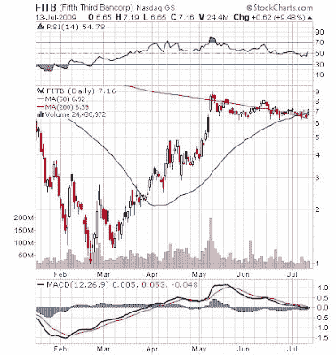

<!--yml
category: 未分类
date: 2024-05-18 00:50:25
-->

# Humble Student of the Markets: A Phoenix (mini) report card

> 来源：[https://humblestudentofthemarkets.blogspot.com/2009/07/phoenix-mini-report-card.html#0001-01-01](https://humblestudentofthemarkets.blogspot.com/2009/07/phoenix-mini-report-card.html#0001-01-01)

I have often written about the

[Phoenix effect](http://humblestudentofthemarkets.blogspot.com/2008/05/waiting-for-ride-on-phoenix.html)

. On February 24, I

[posted](http://humblestudentofthemarkets.blogspot.com/2009/02/phoenix-rising.html)

that speculators could take a punt on Phoenix because the market was so oversold:

> While I wouldn’t recommend it, speculators could try to get long a basket of Phoenix stocks for a punt. If you do, then I would suggest that you manage risk with some tight stops in place so that the trade doesn’t totally fall apart on you.

I then gave a list of names that were Phoenix candidates.

**When do you sell?**

Subsequent to that post, the S&P 500 then fell to its 666 low on March 9\. It then saw a rally, powered mainly by the “junk” stocks, or Phoenix names, that peaked in early May. The S&P 500 further rallied to a new high on June 11, but then fell through its moving average on June 22\.

What would the returns of an equal-dollar-weighted basket of those stocks have been?

The answer depends on your exit price. While there are certain conditions for putting on a Phoenix trade, there are no specific selling rules. However, looking over the performance of that basket, results have been spectacular, with stocks like Fifth Third Bancorp turning in returns north of 300%.

The most conservative estimate of this portfolio would have postulated that a trader bought the basket on February 22 and sold on June 22, the day the S&P 500 fell through its 50-day moving average. The returns would have come to 118%.

**High profit potential**

Although I didn’t personally put on the trade, I did hear from some readers who selectively bought from the list and reported some very good returns. If you had perfect foresight, here is a range of possible returns:

**Sold on June 22 (S&P 500 high):**

164%

**Sold on May 8 (Junk stock high):**

169%

**Bought on March 9 and sold May 8:**

236%

In short, a trader buying a Phoenix portfolio would have seen somewhere between a double and triple in his capital in roughly three months.

***This example illustrates the awesome power of Phoenix.*****Wait for the re-test: China can’t hold up the world**

The equity rally of the last few months has been mainly been powered by signs of stabilization, or “green shoots”. Today, the market has now priced in stabilization and will only see a significant advance if the economy recovers – a much more difficult hurdle.

Globally, much of the expectations of recovery have been based upon the perception that China is growing, driven mainly by rising commodity prices and shipping rates. Commodity prices, however, were rallying because of Chinese inventory accumulation, not consumption. With stories that Chinese inventory accumulation largely over, commodity prices have corrected and so has the

[Baltic Dry Index](http://investmenttools.com/futures/bdi_baltic_dry_index.htm)

.

I fully expect that we will hear “China is slowing” fears circulating among the trading desks in the near future. This would knock the last underpinnings of the current market rally and a decline in the equity indices. It would also mean that the USD and bond market would tactically catch a bid. The S&P 500 could well test the old lows, either made last November or last March.

That will be the time to buy Phoenix. Be patient.