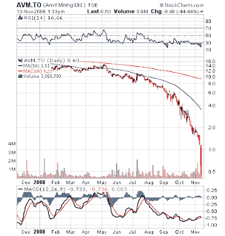

<!--yml
category: 未分类
date: 2024-05-18 01:02:50
-->

# Humble Student of the Markets: A Rorschach test for investors

> 来源：[https://humblestudentofthemarkets.blogspot.com/2008/11/rorschach-test-for-investors.html#0001-01-01](https://humblestudentofthemarkets.blogspot.com/2008/11/rorschach-test-for-investors.html#0001-01-01)

As the US equity market tests its October lows, I would concur with

[John Hussman](http://www.hussmanfunds.com/wmc/wmc081110.htm)

’s cautious bullish stance on the market:

> On the issue of valuations, I want to reiterate that while I believe that stocks are (finally) priced to deliver acceptable and even modestly attractive long-term returns, valuations are still not deeply depressed on a historical basis. Valuations ***might indeed*** move substantially lower over the course of an extended recession and “bear market.” ***I do believe that significant new lows are unlikely in this particular leg***. [Emphasis mine]

From a bottom-up perspective, stocks look cheap and they are getting cheaper. My list of stocks that are worth more dead than alive is growing daily.

Yet macro worries continue to mount.

**Would you buy this stock?** 

The case of Anvil Mining serves as a Rorschbach inkblot test for investors. Anvil is a small cap Canadian miner, listed in Toronto and also trades pink sheet. The company's principal assets consist of three copper mining operations in the Democratic Republic of Congo.

The

[latest quarterly report](http://biz.yahoo.com/cnw/081113/anvilmining_q3results.html?.v=1)

was, shall we say, less than perfect. The company went from being profitable to bleeding cash at the rate of about US$20 million in the quarter. With US$125 million cash on hand, solvency could become an issue. Not only did falling copper prices affect financial results, the company went on to state that:

> In Anvil's case, the impact of these events has been compounded by uncertainty regarding the review of mining agreements by the Government of the Democratic Republic of Congo ("DRC"), operational difficulties at the Dikulushi underground mine, delay in the commissioning of the Electric-Arc Furnace ("EAF") at Kinsevere and increases in operating costs.

Oops! The stock plunged over 40% from the previous close after the release of those results.

**A Ben Graham buy?**
On the other hand, an opportunistic value investor would examine the [financials](http://www.anvilmining.com/files/September%20Quarter%20Financial%20Statements%20_November%2013%202008_.pdf) of the company and note that with the stock under $1, it trades well under net-net working capital (current assets less all liabilities) of US$2.76 per fully diluted share.

**The investor's dilemma**
As an investor, stare into the Anvil Mining metaphorical inkblot and tell me what you would do. That is the investor dilemma in today's market.

***Disclaimer: I have no position in Anvil Mining and this is not a recommendation to either buy or sell the stock.***