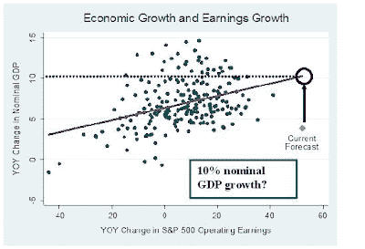

<!--yml
category: 未分类
date: 2024-05-18 00:48:29
-->

# Humble Student of the Markets: A V-shaped recovery with 4-8% GDP growth?

> 来源：[https://humblestudentofthemarkets.blogspot.com/2009/08/v-shaped-recovery-with-4-8-gdp-growth.html#0001-01-01](https://humblestudentofthemarkets.blogspot.com/2009/08/v-shaped-recovery-with-4-8-gdp-growth.html#0001-01-01)

I've written about macro headwinds for the stock market

[before](http://humblestudentofthemarkets.blogspot.com/2009/07/sanity-check-for-bulls_24.html)

. Recently David Rosenberg, former chief economist at Merrill Lynch, now chief economist at Gluskin Sheff,

[indicated that the stock market is pricing 4.25% GDP growth](https://ems.gluskinsheff.net/Articles/Lunch_with_Dave_080709.pdf)

:

> Based on past linkages between earnings trends and the pace of economic activity, believe it or not, the S&P 500 is now de facto discounting a 4¼% real GDP growth rate for the coming year. That is what we would call a V-shaped recovery.

****Raising the GDP growth stakes**

Over at Hussman Funds, William Hester wrote an article entitled

[Earnings Growth Forecasts May Require a Robust Economic Recovery](http://www.hussmanfunds.com/rsi/expectationscontext.htm)

, which may have raised the stakes on Rosenberg's analysis.

Hester analyzed the relationship between implied earnings growth and nominal GDP growth, shown in his chart below. (Note: I have annotated the chart to interpolate a nominal GDP growth of about 10% and the

***10% interpretation is strictly my own***

.) If we assume an inflation rate of around 2% and look at the interpolated nominal GDP growth of 10%, it suggests that the market is discounting real GDP growth of about 8%.

Is 4-8% real GDP growth realistic? It would be quite a V-shaped recovery.

**Deteriorating technical conditions**

Meanwhile, Barry Ritholz at The Big Picture

[wrote](http://www.ritholtz.com/blog/2009/08/rallying-on-falling-volume/)

that the market is rallying on lower volume and deteriorating breadth:

> Ron Griess of The Chart Store points to the rally continuing on decreasing volume. I would also note that breadth is softening as well.

An exuberant and over-the-top-giddy equity market derived macro outlook and deteriorating market technicals isn't exactly encouraging for bulls.

Don’t say that you weren’t warned.**