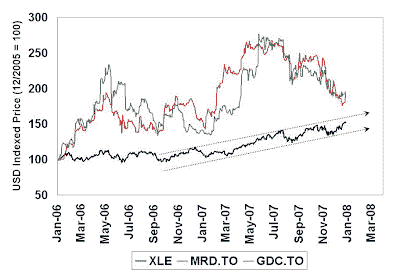

<!--yml
category: 未分类
date: 2024-05-18 01:15:03
-->

# Humble Student of the Markets: A Value Opportunity in the Oil Patch?

> 来源：[https://humblestudentofthemarkets.blogspot.com/2007/12/value-opportunity-in-oil-patch.html#0001-01-01](https://humblestudentofthemarkets.blogspot.com/2007/12/value-opportunity-in-oil-patch.html#0001-01-01)

Further to my recent post on

[energy stocks resuming a relative uptrend](http://humblestudentofthemarkets.blogspot.com/2007/12/energy-stocks-ready-for-another-upleg.html)

, conditions remain largely unchanged since that observation and there remains a healthy dose of

[skepticism](http://money.cnn.com/2007/12/28/news/companies/energy_08/index.htm?postversion=2007123104)

on energy. Oil prices and energy equities have been in a long multi-year uptrend, aided and abetted by a softening US Dollar. If you believe that the long-term secular trend for this sector is still up, then there are some laggards that you could look at, such as real estate plays in the Oil Patch.

**Divergence = Opportunity?**

The accompanying chart shows the indexed US$ values of the XLE (Energy Select SPDR ETF) and a couple of smaller cap Canadian property developers, Melcor Developments (MRD.TO) and Gendis Land Development (GDC.TO), both listed in Toronto. These are developers who are mainly focused in Alberta, the heart of the Canadian Oil Patch. While the XLE has been on a steady uptrend for the past year, the Canadian developers have been on a roller coaster ride. Over time, there is still good physical demand for property from wage and employment gains in that part of the country and property prices should move in line with the region’s underlying economy.

The Canadian residential property market has gone through a cycle somewhat similar to the US, albeit more muted. Lending standards did not get as wild as they did south of the border. The most aggressive lending products were zero-down mortgages and the worst of the US excesses such as no-doc and negative amortization loans did not migrate to Canada.

**Key risks:**

These are smaller capitalization stocks and their prices could be volatile. In addition, the group does face a headwind from Canadian lenders starting to tighten up on lending standards which would restrain demand.