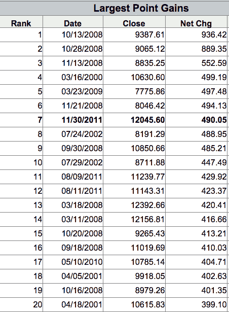

<!--yml
category: 未分类
date: 2024-05-18 03:32:01
-->

# Humble Student of the Markets: A Yom Kippur bottom? Or just more volatility?

> 来源：[https://humblestudentofthemarkets.blogspot.com/2014/10/a-yom-kippur-bottom-or-just-more.html#0001-01-01](https://humblestudentofthemarkets.blogspot.com/2014/10/a-yom-kippur-bottom-or-just-more.html#0001-01-01)

**Trend Model signal summary**

Trend Model signal: Risk-off (downgrade)

Direction of last change: Negative

The actual historical (not back-tested) buy and sell signals of the Trend Model are shown in the chart below:

In addition, I have been trading an account based on the signals of the Trend Model. The last report card of that account can be found

[here](http://humblestudentofthemarkets.blogspot.com/2014/10/trend-model-september-report-1-year-401.html)

.

**Was that the bottom?**

Last weekend, I wrote that, based on my read of the technical tea leaves, the odds were favoring a "buy Yom Kippur" scenario over a deeper decline (see

[The Big Kahuna Korrection, or buy Yom Kippur?](http://humblestudentofthemarkets.blogspot.com/2014/09/the-big-kahuna-korrection-or-buy-yom.html)

). Sure enough, the US equity market got oversold, sentiment appeared to get very bearish, as evidenced by the

[CNN Money Fear and Greed Index](http://money.cnn.com/data/fear-and-greed/?iid=H_INV_QL)

. Other market commentators, such

[Adam Johnson](http://www.bloomberg.com/news/2014-10-02/has-the-stock-market-selloff-run-its-course-.html)

and

[Dwaine Van Vuuren](http://recessionalert.com/baby-correction-belies-verocity-of-breadth-sell-off/)

, showed breadth and option sentiment such as the put-call ratio to be highly oversold and indicative of a short-term bottom. The market saw a bottom on Thursday, the start of Yom Kippur, and rallied hard in reaction to a better than expected Employment Report.

**Start of a bounce or deeper correction?**

Despite my tilt last weekend towards a tradable bottom in the week just past, I am not fully convinced that last Thursday was THE BOTTOM. First of all, the readings in the Fear and Greed Index seems to be all wrong (also see Tom Brakke`s quibbles about that index 

[here](http://rp-pieces.com/post/60557508961/fear-and-greed)

). The index incorporates a number of sentiment and short-term technical indicators to arrive at a composite score.

Conceptually, I am having some trouble with the scaling. Is last week`s extreme reading, which is associated with a minor pullback of less than 5%, be truly comparable to the Eurozone Crisis of 2011 and Taper Tantrum of 2012, which were far more substantial corrections? While I am cognizant of the oversold nature of many breadth indicators,

While it is true that many market breadth indicators reached deeply oversold conditions last week, I believe that we have to put those readings into some perspective. The chart below shows the SPX in top panel, bullish point and figure % in the middle panel and % above 200 dma in the bottom panel for the last four years. While the two indicators reached levels that are consistent with market bottoms seen in the last two years, I would also point out that the stock market has more or less risen in a straight line with only minor pullbacks in the same period. Moreover, the SPX appears to have breached an uptrend line last week, which may foreshadow a deeper corrective period. The key question then becomes: "Is this the start of a bounce or a much deeper correction?"

**Not enough fear?**

Good practice in market analysis dictates that the analysts specify the buy and sell criteria beforehand, so that he is not moving the goal posts and winging his decisions. In that spirit, I go back to my trifecta of bottom calling indicators that I wrote about in the past (see

[A tradable bottom?](http://humblestudentofthemarkets.blogspot.com/2014/08/a-tradable-bottom.html)

 and reiterated in 

[The Big Kahuna Korrection, or buy Yom Kippur?](http://humblestudentofthemarkets.blogspot.com/2014/09/the-big-kahuna-korrection-or-buy-yom.html)

). They consist of:

1.  The combination of TRIN greater than 2 AND an inversion of the VIX term structure; and
2.  An oversold condition in my favorite [overbought-oversold indicator](http://www.tradersnarrative.com/finding-buy-points-with-moving-average-ratios-4021.html) and it starts to mean revert back to a neutral reading.

As the chart below shows, past instances of this trifecta of conditions, which are marked by the dotted vertical lines, have yielded buy signals with a 100% success rate. Currently, we saw TRIN rise above 2, but the other two conditions, namely VIX term structure inversion and an oversold reading in the OBOS model were not achieved. To be sure, the absence of these conditions do not necessarily preclude a market bottom, but the success rate of such a call will be less favorable.

As well, readings from Investors Intelligence are not supportive of a capitulation bottom either. The chart below shows II Bulls in green, II Bears in red and the Bull-Bear ratio in purple at the bottom. In the past few weeks, the number of II bulls have been in retreat and such readings are not the characteristics of a sentiment washout indicating a crowded long.

As the market rallied on Friday, it seemed that market bulls were high-fiving each other everywhere.

[Josh Brown](http://thereformedbroker.com/2014/10/04/the-thing-about-big-one-day-gains/)

made the following observation:

> Amidst the excitement of the day, ***I saw and heard a lot of people chirping about how the huge one-day rally was some sort of proof that all is well agai***n. I don’t think most people realize that large one-day stock market gains are actually not typical of bull markets necessarily. The truth is that the typical bull market advance is more of an upward grind, not a string of explosive rally days. In fact, the data suggests that the largest one-day gains throughout history have actually occurred during downturns.
> 
> The data below comes from the Wall Street Journal. In it, you’ll note that almost all of these “great” days for the Dow occurred at the beginning, middle or end of a bear market or downtrend. Ten of these top twenty occurred in the teeth of the 2008 meltdown, as things had gotten temporarily oversold (on their way toward eventual lower prices):

> The other thing is that huge one-day gains are typically clustered closely together with huge one-day losses. It’s rare to see one without the other. We certainly had these clustered together this time, as this past week featured one of the worst days of the decade.

I am watching to see if short-term trader sentiment turns bullish. In particular, I am watching the

[Ticker Sense](http://tickersense.typepad.com/ticker_sense/)

blogger sentiment poll (I voted bearish) and the Bespoke sentiment poll to see if sentiment has turned sharply bullish. The preliminary indication from the Bespoke poll shows that sentiment has flipped bullish as when

[bears outnumbering bulls last week](http://www.bespokeinvest.com/thinkbig/2014/9/29/more-bears-than-bulls-unchanged-week-over-week.html)

to a preponderance of bulls this week. Similarly, the Ticker Sense blogger poll showed an astounding reading of bears outnumbering bulls 59% to 18%. If these readings suddenly turn bullish, then it may be time to be skeptical about the longevity of the rebound.

**Trend Model: Not out of the woods**

In the meantime, my Trend Model reading has fallen from Neutral last week to Risk-Off this week as many of the model components have been deteriorating. As a reminder, the Trend Model applies trend following techniques to commodity prices and global equity prices to form a composite score.

Commodity prices continue to slide. More importantly, the cyclically sensitive industrial commodity complex remains in a downtrend. Much of the weakness in industrial commodities is reflective of slower growth in China.

Market sentiment on China seems to have turned from bullish to bearish in a relatively short time. The chart below shows the relative performance of the regional stock markets of the three main global engines of growth, the US (SPY), Eurozone FEZ) and Greater China (equal weighted China, FXI, Hong Kong, EWH, Taiwan, EWT, and South Korea EWY) relative to the MSCI All-Country World Index (ACWI). All returns are in USD so there are no currency effects. As the chart shows, Great China markets staged a relative rally but they are now faltering and remain in a long-term relative downtrend.

The above relative performance chart also shows that the Eurozone markets are now rolling over in relative performance while the US remains in a relative, though extended, uptrend.

I am finding that the absolute performance of European stock markets confirm the relative performance chart shown above. The STOXX 600 appears to be making a broad top by rolling over. The recent violation of the 200 day moving average is not a good sign for the European equity bull case.

In the face of mounting deflationary pressures, the ECB appears to be handcuffed in its efforts to implement a Quantitative Easing program to stimulate the eurozone economy (via

[The Telegraph](http://www.telegraph.co.uk/finance/comment/ambroseevans_pritchard/11137502/Mario-Draghis-QE-too-little-for-markets-too-much-for-Germany.html)

):

> European stocks have suffered the steepest one-day fall in 15 months after the European Central Bank retreated from pledges for a €1 trillion blitz of stimulus and failed to clarify the scale of quantitative easing.
> 
> The sell-off came amid a mounting political storm in Europe as leading German economists and jurists reacted with fury to the ECB’s first asset purchases, denouncing the move as monetary debauchery, and threatening a blizzard of lawsuits in the German courts. “Our worst fears are being fulfilled,” said Hans Werner Sinn, head of Germany’s IFO Institute...
> 
> Mario Draghi, the ECB’s president, seemed unable to secure backing for far-reaching measures from Germany’s two ECB members or from the German finance ministry, forcing him to play down earlier hints for a €1 trillion boost to the ECB’s balance sheet.

[Bloomberg](http://www.bloomberg.com/news/2014-10-03/noyer-said-to-oppose-ecb-s-abs-plan-taking-dissenters-to-three.html?hootPostID=f690ab24ee22733c53961b51a0d1a08e)

reported that in addition to German opposition, the ECB's QE program also faces opposition from France's Noyer,. Such indecision is serving to create further uncertain in Europe and headwinds for the global growth outlook.

In the US, the better than expected Employment Report was a welcome relief to the bull camp. However, the SPX remains in a minor downtrend and, despite Friday`s relief rally, has not overcome the technically important 50 day moving average.

As we approach Q3 Earning Season, Factset reports that profit warnings have been declining, which should be positive news (via

[Marketwatch](http://blogs.marketwatch.com/thetell/2014/10/01/profit-warnings-fall-for-third-straight-quarter-as-investors-prep-for-earnings-season/)

):

However, I was surprised to see a poll (though unscientific) of mainly CFA charterholders showing that earnings expectations of beats are high compared to misses. This raises the bar for the reporting period and heightens the odds of disappointment:

> **Poll analysis**
> Entering the third-quarter earnings season, the world finds itself suffering high levels of uncertainty amid simmering geopolitical crises in Ukraine, the Middle East and Hong Kong. Further, many major economies, such as the EU, the U.S. and Japan, are seeing declining business and consumer confidence, as well as increasing income inequality. China too is seeing a slowdown in its residential housing. In other words, global corporate earnings have a backdrop of worry. Yet when we asked CFA Institute NewsBrief readers, 43% of respondents indicated they believe businesses will meet earnings expectations. For those thinking that profits will deviate from expectations, respondents believe corporations are likely to outperform those that underperform by 2.3 to 1 (40% : 17%). Investors are confident of a good earnings season, and perhaps the profit picture of global business will ameliorate some of the economic doubts. Yet even if businesses deliver, it seems that the corporate earnings season and its gyrations have diminished in importance since 2008-2009\. Instead, the market drivers will most likely be interest rates and geopolitical predictions.
> 
> -- Jason A. Voss, CFA, Content Director, CFA Institute
> Poll results are as of 3:30 p.m. EDT Thursday.

**A neutral to negative global growth outlook**

This chart from

[Schwab](http://www.schwab.com/public/schwab/nn/articles/Market-Perspective)

summarizes the global macro outlook as neutral to negative (h/t Jeff Miller at A

[Dash of Insight](http://dashofinsight.com/weighing-week-ahead-will-global-weakness-drag-us-economy/)

):

> If your head is spinning, it’s not your fault. The world’s major economies have taken different paths and are headed in different directions as the third quarter comes to a close.
> 
> *   The United States’ leadership has been reinforced by the sluggishness in most other major economies that is helping keep inflation, oil prices, and interest rates low.
> *   China’s solid start to the quarter deteriorated quickly. The most dramatic example was the 6.9% growth in industrial production in August, the worst reading since the financial crisis of five years ago.
> *   Japan’s economy suffered from the aftermath of the April tax hike. However, the economy showed some improvement during the quarter as the impact of the tax hikes began to fade and the aggressive economic stimulus supplied by the Bank of Japan was increasingly felt.
> *   Europe remains stuck in a negative spiral on the brink of the third recession in six years and is dangerously close to deflation with the year-over-year pace of inflation coming in at just 0.4% in August.
> 
> Markets tend to respond to how actual data compare to expectations, rather than whether that data is strong or weak in an absolute sense. For example, even a weak data point may inspire a lift to stocks if it was better than generally expected. The chart below depicts how actual data has been faring relative to expectations over the past three months and in what direction the data is trending relative to those expectations for the world’s major economies.

**Major economies on different paths**

Note that in the above chart, the US is the only global region whose growth path is above Street expectations, but it is weakening and has moved from a position of accelerating growth to neutral.

To underline the weakness observed by the Trend Model, analysis from 

[GaveKal](http://gavekal.blogspot.ca/2014/10/the-advancedecline-ratio-has-collapsed.html)

 showed that a significant deterioration in the global Advance-Decline ratio, which cannot be viewed as bullish for the global equity outlook:

**A recipe for more volatility**

Putting it all together, current conditions suggest a volatile period for equities with a somewhat bearish bias. 

[Sam Stovall](http://www.spcapitaliq.com/insights/q4-s-historical-performance-will-this-quarter-live-up-to-its-reputation#sf4960839#sf4965762)

 analyzed historical SPX monthly seasonality and found that the October and, indeed, Q4 had a bullish bias. But there is a catch - October turned out to be a very volatile month.

It's not just equity volatility is likely to rise, Analysis from

[Thomson-Reuters](http://alphanow.thomsonreuters.com/september-2014-month-charts/)

indicates that currency volatility has spiked as well.

Given the current environment, increased volatility appears to be a reasonable bet.

My inner trade remains bearishly positioned, with tight stops. I could be wrong on my tactical market call and this could turn out to be a short-term market bottom, but that's why risk control is important at times like this.

My inner investor is cautiously looking to dial back some risk by raising cash in rallies, but he is not in panic mode as the current episode is, at worst, likely to be a relatively minor correction.

**Disclosure:**

Long SPXU, TZA