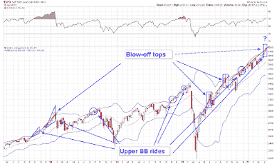

<!--yml
category: 未分类
date: 2024-05-18 02:01:30
-->

# Humble Student of the Markets: A blow-off top ahead?

> 来源：[https://humblestudentofthemarkets.blogspot.com/2021/04/a-blow-off-top-ahead.html#0001-01-01](https://humblestudentofthemarkets.blogspot.com/2021/04/a-blow-off-top-ahead.html#0001-01-01)

**Preface: Explaining our market timing models** 

We maintain several market timing models, each with differing time horizons. The "

**Ultimate Market Timing Model**

" is a long-term market timing model based on the research outlined in our post, 

[Building the ultimate market timing model](https://humblestudentofthemarkets.com/2016/01/26/building-the-ultimate-market-timing-model/)

. This model tends to generate only a handful of signals each decade.

The 

**Trend Asset Allocation Model**

 is an asset allocation model that applies trend following principles based on the inputs of global stock and commodity price. This model has a shorter time horizon and tends to turn over about 4-6 times a year. In essence, it seeks to answer the question, "Is the trend in the global economy expansion (bullish) or contraction (bearish)?"

My inner trader uses a 

**trading model**

, which is a blend of price momentum (is the Trend Model becoming more bullish, or bearish?) and overbought/oversold extremes (don't buy if the trend is overbought, and vice versa). Subscribers receive real-time alerts of model changes, and a hypothetical trading record of the email alerts are updated weekly 

[here](https://humblestudentofthemarkets.com/trading-track-record/)

. The hypothetical trading record of the trading model of the real-time alerts that began in March 2016 is shown below.

The latest signals of each model are as follows:

*   Ultimate market timing model: Buy equities*
*   Trend Model signal: Bullish*
*   Trading model: Bullish*

** The performance chart and model readings have been delayed by a week out of respect to our paying subscribers.***Update schedule**

: I generally update model readings on my 

[site](https://humblestudentofthemarkets.com/)

 on weekends and tweet mid-week observations at @humblestudent. Subscribers receive real-time alerts of trading model changes, and a hypothetical trading record of those email alerts is shown 

[here](https://humblestudentofthemarkets.com/trading-track-record/)

.

Subscribers can access the latest signal in real-time 

[here](https://humblestudentofthemarkets.com/my-inner-trader/)

.

**Setting up for a blow-off top**

The S&P 500 has been rising steadily since late February. As the stock market advanced, readings became increasingly overbought. The S&P 500 has spent two consecutive weeks above its weekly Bollinger Band (BB). Past upper BB episodes have tended to be signals of positive momentum. that led to further gains. The market spent several months on an upper BB ride in late 2017 and early 2018 before it finally topped out.

It appears the S&P 500 is undergoing another melt-up, with a blow-off top ahead. In the last four years, overruns of a rising trend line have been signals of an imminent blow-off top that lasts no more than two weeks.

A closeup look at the S&P 500 daily chart shows more details. The index has overrun rising trend line resistance, which happened twice since the March low. The market topped out after prices went parabolic within a week of the overruns.

The full post can be found

[here](https://humblestudentofthemarkets.com/2021/04/18/a-blow-off-top-ahead/)

.