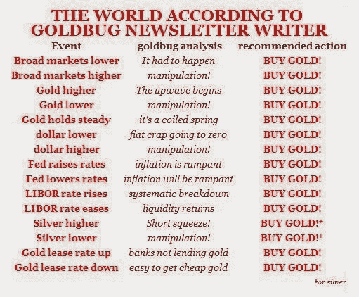

<!--yml
category: 未分类
date: 2024-05-18 03:44:03
-->

# Humble Student of the Markets: A bottom in gold?

> 来源：[https://humblestudentofthemarkets.blogspot.com/2014/02/a-bottom-in-gold.html#0001-01-01](https://humblestudentofthemarkets.blogspot.com/2014/02/a-bottom-in-gold.html#0001-01-01)

The price of gold and gold stocks have been behaving a lot better in the past few weeks and it has prompted a number of technicians to proclaim a bottom in gold. I have found that inter-market analysis can tell us a lot more about the underlying technical picture of an asset than a pure technical focus on the asset itself. My own take is that we are seeing a tradable tactical bottom, but don't count on an intermediate or long term bottom in gold.

**Non-confirmation from silver**

The main basis for my conclusion is the behavior of the silver/gold ratio. Silver is said to be the poor man's gold and tends to have a higher precious metal beta. The chart below shows the gold price in the top panel and the silver/gold ratio in the bottom panel.

Note how gold has rallied out of a downtrend in the top chart, which is what got a lot of technicians and goldbugs excited. By contrast, the silver/gold ratio remains in a downtrend. If gold has staged a convincing bottom, why isn't silver participating?

Now look at this same chart back at the last gold bottom at about the $250 level in 1999 and 2001\. Note how the silver/gold ratio turned up well before the first gold bottom. Now look at the first chart of the current silver/gold ratio and tell me that we are seeing a durable bottom in the gold price.

**A tactical buy?**

The combination of a gold rally out of a downtrend and a falling silver/gold ratio suggests that we are more likely to see a period of consolidation or tactical rally in the gold price. A realistic upside rally target might be the 1400-1460 resistance zone, which is roughly where the 38.2% Fibonacci retracement level is.

**Don't shoot the messenger**

If you are a goldbug and want to write me about how the Yellen Fed is overly dovish and stands ready to print and debase the currency, etc., I refer you to my favorite analysis from

[Otto Rock](http://incakolanews.blogspot.com/2009/04/gold-la-plus-ca-change.html)

. While it is somewhat dated, the truths about goldbugs remains eternal.

*Cam Hui is a portfolio manager at [Qwest Investment Fund Management Ltd.](http://www.qwestfunds.com/) (“Qwest”). The opinions and any recommendations expressed in the blog are those of the author and do not reflect the opinions and recommendations of Qwest. Qwest reviews Mr. Hui’s blog to ensure it is connected with Mr. Hui’s obligation to deal fairly, honestly and in good faith with the blog’s readers.”

None of the information or opinions expressed in this blog constitutes a solicitation for the purchase or sale of any security or other instrument. Nothing in this blog constitutes investment advice and any recommendations that may be contained herein have not been based upon a consideration of the investment objectives, financial situation or particular needs of any specific recipient. Any purchase or sale activity in any securities or other instrument should be based upon your own analysis and conclusions. Past performance is not indicative of future results. Either Qwest or I may hold or control long or short positions in the securities or instruments mentioned.*