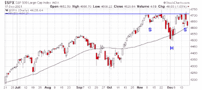

<!--yml
category: 未分类
date: 2024-05-18 01:50:15
-->

# Humble Student of the Markets: A breakout to S&P 4920?

> 来源：[https://humblestudentofthemarkets.blogspot.com/2021/12/a-breakout-to-s-4920.html#0001-01-01](https://humblestudentofthemarkets.blogspot.com/2021/12/a-breakout-to-s-4920.html#0001-01-01)

**Preface: Explaining our market timing models** 

We maintain several market timing models, each with differing time horizons. The "

**Ultimate Market Timing Model**

" is a long-term market timing model based on the research outlined in our post, 

[Building the ultimate market timing model](https://humblestudentofthemarkets.com/2016/01/26/building-the-ultimate-market-timing-model/)

. This model tends to generate only a handful of signals each decade.

The 

**Trend Asset Allocation Model**

 is an asset allocation model that applies trend following principles based on the inputs of global stock and commodity price. This model has a shorter time horizon and tends to turn over about 4-6 times a year. The performance and full details of a model portfolio based on the out-of-sample signals of the Trend Model can be found

[here](https://humblestudentofthemarkets.com/trend-model-report-card/)

.

My inner trader uses a 

**trading model**

, which is a blend of price momentum (is the Trend Model becoming more bullish, or bearish?) and overbought/oversold extremes (don't buy if the trend is overbought, and vice versa). Subscribers receive real-time alerts of model changes, and a hypothetical trading record of the email alerts is updated weekly 

[here](https://humblestudentofthemarkets.com/trading-track-record/)

. The hypothetical trading record of the trading model of the real-time alerts that began in March 2016 is shown below.

The latest signals of each model are as follows:

*   Ultimate market timing model: Buy equities*
*   Trend Model signal: Bullish*
*   Trading model: Bullish*

** The performance chart and model readings have been delayed by a week out of respect to our paying subscribers.***Update schedule**

: I generally update model readings on my 

[site](https://humblestudentofthemarkets.com/)

 on weekends and tweet mid-week observations at @humblestudent. Subscribers receive real-time alerts of trading model changes, and a hypothetical trading record of those email alerts is shown 

[here](https://humblestudentofthemarkets.com/trading-track-record/)

.

Subscribers can access the latest signal in real-time 

[here](https://humblestudentofthemarkets.com/my-inner-trader/)

.

**Publication schedule next week**

: There will be no regular strategy publiction next Saturday owing to the seasonal holidays. I will publish a tactical trading comment next Sunday.

**A potential inverse H&S**

A potential inverse head and shoulders pattern is forming in the S&P 500? The measured upside objective is roughly 4920\. Despite the volatility from Friday's quadruple witching, the S&P 500 held support at its 50 dma.

The bulls shouldn't break out the champagne just yet. Strictly speaking, head and shoulders patterns are incomplete until the neckline breaks. If the index can stage an upside breakout above resistance, then traders can declare a risk-on tone to the market. On the other hand, if the S&P 500 were to undercut the "head" at about 4500 and invalidate the inverse head and shoulders pattern, things could get very ugly.

Here are bull and bear cases.

The full post can be found

[here](https://humblestudentofthemarkets.com/2021/12/19/a-breakout-to-sp-4920/)

.