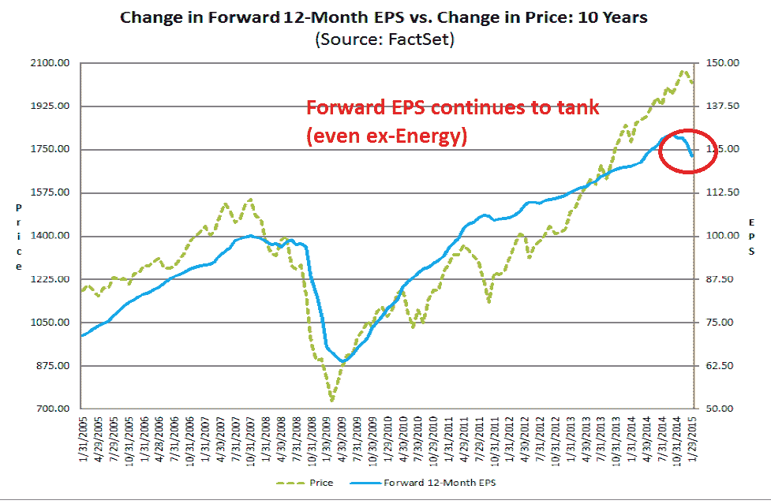

<!--yml
category: 未分类
date: 2024-05-18 03:26:06
-->

# Humble Student of the Markets: A correction is brewing

> 来源：[https://humblestudentofthemarkets.blogspot.com/2015/02/a-correction-is-brewing.html#0001-01-01](https://humblestudentofthemarkets.blogspot.com/2015/02/a-correction-is-brewing.html#0001-01-01)

**Trend Model signal summary**

Trend Model signal: Risk-off

Trading model: Bearish (downgrade)

The Trend Model is an asset allocation model which applies trend following principles based on the inputs of global stock and commodity price. In essence, it seeks to answer the question, "Is the trend in the global economy expansion (bullish) or contraction (bearish)?"

My inner trader uses the trading model component of the Trend Model seeks to answer the question, "Is the trend getting better (bullish) or worse (bearish)?" The history of actual (not backtested) signals of the trading model are shown by the arrows in the chart below. In addition, I have a trading account which uses the signals of the Trend Model. The last report card of that account can be found 

[here](http://humblestudentofthemarkets.blogspot.com/2015/01/an-excellent-trend-model-report-card.html)

.

**Update schedule**

: I generally update Trend Model readings on 

[my blog](http://humblestudentofthemarkets.blogspot.com/)

 on weekends and tweet any changes during the week at @humblestudent.

**Outlook is turning bearish**

In the past week, the outlook has turned decidedly negative for the following reasons:

*   Commodities are signaling a lack of demand.
*   US EPS estimates continue to deteriorate.
*   Uncertainty is rising in Europe.

Let's go through these factors, one by one. 

**Commodities signaling weak global economy**

Commodity prices have been falling for quite some time and they represent a key input to my Trend Model. Historically, falling commodity prices have signaled weakness in the global growth outlook. In my last post (see

[Good news, bad news on the commodity downturn](http://humblestudentofthemarkets.blogspot.com/2015/01/good-news-bad-news-on-commodity-downturn.html)

), I struggled to find reasons to explain the downtrend, such as USD strength and the de-financialization of commodities as an investment. Perhaps this time is different?

Alas, this time is NOT different. Even if we to filter out the effects of the strong USD, the picture isn't pretty. The chart below shows the CRB Index denominated in euros. Even in euro-terms, the CRB remains in a downtrend.

The chart of industrial metals in euros is a bit more constructive as it appears to have rallied through a downtrend and seems to be trying to stabilize.

Overall, I would rate the message from the commodity market as neutral to negative at best. Mr. Market is telling a story of a lack of global demand, which is not helpful for the growth outlook and risk appetite.

**The failing grade from US Earnings Season**

In the US, the equity outlook is deteriorating. The latest analysis from

[John Butters](http://humblestudentofthemarkets.blogspot.ca/2015/01/good-news-bad-news-on-commodity-downturn.html)

of Factset shows that forward EPS continues to fall. As the chart shows, falling consensus EPS has historically been associated to either corrections or bear markets (annotations in red are mine).

In the past few weeks, I had been cautiously bullish as I waited for EPS estimates to turn up as the benefits of lower oil prices became more clear. It`s time to throw in the towel on that thesis.

Earnings Season is in full swing with 227 of the companies in the SP 500 having reported their Q4 results and there is no sign of an upturn in estimates. The earnings beat rate is 80%, which is well above the historical average, and the sales beat rate is 58%, which is roughly in line with past history. The more disturbing result is the negative guidance rate is a whopping 80% which has consequently pushed down estimate revisions.

While Energy stocks have bore the brunt of the earnings downgrades,

[CNBC](http://www.cnbc.com/id/102383431)

reports that negative revisions have not been confined to that sector alone (emphasis added):

> The biggest drag is expected to be energy companies suffering from the oil price collapse, but analysts have dropped projections in almost every sector as the earnings reporting season has unfolded.
> 
> ***On Jan. 1, SP 500 first-quarter earnings were forecast to rise 5.3 percent, including energy companies, and 10.5 percent excluding energy companies. On Thursday, that consensus forecast was flat from a year ago including the energy sector, and cut to 7.9 percent growth excluding energy.***

The earnings headwinds are not just coming from falling oil prices for energy companies. The stronger USD is posing a challenge for multi-nationals. Consider, for example, this comment from the

[Proctor and Gamble](http://www.pginvestor.com/file.aspx?IID=4004124&FID=27285939)

, which missed expectations because of greenback strength (emphasis added):

> Core earnings per share were $1.06, a decrease of eight percent versus the prior year. ***Foreign exchange reduced core earnings by about $0.16 per share, resulting in a 14% decrease in core earnings per share.***

And this:

> "***The October - December 2014 quarter was a challenging one with unprecedented currency devaluations***," said Chairman, President and Chief Executive Officer A.G. Lafley. "***Virtually every currency in the world devalued versus the U.S. dollar***, with the Russian Ruble leading the way. While we continue to make steady progress on the strategic transformation of the company - which focuses P+G on about a dozen core categories and 70 to 80 brands, on leading brand growth, on accelerating meaningful product innovation and increasing productivity savings - ***the considerable business portfolio, product innovation, and productivity progress was not enough to overcome foreign exchange***."

[Bespoke](http://www.bespokeinvest.com/thinkbig/2015/1/30/companies-as-negative-since-the-depths-of-the-financial-cris.html)

showed that negative guidance was not restricted to just energy:

The gloom is spreading, according to

[Bloomberg](http://www.bloomberg.com/news/articles/2015-01-30/american-ceos-most-bearish-on-earnings-since-2008-crisis)

 (emphasis added):

> U.S. chief executive officers are more pessimistic about corporate earnings than any time since the financial crisis, according to research from Bespoke Investment Group LLC.
> 
> The percentage of companies cutting profit forecasts during this earnings season has outpaced those with upward revisions by 8.6 percentage points, the widest margin in six years, according to data compiled by Bespoke. ***Consumer companies and drugmakers are the most bearish among 10 major industries, with at least 18 percent of each group providing lower guidance, the data show.***

The Street is now projecting negative EPS growth in Q1 and Q2:

> ***Analysts now expect per-share earnings from SP 500 companies to decline 2.1 percent in the first quarter and fall 1.1 percent over the following period***, estimates compiled by Bloomberg show. Should the forecasts come true, it would be the first back-to-back profit contractions since 2009\.

Fundamentally, there are two basic ways that stock prices can advance. Either the P/E multiple expands, the E in the P/E ratio rises, or both. Now consider that (for more details see 

[(Sort of) debunking the bear case for stocks](http://humblestudentofthemarkets.blogspot.com/2015/01/sort-of-debunking-bear-case-for-stocks.html)

):

1.  Valuations are elevated;
2.  The Fed is starting a tightening cycle, which will put downward pressure on P/E multiples; and
3.  EPS estimates are falling.

The combination of these factors is a recipe for either a bear market or correction. In a more typical mid expansion phase of an economic cycle (especially when energy input prices are falling), the positive effects of rising earnings growth offsets the negative effects of Fed tightening. This time, EPS estimates are falling down on the job.

**A WTF Greek moment**

Across the Atlantic, the macro picture looks dire on a short-term basis. Late in the European trading day, we saw the news from Greece that they would decline the next round of 

€

7 billion aid upon without a deal on the conditions surrounding the funds, according to

[Bloomberg](http://www.bloomberg.com/news/articles/2015-01-30/greece-shuns-eu-bailout-cash-before-dijsselbloem-visit)

:

> Finance Minister Yanis Varoufakis set the clock ticking on Greece’s standoff with the euro area on Friday saying he’s ready to take his chances without a financial backstop rather than submit to more austerity.
> 
> The new government may be operating without a financial safety net for the first time in five years by March after Varoufakis challenged the euro area to agree to a new framework of support that allows for more spending. Greece won’t engage with officials from the troika who have been policing the conditions of its rescue since 2010, he said at a joint press conference with Eurogroup Chief Jeroen Dijsselbloem in Athens.
> 
> “We don’t plan to cooperate with that committee,” Varoufakis said. “The Greek state has a future, but what we won’t accept has a future is the self-perpetuating crisis of deflation and unsustainable debt.”

While I continue to believe that the standoff between the new Greek government and the Troika will end in a benign manner (see

[The (European) parents fight and the kids hear everything](http://humblestudentofthemarkets.blogspot.com/2015/01/the-european-parents-fight-and-kids.html)

), the news of the Greek opening gambit in negotiation undoubtedly represented a WTF moment for the market. Without the next tranche of aid, Greece will quickly run out of money, perhaps as soon as the end of February.

To put the latest Greek announcement into context: Imagine that some criminals tries to rob a bank but the robbery attempt has turned bad. They are holed up in the bank and taken several hostages, surrounding by the police. The police send in a negotiator. Instead of trying to convince the criminals into giving themselves up, he orders the police sharpshooters to shoot a hostage, in order to show that the robbers have no negotiating leverage. (Maybe this unusual opening gambit, which undoubtedly befuddled the eurocrats, can be explained by the fact that Greek finance minister 

[Yaris Varoufakis once wrote a book on game theory](http://yanisvaroufakis.eu/books/game-theory-a-critical-text/)

.)

Then, on Saturday, Greek PM Tsipras sought to tone down the rhetoric as part of a damage control effort, according to this

[Bloomberg](http://www.bloomberg.com/news/articles/2015-01-31/tsipras-says-greece-to-repay-ecb-imf-reach-deal-with-eu)

report (emphasis added):

> Prime Minister Alexis Tsipras sought to repair relations with Greece’s creditors ahead of a diplomatic push to win support for his economic program, as euro area officials said they’re looking for concessions from the new government.
> 
> ***Greece will repay its debts to the European Central Bank and the International Monetary Fund and reach a deal “soon” with the euro-area nations that funded most of the country’s financial rescue***, Tsipras said in a statement e-mailed to Bloomberg News on Saturday.
> 
> “The deliberation with our European partners has just begun,” Tsipras said. “Despite the fact that there are differences in perspective, I am absolutely confident that we will soon manage to reach a mutually beneficial agreement, both for Greece and for Europe as a whole.”

Yes. WTF would be an apt description of the negotiations.

In the meantime, Greek stocks continue to tank relative to eurozone equities. While the Athens market is oversold on a relative basis, it's still very early in the negotiation process and anything can happen. No doubt there will be much more drama and tantrums to come in the days and weeks to come. The bottom may not be in yet - and any more posturing by either side is likely to spook the markets.

Stay tuned for more drama and volatility as the markets react to the latest headlines. The stakes are high, not just in Greece, but because of the heightened risk of political contagion as the Guardian reported that

[100,000 flocked to Madrid for a Podemos rally](http://www.theguardian.com/world/2015/jan/31/podemos-spain-austerity-rally-madrid-syriza)

.

**China the one bright spot**

Ironically, the one bright spot that could contribute positively to the global growth outlook is China. Despite the headlines about slowing Chinese growth, analysis of the Shanghai market and the stock market of China's major Asian trading partners indicates that they are either in uptrends or in the process of turning up. Such a development must be regarded a positive development for the bulls and investors may want to look at exposure to "Greater China" for the equity component of their portfolios.

While the Chinese economic trajectory is weakening as the

[latest official PMI figures missed expectations](http://www.reuters.com/article/2015/02/01/us-china-economy-pmi-idUSKBN0L50ZX20150201)

, the market is in a "bad news is good news" phase as the perception is that weakness is setting the stage for more easing.

**A correction, or more choppiness?**

The combination of these factors indicate that the path of least resistance for US equity prices is down.

[Mark Cook](http://www.marketwatch.com/story/too-late-were-already-in-a-bear-market-2015-01-28)

wrote last week that he is seeing ominous signs from his technical indicators and believes that we are already in a bear market:

> Here are four observations about this market:
> 
> 1\. Institutions are not buying. Without big institutional support, this market is in trouble.
> Using the CCT [a proprietary breadth indicator], I can see that on the days the market goes up, institutions aren’t participating. This is reflected in the low volume numbers. Lack of institutional buying is bearish.
> 2\. There were more minus-1,000 NYSE ticks than plus-1,000 ticks. This demonstrates that the rallies are hollow and short-lived.
> 3\. The stock market is now at lower prices than just before the European QE was announced. Positive news has no lasting effect on rallying the market.
> 4\. The volume, the lower highs, and now the lower-price highs are all indications of a price pattern deterioration.

In addition,¸

[Cornelius Luca](http://blog.financial.thomsonreuters.com/are-widening-us-credit-spreads-warning-of-a-peak-in-us-equities/)

 at Thomson Reuters is seeing signs of declining risk appetite from the credit markets.

On the other hand, the stock market has been in volatile and range-bound for the last few weeks and we have to allow for the possibility that, instead of declining right away, it rallies and resumes the choppy pattern. The chart below shows that the SPX has seen its recent declines arrested at the 150 day moving average and the index closed just slightly below that level on Friday. In addition, the 5-day RSI, which is a useful short-term swing trading indicator, is showing a slight positive divergence so the rally scenario remains a possibility.

In response to these changes in market conditions, my inner investor is looking to lighten up his equity positions on strength. A correction is brewing and he wants to be prepared.

My inner trader

[went to cash on Tuesday](https://twitter.com/HumbleStudent/status/560098974833455105)

 and

[took a minor NDX short position on Wednesday](https://twitter.com/HumbleStudent/status/560532148222840832)

after the FOMC statement, but before the sell-off cascade that occurred in the last hour of trading. He is leaning bearish, but he has been burned too many times in the past few weeks by the market choppiness (see 

[All washed up!](http://humblestudentofthemarkets.blogspot.com/2015/01/all-washed-up.html)

). He is therefore keeping his short exposure lower than normal for risk control reasons.

**Disclosure:**

Long SQQQ