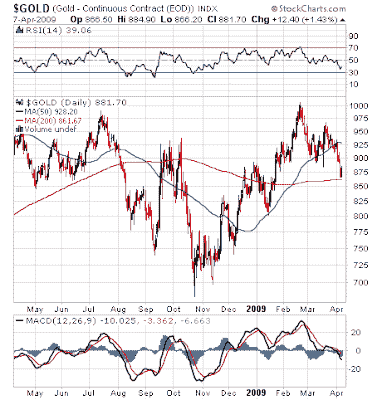

<!--yml
category: 未分类
date: 2024-05-18 00:55:41
-->

# Humble Student of the Markets: A critical test for gold

> 来源：[https://humblestudentofthemarkets.blogspot.com/2009/04/critical-test-for-gold.html#0001-01-01](https://humblestudentofthemarkets.blogspot.com/2009/04/critical-test-for-gold.html#0001-01-01)

Gold has had a nice run in the last few months but as the chart below shows the yellow metal seems to have faltered lately.

**A divergence and critical test**

One indicator I like to watch is the ratio of the CBOE Gold Index (GOX) to the PHLX Gold & Silver Index (XAU). GOX is an equal weighted index, which means that the more speculative and smaller capitalization names have greater weight in the index. By contrast, XAU is a capitalization weighted index, which means that the larger capitalization stocks have greater weight. The performance of the GOX to XAU ratio is a measure of the degree of speculation in gold stocks.

As the chart of the ratio shows, the small caps have been in a steady uptrend against the large caps since August 2008, which indicates rising speculative sentiment. With the downturn in the gold market, the ratio came down to test the uptrend line. So far, the test has been successful. The continued existence of this relative uptrend could be a positive divergence for the gold market.

**Watch this space for the direction on gold and inflation**

Investors should watch this space as a key indicator of the health of the gold market. A continuation of the relative uptrend is an indication that there is speculative sentiment still holds the upper hand and this is just a pause in the gold bull.

I would prefer not to anticipate how the readings on indicators turn out. If I were forced to make a call, I would lean towards being a gold bull. My reasoning is other indicators of inflationary expectations such as the

[inflation swap rates](http://www.bloomberg.com/apps/quote?ticker=USSWIT5%3Aind)

are continuing to rise.