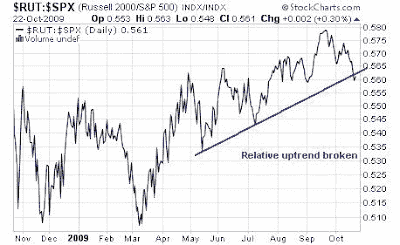
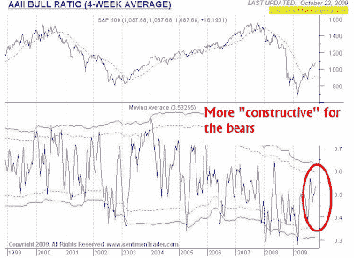

<!--yml
category: 未分类
date: 2024-05-18 00:44:22
-->

# Humble Student of the Markets: A fragile and frothy market

> 来源：[https://humblestudentofthemarkets.blogspot.com/2009/10/fragile-and-frothy-market.html#0001-01-01](https://humblestudentofthemarkets.blogspot.com/2009/10/fragile-and-frothy-market.html#0001-01-01)

As the S&P 500 tests resistance at the 1100-1120 zone, which is the 50% Fibonacci retracement level, it is useful to think about market tone.

How the market reacts to news is often a useful guide to future direction. When the bulls were in full control of the market action, a downgrade by a single analyst on WFC wouldn’t have taken the market down dramatically in the last hour. When the bulls were in full control, news that the

[Chinese economy had grown by 8.9%](http://www.ft.com/cms/s/0/bf07359e-bec1-11de-b4ab-00144feab49a.html)

would have been an excuse for further advances and not pullbacks. Moreover, the

[widespread skepticism over China’s official statistics](http://www.ritholtz.com/blog/2009/10/who-believes-chinas-bernie-madoff-data/)

would have been swept under the rug.

**Technical divergences everywhere**

Today there are

[technical divergences everywhere](http://slopeofhope.com/2009/10/bad-breadth-and-the-market-by-biffermas.html)

. I won’t go into every single one but the most glaring is the faltering leadership of small cap stocks, which led the rally that began in March 2009\. As the chart below shows, the ratio of the Russell 2000 (small caps) to the S&P 500 (large caps) has broken its relative uptrend line, indicating that small cap leadership is rolling over.

**Is the “risk trade” over-owned and over-loved?**

Sentiment readings are getting more constructive for the bears. There is no doubt that the risk trade is coming back. The news that

[John Meriwether is staring his third hedge fund](http://ftalphaville.ft.com/blog/2009/10/22/79046/meriwether-to-start-new-venture/)

after blowing up two others in spectacular fashion could be the top tick for the market. Moreover, EPFR reports that investors are going out on the risk trade by buying emerging market funds: “the $4 billion of net inflows into Emerging Market Equity Funds in the week ending October 14 was the largest weekly total since December 2007.”

Mary Ann Bartels of BofA/Merrill Lynch reports that large speculators (read: hedge funds) are starting to sell their crowded long position in NASDAQ 100 futures, the high-beta vehicle of choice among the fast money crowd. As well, the

[AAII poll of individual investors](http://www.sentimentrader.com/subscriber/charts/WEEKLY/SURVEY_AAII_BULLRATIO_4WK.htm)

is at an elevated bullish level, though not quite a crowded long reading.

On the other hand, Mark Hulbert wrote that

[newsletter writers are still skeptical of this stock market rally](http://www.marketwatch.com/story/contrarian-analysis-still-positive-for-stocks-2009-10-20)

, which is contrarian bullish.

**Watch how sentiment develops**

On top of that, you have a market that is overvalued by

[Tobin Q standards](http://www.smithers.co.uk:80/page.php?id=34)

and

[seriously intermediate term overbought](http://www.hussmanfunds.com/wmc/wmc091019.htm)

. The inability of the market bulls to shrug off bad news and to advance in the face of good news, as well as faltering small cap leadership are signs indicative of an imminent pullback.

Given the still somewhat mixed sentiment picture, the key to future market direction would be how sentiment readings change should the market correct. Would investors be so convinced of a V-shaped recovery (see examples of stories

[here](http://www.econbrowser.com/archives/2009/10/no_l.html)

,

[here](http://scottgrannis.blogspot.com/2009/10/more-v-signs-3.html)

and

[here](http://scottgrannis.blogspot.com/2009/10/rising-confidence-is-driving-equity.html)

) that they would buy on dips and send sentiment readings into over-owned territory, which would be bearish? Or will they turn cautious, which may ironically limit the downside of any corrective action.