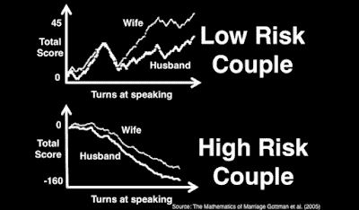

<!--yml
category: 未分类
date: 2024-05-18 03:16:31
-->

# Humble Student of the Markets: A geek's view of love and marriage

> 来源：[https://humblestudentofthemarkets.blogspot.com/2015/09/a-geeks-view-of-love-and-marriage.html#0001-01-01](https://humblestudentofthemarkets.blogspot.com/2015/09/a-geeks-view-of-love-and-marriage.html#0001-01-01)

Mrs. Humble Student of the Markets and I were married 20 years ago on Labor Day weekend in 1995\. As a true geek, I used to have a five uncorrelated factor model for what makes a good relationship.

As a different more simplified approach, Hannah Fry distilled it into a simple mathematical formula in a

[TED talk](https://www.ted.com/talks/hannah_fry_the_mathematics_of_love?language=en#t-196974)

(via

[Business Insider](http://www.businessinsider.com/mathematical-secret-to-lasting-relationships-2015-6)

):

> Fry, who works at the UCL Centre for Advanced Spatial Analysis in London, explains in her 2014 TED Talk and recently released book, "The Mathematics of Love," that the best predictor of long-lasting relationships is how positive and negative a couple can be to one another.
> 
> In her book, she discusses the groundbreaking work of psychologist John Gottman and his team. Over many years they observed hundreds of couples and noted their facial expressions, heart rates, blood pressure, skin conductivity, and the words they used in conversation with their partners.
> 
> They discovered low-risk couples have more positive interactions with each other, and high-risk couples tend to spiral into negativity.
> 
> As Fry puts it, "In relationships where both partners consider themselves as happy, bad behavior is dismissed as unusual." For example, a wife might assume her husband's grumpiness is due to stress at work or a bad night's sleep.
> 
> "In negative relationships, however, the situation is reversed," writes Fry. "Bad behavior is considered the norm." A husband, for instance, might think his wife's grumpiness is "typical," due to her "selfishness" or other negative personality trait.

> As Fry explains, the model is framed as husband and wife but also applies to same-sex spouses and unmarried couples in long-term relationships.
> 
> The wife's equation is the top line, the husband's the bottom, and it solves for how positive or negative the next thing they say will be.
> 
> In hers, w stands for her mood in general, rwWt represents her mood when she's with her husband, and IHW shows how the husband's actions influence her. The husband's follows the same pattern.

Fry concluded:

> Happy couples, then, tend to have more positive interactions than negative ones, and thus are more likely to give each other the benefit of a doubt. When there is an issue, they're more likely to bring it up quickly, fix it, and move on.
> 
> "Mathematics leaves us with a positive message for our relationships," Fry says, "reinforcing the age-old wisdom that you really shouldn't let the sun go down on your anger.

It's funny that as quants we try to build systems and be unemotional about the process of investing, largely because emotional swings can lead us astray. Yet human relationships is about precisely that - emotional bonds. Fry's work bridges that gap with mathematics and demonstrated how to make a relationship last beyond the initial sparks.

To put in more succinctly, it's all about finding a best friend to spend your life with. I am truly blessed to have my best friend to be my life partner for the last 20 years. Together, we have a wonderful daughter (and a dog).

I have taken the last week off and we are re-visiting the site of our wedding ceremony in Kananaskis, a resort in the Canadian Rockies near Banff. The

[2002 G8 Summit](https://en.wikipedia.org/wiki/28th_G8_summit)

was held at Kananaskis and, in fact, the very spot where we got married 20 years ago is where the G8 leader group photo was taken.

Enjoy your long weekend!