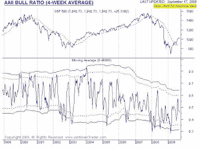
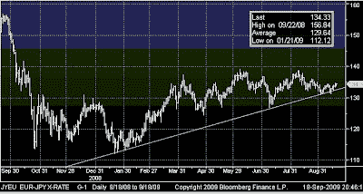
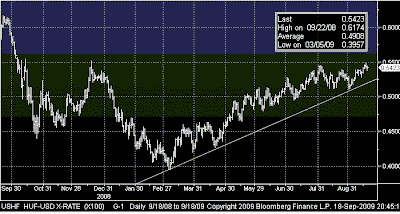
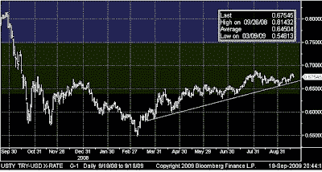

<!--yml
category: 未分类
date: 2024-05-18 00:46:17
-->

# Humble Student of the Markets: A possible market crash - but not yet

> 来源：[https://humblestudentofthemarkets.blogspot.com/2009/09/possible-market-crash-but-not-yet.html#0001-01-01](https://humblestudentofthemarkets.blogspot.com/2009/09/possible-market-crash-but-not-yet.html#0001-01-01)

Regular readers know that I have been skeptical of this equity market rally (see examples

[here](http://humblestudentofthemarkets.blogspot.com/2009/08/v-shaped-recovery-with-4-8-gdp-growth.html)

and

[here](http://humblestudentofthemarkets.blogspot.com/2009/08/v-shaped-recovery-with-4-8-gdp-growth.html)

). My opinion is confirmed by many commentators that I respect.

Jeremy Grantham of GMO wrote in his

[2Q letter](http://www.gmo.com/websitecontent/JGLetter_ALL_2Q09.pdf)

that their estimate of fair value on the S&P 500 is slightly south of 880 and the index could move to between 1000 and 1100\. In addition, reports of

[high levels of insider selling](http://money.cnn.com/2009/09/10/news/economy/insider.sales/index.htm?postversion=2009091107)

is not comforting for the bulls.

On September 9, long time chartist Richard Russell indicated that he saw a rare “double non-confirmation”[emphasis mine]:

> We may have seen a rare "double non-confirmation." On August 27 the Dow closed at 9580.63, a new Dow high for the rally. On the same day the Transports closed at 3714.63, which was not a new high -- in so doing, the Transports failed to confirm the Dow. Today the Transports closed at 3806.75, a new high for the ]Transports. But today the Dow closed at 9547.22, below their August 27 close -- in doing so, the Industrials failed to confirm the Transports. This is what I call a rare "double non-confirmation". First, the Transports were weak in that they could not confirm the Industrials. Today the Industrials were weak in that they could not confirm the Transports. ***These rare "double non-confirmations," in the past, have tended to signal the top***.

[Bespoke](http://bespokeinvest.typepad.com/bespoke/2009/09/sp-500-more-than-20-above-its-200dma-first-time-since-583.html)

also pointed out that the S&P 500 is now 20% above its 200-day moving average, the first time this has happened since 1983\. This suggests that the market is very overbought and due for a pullback.

Art Cashin recently piped in and said

[this market reminded him of 1987](http://www.cnbc.com/id/32796678)

:

> There’s just some eerie things about this—it’s reminiscent of spring and summer of ‘87 when nobody believed the rally and it kept going up despite skepticism, people shorting into it. It ate them alive until it suddenly turned.

**Could the market crash?**

Are we in for a repeat of the Crash of 1987?

Possibly. I have heard anecdotally that hedge fund leverage is now back to pre-Lehman levels, indicating a high level of systemic risk. William Pasek at Bloomberg

[wrote](http://www.bloomberg.com/apps/news?pid=newsarchive&sid=apUH.Ybqzwh8)

the that the US Dollar is now the preferred source of funding for the carry trade, which puts risk levels in context [emphasis mine]:

> Now imagine what might happen if the world’s reserve currency became its most shorted. Carry trades are, after all, bets that the funding currency will weaken further or stay down for an extended period of time. It’s also a wager that a central bank is trapped into keeping borrowing costs low indefinitely…
> 
> Three-month London interbank offered rates, or Libor, for dollar loans are at a record low and fell below those for the yen on Aug. 24 for the first time in 16 years.
> 
> ***Think about the turbulence that would be unleashed by the dollar suddenly shooting 5 percent or 10 percent higher with untold numbers of traders around the globe on the losing side of that trade. It could make the “Lehman shock” look manageable.***

**Watching the bearish tripwires**

Remember that in 1987, the stock market didn’t just spontaneously decide to crash in a single day. Before the October crash, the market had topped in August and was steadily declining before it took the ultimate plunge.

Today we have the combination over-valuation and high risk behavior, but these things have a way of not mattering to the market until they matter. I respect

[Barry Ritholz’s comment](http://finance.yahoo.com/tech-ticker/article/yftt_330576/Rally-May-Only-Be-in-6th-or-7th-Inning,-Ritholtz-Says)

that the current rally could very well be in the 6th or 7th inning.

The key to timing any potential downdraft is to watch the bearish tripwires.

**Sentiment tripwires**

Here is what I am watching for.

One is investor sentiment. James Grant, who could usually be counted on to be not just bearish, but apocalyptic,

[has become a bull](http://online.wsj.com/article/SB10001424052970204518504574420811475582956.html)

. Despite this sign of bearish capitulation, the chart below of public sentiment, as measured by the

[AAII survey](http://www.sentimentrader.com/subscriber/charts/WEEKLY/SURVEY_AAII_BULLRATIO_4WK.htm)

, is not excessively bullish.

**Watching the risk trade**

As I pointed out in my previous post

[Risk on](http://humblestudentofthemarkets.blogspot.com/2009/09/risk-on.html)

, the risk appetites are still rising. For the bear to truly come out of hibernation, investors have to show signs that their taste for risk is becoming sated. The chart below of the euro/yen cross, a measure of the risk trade, is still trending upwards.

**Euro/Japanese Yen**

If the USD is now the preferred currency of choice for the carry trade, then let’s look at some emerging market currencies against the greenback. The chart below of the Hungarian Forint against the Dollar remains in a healthy uptrend.

**Hungarian Forint/U.S. Dollar**

The Turkish Lira is also in an uptrend against the Dollar.

**Turkish Lira/U.S. Dollar** 

Commodity prices, which is an indication of the progress of the reflation trade and risk trade, are also in an uptrend.

Until these bearish tripwires are crossed, the path of least resistance for equities is still up. My inner trader tells me it’s too early to get outright bearish. The 50% Fibonacci retracement level for the S&P 500 is roughly 1120 - and under the circumstances that may be a realistic short-term target.

On the other hand, the trigger for the 1987 decline was the Fed's August decision to raise interest rates. While I have [expressed my doubts](http://humblestudentofthemarkets.blogspot.com/2009/09/recession-over-what-now-ben.html) about the willingness or the ability of the Federal Reserve to effectively implement its exit stratgies, the FOMC statement on Wednesday bears watching.