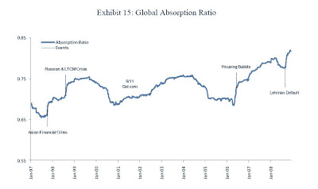

<!--yml
category: 未分类
date: 2024-05-18 00:34:06
-->

# Humble Student of the Markets: A quant's explanation of market fragility

> 来源：[https://humblestudentofthemarkets.blogspot.com/2010/04/quants-explanation-of-market-fragility.html#0001-01-01](https://humblestudentofthemarkets.blogspot.com/2010/04/quants-explanation-of-market-fragility.html#0001-01-01)

If you are around in Boston next Tuesday April 20, 2010, at 6:15, Mark Kirtzman is presenting a fascinating

[paper](http://www.qwafafew.org/filestore/download/752)

on how to measure financial system fragility at the QWAFAFEW (Quantitative Work Alliance For Applied Finance, Economics and Wisdom) meeting.

Mark Kritzman is the President and CEO of Windham Capital Management, LLC, Senior Partner of State Street Associates, and teaches a financial engineering course at MIT's Sloan School.

Here is the abstract [emphasis mine]:

> The U. S. government’s failure to provide oversight and prudent regulation of the financial markets, together with excessive risk taking by some financial institutions, pushed the world financial system to the brink of systemic failure in 2008\. As a consequence of this near catastrophe, both regulators and investors have become keenly interested in developing tools for monitoring systemic risk. But this is easier said than done. Securitization, private transacting, and “flexible” accounting prevent us from directly observing the many explicit linkages of financial institutions. As an alternative, we introduce a measure of implied systemic risk called the absorption ratio, which equals the fraction of the total variance of a set of asset returns explained or “absorbed” by a fixed number of eigenvectors. The absorption ratio captures the extent to which markets are unified or tightly coupled. When markets are tightly coupled, they become more fragile in the sense that negative shocks propagate more quickly and broadly than when markets are loosely linked.
> 
> ***We offer persuasive evidence that the absorption ratio effectively captures market fragility***. We show that:
> 
> 1 ***Most significant U.S. stock market drawdowns were preceded by spikes in the absorption ratio***.
> 2 Stock prices, on average, depreciated significantly following spikes in the absorption ratio and, on average, appreciated significantly in the wake of sharp declines in the absorption ratio.
> 3 The absorption ratio was a leading indicator of the U.S. housing market bubble.
> 4 The absorption ratio systematically rose in advance of market turbulence.
> 5 Shifts in the absorption ratio coincided with major global financial crises and tracked changes in independent measures of contagion.

In essence, Kritzman et al have developed a measure of the state of financial fragility:

Based on the above chart, we appear to still be in a very fragile state.

The meeting is at 6:15 at 3rd Floor of the Tennis & Racquet Club, 939 Boylston Street. Boston, MA. RSVP responses to Hugh at QWAFAFEW dot org (note spam protected email address).