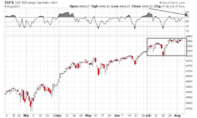

<!--yml
category: 未分类
date: 2024-05-18 01:56:39
-->

# Humble Student of the Markets: A range-bound August?

> 来源：[https://humblestudentofthemarkets.blogspot.com/2021/08/a-range-bound-august.html#0001-01-01](https://humblestudentofthemarkets.blogspot.com/2021/08/a-range-bound-august.html#0001-01-01)

**Preface: Explaining our market timing models** 

We maintain several market timing models, each with differing time horizons. The "

**Ultimate Market Timing Model**

" is a long-term market timing model based on the research outlined in our post, 

[Building the ultimate market timing model](https://humblestudentofthemarkets.com/2016/01/26/building-the-ultimate-market-timing-model/)

. This model tends to generate only a handful of signals each decade.

The 

**Trend Asset Allocation Model**

 is an asset allocation model that applies trend following principles based on the inputs of global stock and commodity price. This model has a shorter time horizon and tends to turn over about 4-6 times a year. The performance and full details of a model portfolio based on the out-of-sample signals of the Trend Model can be found

[here](https://humblestudentofthemarkets.com/trend-model-report-card/)

.

My inner trader uses a 

**trading model**

, which is a blend of price momentum (is the Trend Model becoming more bullish, or bearish?) and overbought/oversold extremes (don't buy if the trend is overbought, and vice versa). Subscribers receive real-time alerts of model changes, and a hypothetical trading record of the email alerts is updated weekly 

[here](https://humblestudentofthemarkets.com/trading-track-record/)

. The hypothetical trading record of the trading model of the real-time alerts that began in March 2016 is shown below.

The latest signals of each model are as follows:

*   Ultimate market timing model: Buy equities*
*   Trend Model signal: Bullish*
*   Trading model: Neutral*

** The performance chart and model readings have been delayed by a week out of respect to our paying subscribers.***Update schedule**

: I generally update model readings on my 

[site](https://humblestudentofthemarkets.com/)

 on weekends and tweet mid-week observations at @humblestudent. Subscribers receive real-time alerts of trading model changes, and a hypothetical trading record of those email alerts is shown 

[here](https://humblestudentofthemarkets.com/trading-track-record/)

.

Subscribers can access the latest signal in real-time 

[here](https://humblestudentofthemarkets.com/my-inner-trader/)

.

**A holding pattern**

Regular readers will know that I have been calling for a sideways holding pattern for the S&P 500\. That remains my base case scenario for the rest of August. Continuing concerns about the Delta variant stalling growth are likely to put downward pressure on risk appetite. On the other hand, an improving EPS growth outlook is putting a floor on stock prices.

To be sure, the S&P 500 made a marginal new high on Friday, but the market's less than enthusiastic reception to Friday's strong jobs report is indicative of the market's internals and makes my case that the stock market is likely to be range-bound. On the surface, the S&P 500 advance. Looking under the hood, the yield curve steepened and cyclical and value stocks rallied, while growth stocks fell.

The full post can be found

[here](https://humblestudentofthemarkets.com/2021/08/08/a-range-bound-august/)

.