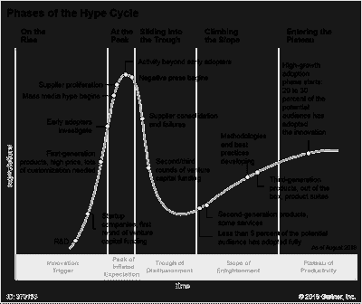

<!--yml
category: 未分类
date: 2024-05-18 01:18:28
-->

# Humble Student of the Markets: A reply to Grantham's AI warning

> 来源：[https://humblestudentofthemarkets.blogspot.com/2024/03/a-reply-to-granthams-ai-warning.html#0001-01-01](https://humblestudentofthemarkets.blogspot.com/2024/03/a-reply-to-granthams-ai-warning.html#0001-01-01)

Well-known value investor Jeremy Grantham recently penned an

[essay](https://www.gmo.com/globalassets/articles/viewpoints/2024/gmo_the-great-paradox-of-the-us-market_3-24.pdf)

titled, “The Great Paradox of the U.S. Market”, in which he warned, “Prices reflect near perfection yet today’s world is particularly imperfect and dangerous”.

In particular, he sounded the alarm over the bubble in AI stocks and cited the

[Gartner Hype Cycle](https://www.gartner.com/en/documents/3887767)

as the main reason for caution:

> But every technological revolution like this – going back from the internet to telephones, railroads, or canals – has been accompanied by early massive hype and a stock market bubble as investors focus on the ultimate possibilities of the technology, pricing most of the very long-term potential immediately into current market prices. And many such revolutions are in the end often as transformative as those early investors could see and sometimes even more so – but only after a substantial period of disappointment during which the initial bubble bursts. Thus, as the most remarkable example of the tech bubble, Amazon led the speculative market, rising 21 times from the beginning of 1998 to its 1999 peak, only to decline by an almost inconceivable 92% from 2000 to 2002, before inheriting half the retail world!

As much as I respect Grantham’s investment insights, he suffers from the value investor problem of being too early and overly reliant on valuation for his views. I reiterate my view that it’s still early in the bull cycle for AI stocks (see

[The Path to Magnificent Exuberance](https://humblestudentofthemarkets.com/2024/02/24/the-path-to-magnificent-exuberance/)

). Here’s why.

The full post can be found

[here](https://humblestudentofthemarkets.com/?p=88773)

.