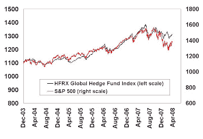

<!--yml
category: 未分类
date: 2024-05-18 01:10:59
-->

# Humble Student of the Markets: A reprieve for hedge funds but challenges remain

> 来源：[https://humblestudentofthemarkets.blogspot.com/2008/04/reprieve-for-hedge-funds-but-challenges.html#0001-01-01](https://humblestudentofthemarkets.blogspot.com/2008/04/reprieve-for-hedge-funds-but-challenges.html#0001-01-01)

We all know the story. The hedge fund industry grew from a handful of funds on a relatively small asset base in the early 1990s to over $2 trillion in assets today. What really spawned the explosive growth were hedge funds’ positive returns which were uncorrelated to the equity market in the post-2000 Tech Bubble bear market.

Since then, the chart below of the HFRX Global Hedge Fund Index and the S&P 500 shows that hedge funds returns have become highly correlated to the S&P 500\. In the current equity market downturn, hedge fund returns has fallen with the S&P 500 but the level of correlation has decreased in the last few months.

**Challenges remain for the hedge fund industry** 

Despite the near term recovery, several challenges remain for the hedge fund industry. Firstly, no doubt many hedge fund investors feel chastened by their experience and caution will be the watchword going forward. In addition, various

[studies](http://humblestudentofthemarkets.blogspot.com/2007/11/what-exactly-are-hedge-funds-hedging.html)

have shown that hedge fund returns can be replicated using factor betas. Larger sponsors that I have spoken with echo the sentiments of Russell Read, chief investment officer of the $225 billion California Public Employees Retirement System: “We can get average market risk very cheaply. We hate paying a performance fee for something we can get very cheaply.”

**The industry is getting more institutional** 

These problems are well known and many commentators have given their views on how the hedge fund business is likely to evolve so let me throw me my two cents worth.

*   The industry needs to move away from a strict absolute return based focus and need to better understand clients and customize solutions
*   Fee compression pressure will intensify as a result

**Understanding the client**
For most of their history, hedge fund managers have marketed themselves as absolute return vehicles, with low correlations to other asset classes. As returns came down, they clung to the low correlation idea but that line is wearing a little thin these days.

Low correlation, in of itself, has limited value. Supposing that I told you that I had access to a fair roulette game, i.e. the house didn’t have an edge. Returns would be uncorrelated to virtually any asset class that you could think of. Would you fund me on a 2% and 20% fee structure?

I believe that the key to surviving and prospering as an alternative asset manager is to learn to listen more to clients and understand how sponsors put together portfolios. You represent a piece of a jigsaw puzzle to them and know what the benefits you offer.

This William Mercer [study](http://www.asrs.state.az.us/web/pdf/financials/20080321_investment_industry_trends.pdf) for the State of Arizona is typical of the new thinking. Mercer suggests, among other things, that sponsor portfolios should be optimized to alpha exposure. Expected alpha, alpha volatility and alpha correlation all matter in how you pick managers. This is part of the move toward the “portable alpha” concept where a sponsor moves towards a liability driven investing framework. He builds a passive portfolio based on that benchmark and then overlays a “portable alpha” on top of the passive portfolio.

**Fee compression pressures to rise** If the concepts in the Mercer study become accepted and widespread then fee compression pressures are likely to rise. Reading between the lines the terms of “expected alpha”, “alpha volatility” and especially “alpha correlation” sound suspiciously like the hedge fund factor betas concept that Bridgewater Associates and others have documented in their studies. The obvious conclusion is you shouldn’t be paying the same level of fees for beta as alpha.

Further fee pressures could come from portable alpha implementation. A sponsor can gain access to a portable alpha in two ways. The high cost route would be to buy it from a hedge fund or a hedge fund of funds. The cheaper way would be to synthetically create an alpha stream by hiring a traditional long-only manager and shorting the manager’s benchmark against the long portfolio. As an example, the sponsor could hire a small cap equity manager and then simultaneously short the Russell 2000 using derivatives. The hedge fund solution would cost 2% and 20% or more. The synthetic alpha solution would run around 0.5% and 1.0% for a reasonably large sponsor.

If you were a pension fund or endowment fund, what you choose?