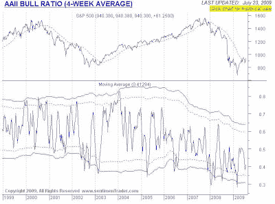

<!--yml
category: 未分类
date: 2024-05-18 00:49:43
-->

# Humble Student of the Markets: A sanity check for bulls

> 来源：[https://humblestudentofthemarkets.blogspot.com/2009/07/sanity-check-for-bulls_24.html#0001-01-01](https://humblestudentofthemarkets.blogspot.com/2009/07/sanity-check-for-bulls_24.html#0001-01-01)

As the S&P 500 roared past resistance at 950 and the calls that

[the recovery is here](http://www.bcaresearch.com/public/story.asp?pre=PRE-20090708.GIF)

increase, a friend of mine suggested a thought experiment for bulls and bears alike.

**A thought experiment**

In the area that you live (if you don’t live in the US, use the United States as the area under consideration), what is your forecast for the following a year from now?

1.  Tax rate, including state, local, property and sales taxes (Up, down or flat)
2.  Short term interest rates (Up, down or flat)
3.  Employment (Up, down or flat)
4.  Savings rate, remember the [new frugality](http://globaleconomicanalysis.blogspot.com/2009/07/for-one-third-of-us-frugality-is-new.html) (Up, down or flat)
5.  Consumer spending and confidence (Up, down or flat)

Do your answers add up to a bullish outlook for the economy? I didn’t think so.

My inner investor tells me to be very cautious at these levels. On the other hand, when short-term traders like Tim Knight, who is bearish, start [posting](http://slopeofhope.com/2009/07/resilience.html) on the theme of “why I am right and the market is wrong” and with [investor sentiment](http://www.sentimentrader.com/subscriber/charts/WEEKLY/SURVEY_AAII_BULLRATIO_4WK.htm) still leaning bearish, my inner trader tells me that this rally may have a bit further to run in the short-term.

Fear the bear, but respect the bull.