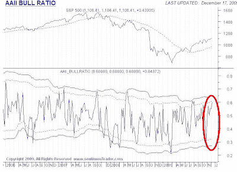

<!--yml
category: 未分类
date: 2024-05-18 00:41:03
-->

# Humble Student of the Markets: A sentimental warning for equity bulls

> 来源：[https://humblestudentofthemarkets.blogspot.com/2009/12/sentimental-warning-for-equity-bulls.html#0001-01-01](https://humblestudentofthemarkets.blogspot.com/2009/12/sentimental-warning-for-equity-bulls.html#0001-01-01)

This is just a quick note, as blogging will be light until the New Year:

The latest reading from

[AAII](http://www.sentimentrader.com/subscriber/charts/WEEKLY/SURVEY_AAII_BULLRATIO.htm)

shows the bull-bear ratio at a bullish extreme, which is contrarian bearish for the market.

Add to that came the news that

[Rydex timers really bullish](http://thetechnicaltakedotcom.blogspot.com/2009/12/rydex-market-timers-this-is-amazing.html)

. These readings serve as a warning for equity bulls that the upside for the market may be limited.