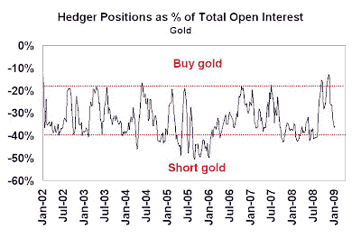

<!--yml
category: 未分类
date: 2024-05-18 00:59:58
-->

# Humble Student of the Markets: A sentimental warning for gold

> 来源：[https://humblestudentofthemarkets.blogspot.com/2009/01/sentimental-warning-for-gold.html#0001-01-01](https://humblestudentofthemarkets.blogspot.com/2009/01/sentimental-warning-for-gold.html#0001-01-01)

With gold having shown a nice bounce in the last couple of months from about 700 and now moving in the mid-800s, sentiment models now show that the advance may be overdone in the short run.

First, via

[Barrons](http://online.barrons.com/article/SB123143761671364971.html)

, Mark Hulbert’s reading of gold timers are show excessive bullishness, which is contrarian bearish

The Commitment of Traders data from the

[CFTC](http://www.cftc.gov/marketreports/commitmentsoftraders/index.htm)

confirms the high level of risk for gold bulls. The chart below shows the net positions as a percentage of open interest of commercials, or hedgers, in gold. While readings are technically in the neutral zone, they are very near levels where a signal to go short is generated.

The chart of the net positions of large speculators, or hedge funds, is mostly a mirror image of the chart of the hedgers’ positions and tells the same story of excessively bullishness, which is contrarian bearish for bullion:

The blogger

[COTs Timer](http://cotstimer.blogspot.com/2009/01/s-500-heading-lower-data.html)

is also cautious:

> My trading setup for gold is in cash for the third week in a row. Large speculator net positioning has climbed gradually since it collapsed in August, when a bullish signal was triggered. It hasn't yet climbed to what my setup considers any kind of bullish extreme. But the other signal I use for this setup - based on the large speculator total open interest - has been on a bearish signal for the past four weeks. This is owing to a 31-percent increase in the large spec total open interest in the past month - typically a sign of downward pressure on the price of gold. So since the two signals don't agree, the overall setup is in cash.

In my past post

[Giving inflation a chance](http://humblestudentofthemarkets.blogspot.com/2008/12/giving-inflation-chance.html)

, I remain of the belief that inflation is destined to rear its head, which will be commodity bullish, but commodity prices are probably in a trading range for the next year or so and need to base before making a sustained advance.

In the short term, it looks like gold prices are facing stiff headwinds.

**Addendum:**

Mebane Faber at

[World Beta](http://worldbeta.blogspot.com/2009/01/update-to-gold-miners-bullion-ratio.html)

has a blog entry about the XAU/Gold ratio being at a historic low. I refer readers to my

[previous post](http://humblestudentofthemarkets.blogspot.com/2008/03/how-cheap-are-gold-stocks-relative-to.html)

on the analysis of gold stock vs. gold ratio and why it might be out of whack, i.e. are production costs at gold companies rising?