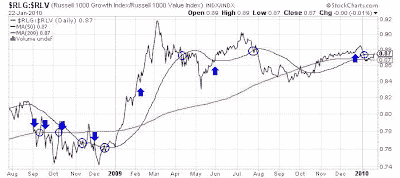
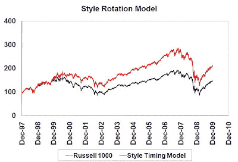
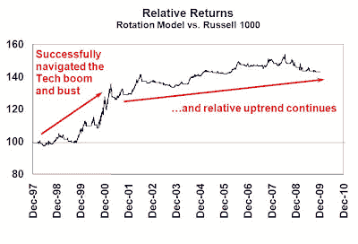

<!--yml
category: 未分类
date: 2024-05-18 00:39:19
-->

# Humble Student of the Markets: A simple style rotation model

> 来源：[https://humblestudentofthemarkets.blogspot.com/2010/01/simple-style-rotation-model.html#0001-01-01](https://humblestudentofthemarkets.blogspot.com/2010/01/simple-style-rotation-model.html#0001-01-01)

Recently one of the more frequent commentators on this site quoted George Soros at The Big Picture blog (thanks

[Keith](http://www.ritholtz.com/blog/2010/01/most-ironically-titled-wall-street-research-report/?utm_source=feedburner&utm_medium=feed&utm_campaign=Feed%3A+TheBigPicture+%28The+Big+Picture%29#comment-250158)

):

> Economic history is a never-ending series of episodes based on falsehoods and lies, not truths. It represents the path to big money. The object is to recognize the trend whose premise is false, ride that trend, and step off before it is discredited.

In other words, the path to profit is to spot a trend early, jump on it and then jump off before it totally blows up. This makes absolute sense and I can illustrate the effectiveness of such models by applying it to the NASDAQ Bubble of the late 1990’s and its aftermath.

**Style rotation with trend following models**

I have written about trend following models

[before](http://humblestudentofthemarkets.blogspot.com/2009/06/golden-cross-on-s-500.html)

and the NASDAQ Bubble example is an ideal application of this class of models. First, I formed a relative performance ratio of the Russell 1000 Growth Index against the Russell 1000 Value Index and apply the following rules:

Buy Russell 1000 Growth Ratio > 50 day MA > 200 day MA (Growth signal)

Buy Russell 1000 Value Ratio < 50 day MA < 200 day MA (Value signal)

Buy Russell 1000 All other conditions (Neutral signal)

The above chart illustrates how the model has performed in the last 18 months. The down arrows are the “buy Value” signals; the up arrows are the “buy Growth” signals and the circles are the neutral signals.

The chart below shows the performance of the style rotation model compared to a buy and hold Russell 1000 Index for the period from December 1997 to December 2009\. A buy and hold strategy of holding the Russell 1000 had a total return of 3.2% from 1997 to 2009, compared to 1.7% for the Russell 1000 Growth Index and 3.9% for the Value Index. The style rotation model’s return was 6.4% over the same period, an outperformance of 3.2%, and it had a lower risk (standard deviation of return of 21.5%) compared to the Russell 1000 (21.7%).

The next chart shows the relative performance line of the style timing model compared to the Russell 1000\. The model successfully navigated the extremely tricky Technology boom and bust period by switching between Value and Growth. Since then, it has had a long record of positive relative returns. It should be noted that the magnitude of relative performance was not as large since 2001 because the lower magnitude of relative returns between growth and value US large capitalization stocks.

**Spotting the next investment bubble?**

In summary, this is a proof of concept of using trend following models to spot long and medium dated trends and manias.

This model was intentionally not optimized as I used the commonly used 50-day and 200-day moving averages to prove my point about the use of trend following models. In addition, there are no trading costs in the simulation, which led to annual turnover of about 16 times a year. Slowing turnover down to about 1.5 times a year cut the alpha of 3.2% by about 1%, indicating that this model can be implemented as part of an investment process.

Trend following models have been around for a long time. The best known is probably The Dow Theory. My

[Inflation-Deflation Timer](http://www.qwestfunds.com/publications/newsletters_pdf/newsletter_november_2009.pdf)

model is also based on trend following principles. The idea is to spot a bandwagon forming and jump on it as more and more investors pile on. The sell signal comes when momentum begins to falter.

Maybe we can use it to spot and profit from the next investment bubble!