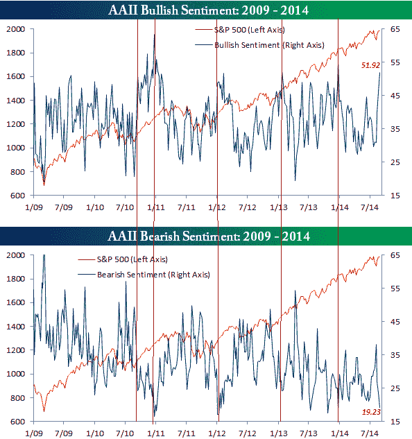

<!--yml
category: 未分类
date: 2024-05-18 03:34:15
-->

# Humble Student of the Markets: A sweet spot for equities

> 来源：[https://humblestudentofthemarkets.blogspot.com/2014/09/a-sweet-spot-for-equities.html#0001-01-01](https://humblestudentofthemarkets.blogspot.com/2014/09/a-sweet-spot-for-equities.html#0001-01-01)

**Weekly Trend Model signal**

Trend Model signal: Risk-on

Direction of last change: Positive

The real-time (not back-tested) signals of the Trend Model is shown in the chart below:

**Expecting the market to grind higher**

The US equity market remains in bull mode on an intermediate term basis. The Trend Model looks at markets globally and conditions have marginally improved from last week, which was at an already "risk-on" signal. The SP 500 remains in an uptrend, with the index staging an upside breakout to new all-time highs.

Despite the disappointing growth outlook and heightened geopolitical risk from Russia-Ukraine, European markets weathered the bad news last week relatively well and remains in a weak uptrend.

Commodity markets were mixed. The broadly-based CRB Index (in black) remains in a downtrend, though it appears to be trying to stage a rally. Industrial commodities, which are even more cyclically sensitive than the CRB, are showing more strength and appears to be undergoing a high-level consolidation.

More encouraging is the bullish engulfing pattern shown by the monthly SPX candlestick chart. This pattern has historically led to further advances in the past.

**Sam Eisenstadt`s bullish call**

The bull case was bolstered by

[Mark Hulbert`s column](http://www.marketwatch.com/story/get-ready-for-sp-500-at-2150-top-market-timer-says-2014-08-27)

 outlining how Sam Eisenstadt remains bullish with an SPX target of 2150 by year-end:

> This incredible bull market, which pushed the SP 500 above 2,000 earlier this week, is still alive and well. By the end of the year, the benchmark index may rise to around 2,150, about 8% higher.
> 
> So says Sam Eisenstadt, who has more successfully called the stock market in recent years than almost every other market timer I can think of — including many who I have featured in this column.
> 
> Eisenstadt, for those of you who don’t know of him, is the former research director at Value Line Inc. Though he retired in 2009, after 63 years at that firm, he continues in retirement to update and refine a complex econometric model that generates six-month forecasts for the SP 500 — and he shares them with inquiring columnists.

Hulbert wrote that one reason Eisenstadt's model is bullish is because of low interest rates:

> Though it is proprietary, he does say that one of the most bullish inputs to his model right now is low interest rates. Since the Federal Reserve has signaled that it could begin raising short-term interest rates in 2015, Eisenstadt’s model could as early as next year start forecasting a less rosy six-month outlook.

However. rate pressure might be less than Hulbert postulates. The latest

[Dallas Fed releases](http://www.dallasfed.org/research/pce/index.cfm)

of the Core PCE and Trimmed Mean PCE inflation rates show that these (Fed's favorite) measures of inflation, are moderating. The one-month Core and Trimmed Mean PCE Inflation Rates had been elevated but they have fallen back in June and July. The more annual figures have either remained steady or stayed level for the past four months:

Low inflation readings from the Fed's favorite inflation gauge has the potential to keep the Fed on hold longer, which is bullish for equities on an intermediate term basis.

**Growth outlook positive**

In addition, the growth outlook remains positive. The latest Q2 GDP report shows a picture of slow and even growth. More importantly for equities,

[Factset](http://www.factset.com/insight/2014/8/earningsinsight_8.29.14#.VAJVxLl0zPZ)

reports that forward EPS estimates continue to climb at a steady rate.

The combination of uptrends in global equities and industrial commodities; a benign interest rate environment and rising EPS growth expectations represent a sweet spot for equities.

**Sentiment models are mixed**

Last week, I called for either a minor pullback or choppy consolidation as the SPX approached the round-number 2000 level (see

[The easy money has been made](http://humblestudentofthemarkets.blogspot.com/2014/08/the-easy-money-has-been-made.html)

). Instead, the SPX staged an upside breakout through 2000 and consolidated in a tight range during the week. As a result, the overbought conditions that I observed last week remain in place.

The near-term overbought condition doesn't necessarily mean a pullback is a foregone conclusion as short-term sentiment model readings are mixed. The latest AAII survey (via

[Bespoke](http://www.bespokeinvest.com/thinkbig/2014/8/28/bullish-sentiment-above-50.html)

) show the percentage of bulls to be above 50 and bears at historical lows - which appear to be a worrisome development. However, these readings are highly volatile and unreliable. As an example, I inserted vertical lines into the Bespoke charts indicating similar extremes in sentiment. While some of these signals were accurate warnings of near-term tops, in other cases the market shrugged off these excesses in the past to advance higher.

We saw a contradictory reading in option sentiment last Thursday, when the put-call ratio spike to an extreme. Such spikes have signaled market rallies in the past. However, previous spikes in the put-call ratio have occurred when the market had been falling, not rising as it had been last week. I therefore interpret last week's put-call ratio as an anomalous reading that could be ignored, despite its bullish implications. One possible explanation for the put-call ratio spike was that traders were seeking protection from negative Russia-Ukraine developments over the long Labor Day weekend - which is a one-time event.

When I see contradictory readings from sentiment models, it's useful to survey what other sentiment readings are showing. Rydex fund flows show a picture of a market that has recovered from a panic with sentiment readings normalizing, but have not moved to the other extreme of a crowded long.

The equity-only put-call ratio (not shown) shows a similar picture of recovery from panic and normalization. I interpret these conditions as a market that could see a minor (1-2%) pullback but the risk of a major correction as being low. The path of least resistance for stocks is still up.

**Bottom line:**

Both my inner investor and inner trader remain bullishly positioned. We are in the middle of a sweet spot for US equity prices. Sit back, relax and enjoy.

*You can also follow any updates that I might have on Twitter at @humblestudent, or subscribe to my blog post updates by email [here](http://www.feedburner.com/fb/a/emailverifySubmit?feedId=2701205&loc=en_US).*