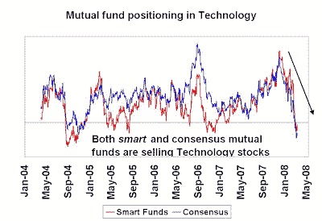

<!--yml
category: 未分类
date: 2024-05-18 01:09:50
-->

# Humble Student of the Markets: A warning for Tech

> 来源：[https://humblestudentofthemarkets.blogspot.com/2008/05/warning-for-tech.html#0001-01-01](https://humblestudentofthemarkets.blogspot.com/2008/05/warning-for-tech.html#0001-01-01)

The chart below shows that both

[smart](http://humblestudentofthemarkets.blogspot.com/2008/02/smart-money-postured-for-recession.html)

and consensus mutual funds are both selling their Technology holdings. In the face of such selling pressure it will be difficult for the sector to make any headway in the medium term.

This concerted selling is occurring just as this Bloomberg story pointed out that

[Bank Stocks Cede Biggest S&P Weighting to Technology](http://www.bloomberg.com/apps/news?pid=20601213&sid=adD4MfoIscYo&)

. Is the story the ultimate contrary indicator?