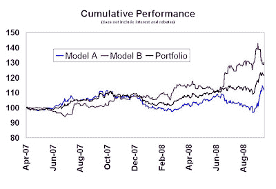
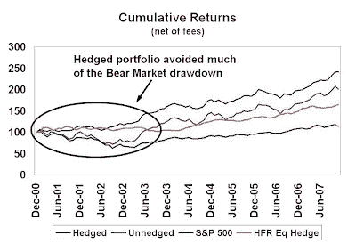

<!--yml
category: 未分类
date: 2024-05-18 01:03:56
-->

# Humble Student of the Markets: Advice for the hedgie walking wounded

> 来源：[https://humblestudentofthemarkets.blogspot.com/2008/10/advice-for-hedgie-walking-wounded.html#0001-01-01](https://humblestudentofthemarkets.blogspot.com/2008/10/advice-for-hedgie-walking-wounded.html#0001-01-01)

As the list on the

[Hedge Fund Implode-O-Meter](http://hf-implode.com/)

grows, my sources show that the average diversified hedge funds were down about 16% YTD (to early October) and they were exhibiting current drawdown of about 17%. Convertible Arbitrage, Equity Long/Short and Event Driven strategies were the worst performing strategies with average current drawdowns of over 20% each. Moreover, there have also been stories floating around that even some large brand name hedge funds are down 10-15% YTD.

**Living to fight another day** 

If you are one of those walking wounded hedge fund managers who survived, congratulations! Periods of negative returns are useful for reflection and analysis of your investment process. If you are undergoing such a review, here is some free simple advice on how to put together a strategy and portfolio:

*   **Diversify, diversify, diversify your factors!** As any baby quant knows, combining uncorrelated factors to put together a strategy makes for more stable results.
*   **Distill your bets and focus on what you are good at.** In other words, don't forget risk control.

I show two examples of these principles below.

**Factor diversification**
I have written about the benefits of factor diversification [before](http://humblestudentofthemarkets.blogspot.com/2008/09/factor-diversification-living-to-fight.html). Here is another example. This was a strategy that I was heavily involved in developing for an equity market neutral portfolio. The chart below shows the out of sample returns of two stock selection models.

Model A is a bottom-up derived multi-factor model with an average holding period of 1-2 months. Even though the process was bottom-up oriented, it acquired decided top-down trend following like characteristics (which was extremely powerful during the backtest period). My solution was to complement Model A with Model B, a short-term price reversal model with an average holding period of 4-5 days. The portfolio returns, which consist of a 67% weight in Model A and 33% in Model B, are less volatile.

The chart below shows the rolling correlation of the two models. Intuitively, one would expect that the trend following/momentum Model A and the price reverting Model B to have a correlation of close to -1\. In fact, their rolling correlations have fluctuated around the zero line over the out of sample period.

**The bottom line:**

The combination of Model A and B made for a far more stable stock selection model, as shown by its positive (though somewhat volatile) returns during a difficult period for hedge funds. The results were updated to 14 Oct 2008\. Portfolio returns were stable in the panic market selloff last week and subsequent rally on Monday.

**Distilling your bets**

I have my reservations about the blind application of Grinold’s

[Fundamental Law of Active Management](http://humblestudentofthemarkets.blogspot.com/2008/02/examining-your-assumptions-fundamental.html)

. Nevertheless, the ideas behind his principles remain true:

In so many words, Grinold said to size your bet according to your skill. If you have no skill, the solution is to eliminate or minimize that bet.

A case in point. About a year ago, I was involved in a risk-control project for a long/short equity manager. He had shown very good returns over the years but results were volatile.

The manager had an eclectic top-down rotation investment process. At any one time, he may latch onto one or more interesting investment themes, e.g. biotech, emerging markets, etc., and make a big bet on any one of those themes. The result was a long/short equity portfolio with a decidedly long bias.

Unfortunately, the portfolio was taking on excessive and unnecessary market risk. While long term returns were excellent, the fund suffered large draw-downs in bear markets. Our solution was to sizably reduce market and common factor risk in the portfolio, as the manager admittedly didn’t have any market timing ability. We used standard risk models, from Barra and from Northfield, to estimate the factor exposures of the portfolio in order to form a hedge and overlay on top of the actual portfolio. The chart below shows the returns of the original portfolio and a portfolio hedged using ETFs, such as ETFs on the S&P 500, Russell 2000, as well as country and sector ETFs.

The table below shows the returns of the simulation. The returns of the hedged portfolio over the simulation period outperformed the original unhedged portfolio by 3%. The hedged portfolio avoided much of the drawdown experienced by the unhedged portfolio and outperformed both the S&P 500 and the HFR Equity Hedge Index. In addition, the hedged portfolio had superior risk characteristics as it avoided much of the drawdown in the bear market after the Tech Bubble top of 2000.

 ****The moral of this story:** Figure out what you are good at, stick to it and eliminate/minimize the other bets in your portfolio.**