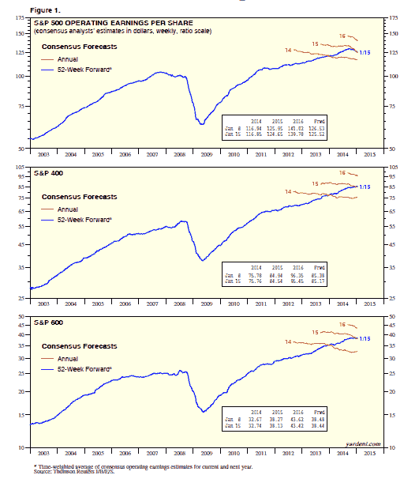
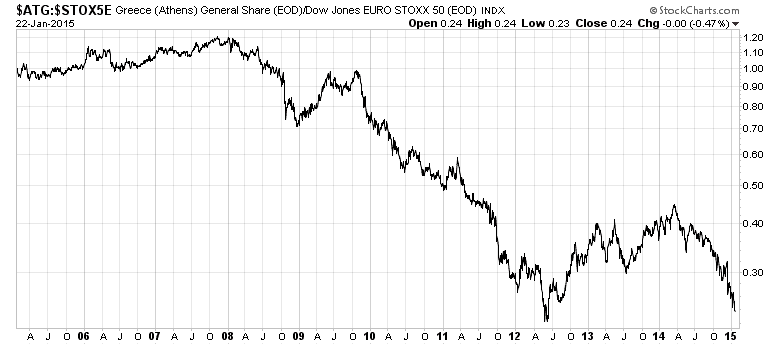

<!--yml
category: 未分类
date: 2024-05-18 03:26:23
-->

# Humble Student of the Markets: All washed up!

> 来源：[https://humblestudentofthemarkets.blogspot.com/2015/01/all-washed-up.html#0001-01-01](https://humblestudentofthemarkets.blogspot.com/2015/01/all-washed-up.html#0001-01-01)

**Trend Model signal summary**

Trend Model signal: Neutral

Trading model: Bullish

The Trend Model is an asset allocation model which applies trend following principles based on the inputs of global stock and commodity price. In essence, it seeks to answer the question, "Is the trend in the global economy expansion (bullish) or contraction (bearish)?"

My inner trader uses the trading model component of the Trend Model seeks to answer the question, "Is the trend getting better (bullish) or worse (bearish)?" The history of actual (not backtested) signals of the trading model are shown by the arrows in the chart below. In addition, I have a trading account which uses the signals of the Trend Model. The last report card of that account can be found 

[here](http://humblestudentofthemarkets.blogspot.com/2015/01/an-excellent-trend-model-report-card.html)

.

**Update schedule**

: I generally update Trend Model readings on 

[my blog](http://humblestudentofthemarkets.blogspot.com/)

 on weekends and tweet any changes during the week at @humblestudent.

**When models fail**

Good investors know their own limitations. As an example, Stan Druckenmiller described himself as being "all washed up", because he doesn`t understand today`s markets and he has therefore lost his edge (via

[Zero Hedge](http://www.zerohedge.com/news/2013-06-14/stanley-druckenmiller-chinas-future-and-investing-new-normal)

):

> It has become harder for me, because the importance of my skills is receding. Part of my advantage, is that my strength is economic forecasting, but that only works in free markets, when markets are smarter than people. That’s how I started. I watched the stock market, how equities reacted to change in levels of economic activity and I could understand how price signals worked and how to forecast them. Today, all these price signals are compromised and I’m seriously questioning whether I have any competitive advantage left.

[Charlie Munger](http://blogs.wsj.com/moneybeat/2014/09/12/a-fireside-chat-with-charlie-munger/)

put it slightly differently, but the underlying message is the same. You have to know your own limitations and manage your investment risk accordingly:

> Confucius said that real knowledge is knowing the extent of one’s ignorance. Aristotle and Socrates said the same thing...
> 
> You have to strike the right balance between competency or knowledge on the one hand and gumption on the other. Too much competency and no gumption is no good. And if you don’t know your circle of competence, then too much gumption will get you killed. But the more you know the limits to your knowledge, the more valuable gumption is.

I am neither a billionaire hedge fund manager nor am I Warren Buffett`s partner, but I recognize that the Trend Model may also be "all washed up". That`s because current market conditions are not conducive to the Trend Model adding very much value. The underlying premise of the model is to spot developing macro trends and jump on them in order to capitalize on the "bandwagon price effect", Unfortunately, there are no trends at the moment.

The chart below of the SPX in the last six months shows how the market environment has changed. Early in this period, the price trend of the market were long-lived. Starting about mid-December, the price swings got shorter and the magnitude of the moves were lower, which change the character of the market from a trending market (shown by the blue lines) to a choppy, whipsaw market (shown by the red lines).

This is an especially challenging environment for trend following models and my inner trader has had to rely more on short-term sentiment and overbought-oversold models for his trading. The markets are experiencing powerful cross-currents, which can be highly treacherous if someone is positioned in the wrong way.

Current conditions are suggestive of a range-bound stock market - at least we start to get more clarity on how fundamentals are developing. 

*Until macro trends start to stabilize, I urge my readers to pay minimal attention to Trend Model readings.*

 This model is "all washed up", at least for the moment.

**The bull case: Global reflation**

To explain my thesis for a range-bound market, I believe that the market is being pushed and pulled by both bullish and bearish forces, neither of which is able to consistently gain the upper hand. The result is a choppy up and down market, depending on which camp is dominant at the moment.

First, let`s start with the bull case. In my post last week (see

[The global deflationary storm is abating](http://humblestudentofthemarkets.blogspot.com/2015/01/the-global-deflationary-storm-is-abating.html)

), I indicated that macro trends were improving from "bad" to "less bad". Indeed, if you tour the global markets this week, that seems to be the case.

Despite the ups and downs of the US equity market in January, the SPX managed to rally above its 50 day moving average this week and it is in a minor uptrend.

On Thursday, the world held its breath and waited for the ECB decision. Mario Draghi did not disappoint with the size and the scope of the QE program and the European markets melted up in response. As the chart below shows, Euro STOXX 50 staged a mult-year upside breakout.

China was also showing signs that it is reflating. Notwithstanding the casino-like atmosphere surrounding the Shanghai market, three of the four of the regional bourses that I monitor staged upside breakouts, indicating better optimism about the regional and global growth outlook. The fourth, which is the South Korean KOSPI, has rallied to test a downtrend line and, given the powerful regional bullish forces at work, may break out next week.

In short, global assets were enjoying a surge in risk appetite and the bulls were clearly in control of the tape.

**The bear case: Earnings, macro and technical headwinds**

Despite the rejoicing over the latest party thrown by Mario "whatever it takes" Draghi, ominous dark clouds were gathering. In the past few months, the US economy had been seen as the engine of growth while non-US economies sputtered, it may be the turn of the US to pause and catch its breath. Cracks are starting to appear in US earnings reports, employment and technically.

One of my biggest concerns has been the corporate progress shown the current Q4 earnings season. As this chart from

[John Butters](http://www.factset.com/websitefiles/PDFs/earningsinsight/earningsinsight_1.23.15)

of Factset shows (annotations in red are mine), forward 12 month EPS continues to fall and past episodes have been highly correlated with stock market weakness:

The reports from Earnings Season, so far, have been mixed. With 90 of the SP 500 having reported, the EPS beat rate was 79%, which is well above historical average, and the sales beat rate came in at 54%, which is slightly below. Analyzing the earnings results further, Butters' analysis showed that the 79% beat rate may not be as good as it sounds for two reasons:

*   **The misses were much worse than the beats.** Even though there were many more earnings beats than misses, the magnitude of the misses were much worse than the beats.
*   **The aggregate earnings growth rate is disappointing**, largely because megacap stocks tended to miss EPS estimates so that, on a capitalization weighted basis, these misses pulled down the aggregate growth rate. The worse culprits were the large cap banks, which virtually all missed Street expectations.

The combination of these effects led to significant downgrades in aggregate SPX forward EPS estimates - which creates a significant headwind for US large cap stocks. I had suggested in the past that the strong USD effect was creating a drag on large cap multi-national companies and mid and small cap stocks, which had better US domestic exposure, was a better place to be (see

[Focus on small caps in 2015](http://humblestudentofthemarkets.blogspot.com/2015/01/focus-on-small-caps-in-2015.html)

). Unfortunately, this may not be the case. Analysis from Ed Yardeni show that forward earnings for small and mid-cap indices are declining as well.

**Large, mid and small cap Consensus EPS**

|  |
| Click to enlarge |

Forward EPS weakness is concentrated in three sectors: Energy, Financials and Consumer Discretionary, as shown by the chart below (via

[Factset](http://www.factset.com/websitefiles/PDFs/earningsinsight/earningsinsight_1.23.15)

). These three sector make up roughly 36% of the weight of the index and it would be difficult for aggregate earnings to make significant headway with such heavyweights dragging it down.

The presence of Consumer Discretionary stocks in the list was a big surprise as I would have expected that this sector would have been a prime beneficiary of lower oil prices. While it's still early in Earning Season, Factset reported that six Consumer Discretionary companies had given earnings guidance, with five negative and one positive.

As well, this

[interview](http://www.bnn.ca/Video/player.aspx?vid=535871&hootPostID=1695cade54f66d2b44339370ad39c50e)

with Ali Dibadj of Bernstein Research indicated that better consumer confidence does not necessarily translate into better growth for Consumer Discretionary companies and that the benefits are much more focused on specific industries, such as restaurants.

In addition to the stubborn headwinds posed by the lack of positive momentum from forward EPS estimates, another nagging worry I have is that employment may be starting to stall. The chart below shows the 4-week moving average of initial claims, which seems to be ticking up. While the rise may just be data noise, it is starting to create a concern for me.

This chart shows stock prices have been highly inversely correlated with initial claims during this recovery. Should initial claims start to rise again, it could spell trouble for the economic growth outlook and therefore stock prices.

The same inverse correlation held up well during past periods when stock prices were largely range-bound until its breakout in 1982:

However, initial claims was not a good explanatory variable for stock prices during the secular bull market (1985-1999):

My third source of bearish angst arise from the nature of the market leadership. The black line in the chart below depicts the relative returns of defensive sectors, Consumer Staples (XLP), Utilities (XLU) and Telecom (IYZ) relative to the SPX. As the chart shows, defensive sectors have begun to outperform and past episodes (which are shaded on the chart) have been associated with either bear markets or corrections.

**What does this all mean?**

When I put this all together, it is suggestive of a choppy range-bound market. While US equities are likely to enjoy the lift from global reflation effects from non-US sources, my base case scenario calls for a rally to test the all-time highs and a failure at about those levels as the bullish non-US tide diminishes as the major US indices face technical resistance. At that time, the bearish forces are likely to assert themselves and push prices downwards.

Tactically, we are likely to see two major events with binary outcomes and possible sources of volatility in the week ahead. This weekend, we have the Greek election. As I write these words, roughly 95% of the votes have been counted and Syriza has won 149 seats, which is just short of the magic 151 seat count required for a majority government. They therefore need a coalition partner, which may imply some softening of their anti-austerity stance.

The 10-year chart below of Greek stocks relative to the Euro STOXX 50 shows that these stocks are already approaching past crisis lows and therefore expectations are already very low. Even a minor positive surprise could cause European stocks to rocket upwards.

Even though SP 500 futures are deeply red at the time of this writing, here are some scenarios to ponder when interpreting the election results:

1.  The Syriza victory is a terrible outcome and creates more uncertainty in the eurozone as the specters of Cyprus, Grexit, etc. rear their ugly heads. (Bearish)
2.  Based on past polling, this is not an entirely unexpected result. Greece`s European partners were ready to negotiate some sort of accommodation in any case, so why worry? (Neutral)
3.  Given the Greek primary budget surplus, either we get (2), which is the status quo, or some sort of compromise where some of that budget surplus is spent, which follows Mario Draghi`s suggestion that Europe needs a little bit of fiscal stimulus. (Bullish)
4.  How often will the market consensus oscillate between (1), (2) and (3)?

In addition, the FOMC is meeting on Tuesday and Wednesday and market participants will be scrutinizing the statement closely to watch for any change in language. While the market expectations derived from the futures market indicates that the first rate hike will occur in the second half of 2015, both

[Tim Duy](http://economistsview.typepad.com/timduy/2015/01/will-the-fed-take-a-dovish-turn-n.html)

and

[Jon Hilsenrath](http://www.wsj.com/articles/fed-officials-on-track-to-raise-short-term-rates-later-in-the-year-1421694861)

have suggested that the Fed is much slower to react and the base case seems to be a June liftoff for interest rates. If that is the case, the Fed could use January FOMC statement to "correct" market perceptions, which could create tremendous market volatility.

[Bloomberg](http://www.businessweek.com/news/2015-01-15/yellen-leaves-greenspan-put-behind-as-she-charts-rate-increase)

recently featured a story that the Yellen Fed, despite its dovish tilt, is philosophically opposed the idea of a "Yellen Put" for the stock market:

> Janet Yellen is leaving the Greenspan “put” behind as she charts the first interest-rate increase since 2006 amid growing financial-market volatility.
> 
> The Federal Reserve chair has signaled she wants to place the economic outlook at the center of policy making, while looking past short-term market fluctuations. To succeed, she must wean investors from the notion, which gained currency under predecessor Alan Greenspan, that the Fed will bail them out if their bets go bad -- just as a put option protects against a drop in stock prices.

Bill Dudley of the New York Fed outlined that approach explicitly and expects greater market volatility ahead. Investors should as well.

> “Let me be clear, there is no Fed equity market put,” William C. Dudley, president of the New York Fed, the central bank’s watchdog on financial markets, said in a Dec. 1 speech in New York. “Because financial-market conditions affect economic activity only slowly over time, this suggests that we should look through short-term volatility.”

My inner investor remains neutrally positioned at policy weight in stocks and bonds in his balanced portfolio. My inner trader is nervously long equities with tight stops and a higher than normal cash position.

**Disclosure:** Long SPXL