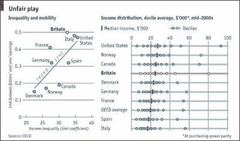

<!--yml
category: 未分类
date: 2024-05-18 00:39:39
-->

# Humble Student of the Markets: American Dream or Fugue?

> 来源：[https://humblestudentofthemarkets.blogspot.com/2010/01/american-dream-or-fugue.html#0001-01-01](https://humblestudentofthemarkets.blogspot.com/2010/01/american-dream-or-fugue.html#0001-01-01)

Recently Barry Ritholz at

[Big Picture](http://www.ritholtz.com/blog/2010/01/george-carlin-on-the-american-dream/)

posted a video of George Carlin’s comment about the plight of the middle class and the illusion of the American Dream.

<param name="movie" value="//www.youtube.com/v/acLW1vFO-2Q&amp;color1=0xb1b1b1&amp;color2=0xcfcfcf&amp;hl=en_US&amp;feature=player_embedded&amp;fs=1"><param name="allowFullScreen" value="true"><param name="allowScriptAccess" value="always"><embed src="//www.youtube.com/v/acLW1vFO-2Q&amp;color1=0xb1b1b1&amp;color2=0xcfcfcf&amp;hl=en_US&amp;feature=player_embedded&amp;fs=1" type="application/x-shockwave-flash" allowfullscreen="true" allowscriptaccess="always">****American Illusion?**

I had posted before about this populist issue in

[Political stability and the middle class](http://humblestudentofthemarkets.blogspot.com/2009/10/political-stability-and-middle-class.html)

. The problem is that the American Dream of unlimited opportunity is that, a dream. I had also

[previously highlighted](http://humblestudentofthemarkets.blogspot.com/2009/04/third-way-in-inflationdeflation-debate.html)

an

[OECD study](http://www.economist.com/world/britain/displaystory.cfm?story_id=12480828)

showing that the United States has a high level of inequality combined with low intergenerational social mobility:

While high inequality, as measured by Gini coefficients, is not in of itself a bad thing. The evidence of low intergenerational social mobility creates a class structure which will ultimately lead to a society’s downfall. After all, if anyone can’t succeed in America just by trying hard, what do you have? An old boys’ club? Economic ossification?

I recently came across a couple of papers that further confirms the low intergenerational mobility effect:

**Get ready for an era of commodity inflation**
Under the current circumstances, the most immediate macro-economic effect of rising inequality is likely to be an era of commodity price inflation in the US. Steve Randy Waldman, who blogs at [Interfluidity](http://www.interfluidity.com/v2/213.html), explains [emphasis mine]:

> Follow the money. Whether an economy generates asset price inflation or consumer price inflation depends on the details of to whom cash flows. In particular, ***cash flows to the relatively wealthy lead to asset price inflation, while cash-flows to the relatively poor lead to consumer price inflation***.
> 
> Why? In Keynesian terms, poorer people have a higher marginal propensity to consume. The relatively poor include people who are cash-flow constrained — that is they cannot purchase what they wish to purchase for lack of green, so their marginal dollar gets immediately applied to the shopping list. Also, poorer people may be different, there may be a correlation between poverty and disorganization, lack of impulse control, inability to defer gratification etc. Think of [Greg Mankiw’s Spenders/Savers model](http://www.economics.harvard.edu/files/faculty/40_aea1.pdf).

At best, the US is becoming another Argentina. At worst, it risks a populist backlash, growing social unrest and a possible uprising that could turn the country upside down. In such a case, the elites can party now, but longer term they will have trouble staying alive to enjoy their wealth.

<param name="movie" value="//www.youtube.com/v/CHreMg49HZs"><param name="allowFullScreen" value="true"><param name="allowScriptAccess" value="always"><embed src="//www.youtube.com/v/CHreMg49HZs" type="application/x-shockwave-flash" allowfullscreen="true" allowscriptaccess="always">**