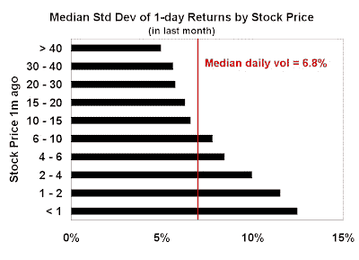

<!--yml
category: 未分类
date: 2024-05-18 01:02:12
-->

# Humble Student of the Markets: An alternate (simple) explanation for market volatility

> 来源：[https://humblestudentofthemarkets.blogspot.com/2008/11/alternate-simple-explanation-for-market.html#0001-01-01](https://humblestudentofthemarkets.blogspot.com/2008/11/alternate-simple-explanation-for-market.html#0001-01-01)

Recently, there have been many articles referring to the equity market’s volatility.

[Barron’s](http://online.barrons.com/article/SB122731156668449361.html)

reported that daily volatility is approaching 1929 levels.

[Bespoke](http://bespokeinvest.typepad.com/bespoke/2008/11/the-most-volatile-market-ever.html)

reported that the recent average daily swing for the S&P 500 is now an astounding 3.8%! Floyd Norris

[blogs](http://norris.blogs.nytimes.com/2008/11/24/wild-days/)

that:

> We have just completed two consecutive trading days when the Standard & Poor’s 500-stock index rose more than 6 percent each day — the first time that happened since 1933\. They followed the first two consecutive 6 percent declines since 1933.
> 
> For the four days, the S.& P. is down 0.9 percent. We may not be accomplishing much, but it sure is a lot of fun.

In this environment, VaR and other risk control estimates all go out the window.

**Why is the market so volatile?**

There are many explanations for this volatility. The most obvious one is the macroeconomic uncertainty that grips the financial markets. I have

[noted](http://humblestudentofthemarkets.blogspot.com/2008/10/does-market-bottom-in-1q2q-2009.html)

that many hedge funds have gone to cash for the remainder of the year. Given the decrease in “fast money” trading and the lack of conviction by other market participants, it is not surprising that daily volatility has risen.

Other analysts have suggested more esoteric explanations. Some have turned from the equilibrium models used by many economics to

[agent based models](http://www.nytimes.com/2008/10/01/opinion/01buchanan.html?_r=3&pagewanted=2&pagewanted=all&oref=slogin)

to explain the swings int the market. Others have modeled stock market volatility using

[predator-prey models](http://arxiv.org/abs/0810.4844)

. (

*Yeah - The early bird gets the worm, but does the early worm get eaten?*

)

**A simpler contributing factor: low stock price** 

No doubt there is some element of truth in all of these explanations. I would like to suggest a far simpler contributing factor to this market volatility: lower stock price.

Bespoke recently

[reported](http://bespokeinvest.typepad.com/bespoke/2008/11/stocks-over-100-and-under-10.html)

that the number of high priced stocks and low priced stocks are at levels seen at the last market bottom in 2002, no doubt a result of the market's severe downdraft. While this market decline creates a far larger universe of

[Phoenix](http://humblestudentofthemarkets.blogspot.com/2008/05/waiting-for-ride-on-phoenix.html)

candidates, the lower price per share of stocks also contributes to increased volatility.

The chart below shows the median standard deviation of one-day returns in the past month for the components of the Russell 3000, categorized by stock price. As you can see, as the per share prices of stocks fall, volatility increases monotonically. Though not shown in the chart, I found that this effect can be seen whether you measure volatility using the standard deviation of daily returns, average daily percentage swings, or the difference between daily high and low.

With the shares of such venerable names such as GM and C are trading at low to mid single-digits, it’s no wonder we are seeing huge jumps in daily swings.