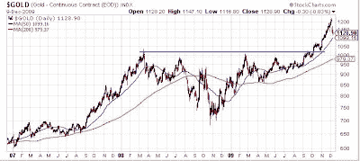
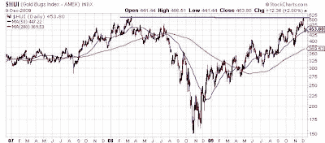
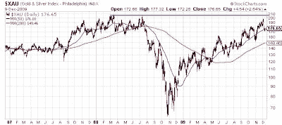
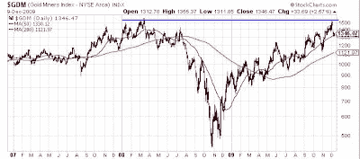

<!--yml
category: 未分类
date: 2024-05-18 00:41:41
-->

# Humble Student of the Markets: An embarassing question for gold bugs

> 来源：[https://humblestudentofthemarkets.blogspot.com/2009/12/embarassing-question-for-gold-bugs.html#0001-01-01](https://humblestudentofthemarkets.blogspot.com/2009/12/embarassing-question-for-gold-bugs.html#0001-01-01)

Here is an embarrassing question for gold bugs. The chart below shows that price of gold decisively moved to all-time highs in early October, notwithstanding the recent pullback:

Meanwhile, the Amex Gold Bugs Index (HUI) barely challenged its old highs. What happened to the thesis that gold stocks are a levered play on the price of gold?

In case you thought I was cherry picking gold stock indices, the failure to make new highs is not exclusive to HUI, just look at XAU:

…and GDM, which is the base index for the GDX gold stock ETF:

Barry Sargent, writing at

[Mineweb](http://www.mineweb.com/mineweb/view/mineweb/en/page33?oid=94157&sn=Detail)

, attributes the poor performance to the negative cash flows generated by the major gold miners:

> Since the start of 2007 (and excluding the fourth quarter of 2009), eight of the world's Tier I gold stocks - AngloGold Ashanti, Barrick, Goldcorp, Newmont, Yamana, Kinross, Harmony, and Gold Fields - have generated negative free cash flow of USD 3.2bn (for the first nine months of this year, in line with rising bullion prices, generation of free cash flow has been positive to the tune of USD 1.1bn).

I believe that the story is simpler than that. I showed before that gold mines can be modeled as a series of call options on the gold price and production costs are rising at the major mining companies. Who knows, maybe the era of peak gold has arrived (see articles

[here](http://europe.theoildrum.com/node/5989)

and

[here](http://europe.theoildrum.com/node/5995)

).

I

[posted](http://humblestudentofthemarkets.blogspot.com/2009/03/market-valuing-gold-stocks-on-cash-flow.html)

on this topic before and got a lot of hate mail for it. Now it’s time to revisit that issue again. For gold bulls who insist on a levered play on bullion, I would rather buy a long-dated deep in the money call option on gold than holding gold stocks.

Fool me once, shame on you. Fool me twice, shame on me.

You have been warned more than once. Gold bugs have no one else to blame if they underperform if there is another upleg in gold prices.