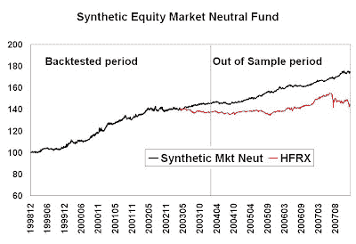

<!--yml
category: 未分类
date: 2024-05-18 01:13:52
-->

# Humble Student of the Markets: An idiot's equity market neutral fund

> 来源：[https://humblestudentofthemarkets.blogspot.com/2008/02/idiots-equity-market-neutral-fund.html#0001-01-01](https://humblestudentofthemarkets.blogspot.com/2008/02/idiots-equity-market-neutral-fund.html#0001-01-01)

Here is a simple way of do-it-yourself way of making an equity market neutral fund without having to pay the big fees:

1.  Buy the top large cap Growth and Value equity funds, as ranked by Morningstar
2.  The funds must be no-load mutual funds, have assets of at least a billion dollars and expense ratios less than 1%
3.  Short the S&P 500 Spyder (SPY) against the portfolio
4.  Re-balance the dollar amounts allocated to the funds monthly and re-balance the fund components annually

For the period from December 1998 to Janaury 2008 the synthetic equity market neutral portfolio showed a very respectable annualized return of 6.4% (after fees) and a Sharpe ratio of 0.9\. Comparing to the HFRX Equity Market Neutral Index using that index's inception date of March 2002, this portfolio returned 4.5% vs. the HFRX return of 0.6%.

I have been running this simple portfolio out of sample for since December 2003 and the results are similar to the in-sample results. In 2007, the synthetic market neutral portfolio also beat HFRX with 6.8% to 3.4%.

Sometimes the simple solutions are the best.