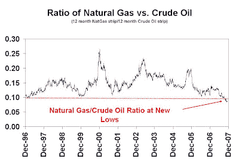
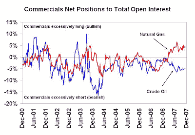

<!--yml
category: 未分类
date: 2024-05-18 01:15:45
-->

# Humble Student of the Markets: An interesting Oil and NatGas divergence

> 来源：[https://humblestudentofthemarkets.blogspot.com/2007/12/interesting-oil-and-natgas-divergence.html#0001-01-01](https://humblestudentofthemarkets.blogspot.com/2007/12/interesting-oil-and-natgas-divergence.html#0001-01-01)

Natural gas hasn’t followed the rally of crude oil. Even as crude oil approached $100 natural gas languished in the $7-8 range, compared to the highs of $14-16 seen in late 2005\. The accompanying change shows the ratio of the price of natural gas to crude oil futures. I have used the 12-month strip as the reference prices (1/12th the front month + 1/12th the 2nd month + … + 1/12th the 12 month future) as natural gas prices can be seasonal. The chart shows that natural gas prices are probing new lows against oil prices.

A look at the Commitment of Traders data from the

[CFTC](http://www.cftc.gov/marketreports/commitmentsoftraders/index.htm)

shows a very different kind of story. Commercial traders, who are usually thought of as the “smart money”, are excessively long natural gas and giving a bullish signal. On the other hand, the signal from the COT data for crude oil can be best described as neutral.

As a former trader I can attest that all these fundamental and sentiment signals don’t matter until they matter.

[Others](http://www.cotstimer.blogspot.com/)

have traded successfully on COT data but I have found them problematical as a timing tool. These conditions have persisted for several weeks. Just because these conditions are at extremes doesn’t mean that they can’t get stretched further.

In future posts I will examine other interesting divergences in the energy and energy related markets.