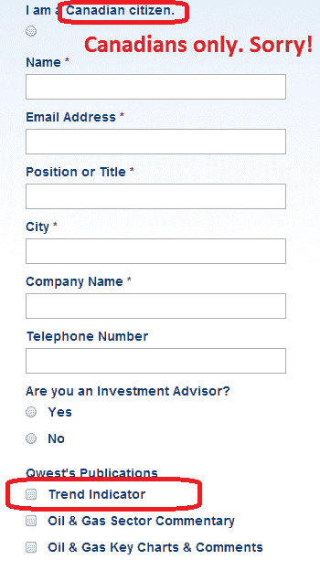

<!--yml
category: 未分类
date: 2024-05-18 03:37:26
-->

# Humble Student of the Markets: An intriguing Trend Model interim report card

> 来源：[https://humblestudentofthemarkets.blogspot.com/2014/07/an-intriguing-trend-model-interim.html#0001-01-01](https://humblestudentofthemarkets.blogspot.com/2014/07/an-intriguing-trend-model-interim.html#0001-01-01)

***Let me start this post with the disclaimer that I have nothing to sell anyone. Moreover, I am not in a position to manage anyone`s money based on the investment strategy that I am about to describe.***

 (If nominated, I will not run. If elected, I will not serve.)

This is an interim report card on my Trend Model, which I haven`t written about for quite some time. For readers who are unfamiliar with my Trend Model, it is a market timing, or asset allocation, model which uses trend following techniques as applied to commodity and global stock market prices to generates a composite Risk-On/Risk-Off signal (risk-on, risk-off or neutral).

**Intriguing signal results**

We have been writing a weekly report showing the signals of the Trend Model since 2010\. To communicate the strength of the signal, We used a dial to graphically represent the Trend Model`s output. If the risk-on signal strengthens, the dial would move to the right and if it weakens, it would move to the left.

A funny thing happened as we ran this model in real-time. While the Trend Model was relatively effective at showing risk friendly and unfriendly environments, we noticed that the model was much better at turning points. The chart below shows the real-time (not back-tested) changes in the

***direction***

of the signal, which are indicated by the arrows, overlaid on top of a chart of the SP 500\. You can think of the green up arrows, which occurred when the trend signal changed from negative to positive, as buy signals and the red down arrows, which occurred when the trend signal changed from positive to negative, as sell signals.

**A proof of concept**

While the results from the above chart, which represents paper trading, is always interesting, there is no substitute for actual performance. As a proof of concept, I started to manage a small (about 100K) account that traded long, inverse and leveraged ETFs on the major US market averages. Trading decisions were based on Trend Model signals combined with some short-term sentiment indicators. The inception date of the account was September 30, 2013 and the chart below represents a preliminary report card of the account.

When evaluating the performance of this trading account, keep in mind that this is intended to be an absolute return vehicle. While I do show the SPY total return, which includes re-invested dividends, for illustrative purposes, the SP 500 is not an appropriate benchmark for measuring the performance of this modeling technique.

**Promising preliminary results**

I offer the following observations based on nine months of actual performance:

*   **Returns were roughly in line with what I expected given the history of the signals**. A nine-month return of 13.8% for an absolute return vehicle is promising, but the jury is still out on this trading system. While the return pattern was a little choppy, a quick-and-dirty risk-adjusted return ratio of return (13.8%) divided by maximum draw-down (6.7%) came to 2.1 and that is quite acceptable by most hedge fund standards.
*   **The low correlation shown by this trading strategy to the returns of major asset classes was also promising**. The correlation of the account returns for the nine-month test period to equities (SPY) was 0.13 and -0.10 to bonds (AGG). These results suggest that the addition of such a strategy, in measured doses, can raise the risk-adjusted return of a well-diversified portfolio.
*   **The weakness of all trend following models is the risk of whipsaw when the market is not trending**. When markets are choppy, trend following models will experience sub-par returns. That seems to be what happened in 1Q 2014.
*   **The real test for this trading strategy has yet to come as stock prices have largely gone in a single direction**. Stock prices have been more or less in an uptrend all of the test period that began  in September 2014\. The acid test of this trading strategy will occur when the market corrects. I will be watching carefully how it behaves before, during and after the correction.

This is a high frequency trading model that is not suitable for everyone. So far, the observed monthly turnover was approximately 175% per month, or over 2000% per year - definitely not for the faint of heart.

Nevertheless, the results are promising so far. I plan on reporting on the results later in the year when it has a one-year track record. Hopefully, the stock market will have hit an air pocket by then and we can observe the behavior of this model during a corrective period.

If there is sufficient interest in the future, we will contemplate offering an investment offering based on the Trend Model, but not without the proper offering documents and risk disclosures, etc. In the meantime, Canadians who are interested in subscribing to the weekly Trend Model commentary can do so by clicking

[here](http://qwestfunds.com/subscription-form/)

. Just selected "Trend Indicator" as the report you want to receive.

*Cam Hui is a portfolio manager at [Qwest Investment Fund Management Ltd.](http://www.qwestfunds.com/) (“Qwest”). The opinions and any recommendations expressed in the blog are those of the author and do not reflect the opinions and recommendations of Qwest. Qwest reviews Mr. Hui’s blog to ensure it is connected with Mr. Hui’s obligation to deal fairly, honestly and in good faith with the blog’s readers.”

None of the information or opinions expressed in this blog constitutes a solicitation for the purchase or sale of any security or other instrument. Nothing in this blog constitutes investment advice and any recommendations that may be contained herein have not been based upon a consideration of the investment objectives, financial situation or particular needs of any specific recipient. Any purchase or sale activity in any securities or other instrument should be based upon your own analysis and conclusions. Past performance is not indicative of future results. Either Qwest or I may hold or control long or short positions in the securities or instruments mentioned.*