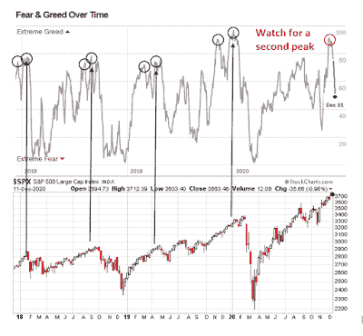

<!--yml
category: 未分类
date: 2024-05-18 02:06:29
-->

# Humble Student of the Markets: An update on the seasonal FOMO stampede

> 来源：[https://humblestudentofthemarkets.blogspot.com/2021/01/an-update-on-seasonal-fomo-stampede.html#0001-01-01](https://humblestudentofthemarkets.blogspot.com/2021/01/an-update-on-seasonal-fomo-stampede.html#0001-01-01)

**Preface: Explaining our market timing models**

We maintain several market timing models, each with differing time horizons. The "

**Ultimate Market Timing Model**

" is a long-term market timing model based on the research outlined in our post,

[Building the ultimate market timing model](https://humblestudentofthemarkets.com/2016/01/26/building-the-ultimate-market-timing-model/)

. This model tends to generate only a handful of signals each decade.

The

**Trend Asset Allocation Model**

is an asset allocation model that applies trend following principles based on the inputs of global stock and commodity price. This model has a shorter time horizon and tends to turn over about 4-6 times a year. In essence, it seeks to answer the question, "Is the trend in the global economy expansion (bullish) or contraction (bearish)?"

My inner trader uses a

**trading model**

, which is a blend of price momentum (is the Trend Model becoming more bullish, or bearish?) and overbought/oversold extremes (don't buy if the trend is overbought, and vice versa). Subscribers receive real-time alerts of model changes, and a hypothetical trading record of the email alerts are updated weekly

[here](https://humblestudentofthemarkets.com/trading-track-record/)

. The hypothetical trading record of the trading model of the real-time alerts that began in March 2016 is shown below.

The latest signals of each model are as follows:

*   Ultimate market timing model: Buy equities*
*   Trend Model signal: Bullish*
*   Trading model: Bullish*

** The performance chart and model readings have been delayed by a week out of respect to our paying subscribers.* **Update schedule**

: I generally update model readings on my 

[site](https://humblestudentofthemarkets.com/)

 on weekends and tweet mid-week observations at @humblestudent. Subscribers receive real-time alerts of trading model changes, and a hypothetical trading record of those email alerts is shown

[here](https://humblestudentofthemarkets.com/trading-track-record/)

.

Subscribers can access the latest signal in real-time 

[here](https://humblestudentofthemarkets.com/my-inner-trader/)

.

**No stampede**

Three weeks ago, I rhetorically asked if the market would surge higher during a seasonally favorable time of year (see

[Time for another year-end FOMO stampede?](https://humblestudentofthemarkets.com/2020/12/12/time-for-another-year-end-fomo-stampede/)

). I observed that "the Fear & Greed Index followed a pattern of an initial high, a retreat, followed by a higher high either coincident or ahead of the ultimate stock market peak." (Warning, small sample size of n=4).

Since I wrote those words, the S&P 500 rose a respectable 2.5% while the 

[Fear and Greed Index](https://money.cnn.com/data/fear-and-greed/)

 fell to 51\. It's not exactly a stampede. The main question is: "Will Fear and Greed exhibit a second peak before the actual market peak?"

The full post can be found

[here](https://humblestudentofthemarkets.com/2021/01/03/an-update-on-the-fomo-seasonal-stampede/)

.