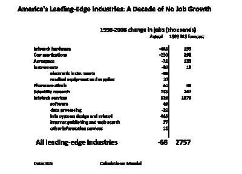
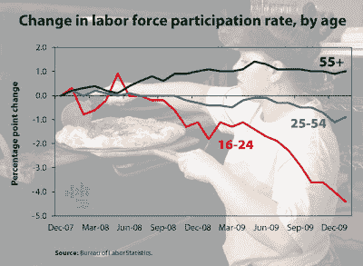

<!--yml
category: 未分类
date: 2024-05-18 00:36:24
-->

# Humble Student of the Markets: Another step down the road to Argentina

> 来源：[https://humblestudentofthemarkets.blogspot.com/2010/03/another-step-down-road-to-argentina.html#0001-01-01](https://humblestudentofthemarkets.blogspot.com/2010/03/another-step-down-road-to-argentina.html#0001-01-01)

I have written

[before](http://www.qwestfunds.com/publications/newsletters_pdf/newsletter_september_2009.pdf)

about how U.S. may be making the same mistakes as Argentina did a century ago. Now there is one more worrying data point that

[America is going down the Argentina road](http://fabiusmaximus.wordpress.com/2010/03/04/argentina/)

.

The

[New York Times](http://www.nytimes.com/2010/03/18/business/global/18research.html)

is reporting that American firms are offshoring high tech research jobs to China. As an example, Applied Materials built its biggest lab in China, and Chief Technology Officer Mark R. Pinto plans to move there. Another disturbing sign of the loss of competitiveness: Some US companies are licensing technology from Chinese developers for use in the US.

**Is America innovating?**

Michael Mandel, former chief economist for BusinessWeek magazine, recently

[wrote](http://innovationandgrowth.wordpress.com/2010/02/22/why-isnt-the-innovation-economy-creating-more-jobs-part-i/)

that “Innovation makes up the main comparative advantage for the U.S., since we can’t compete on cost with lower-wage countries (at least not yet).” Unfortunately, American leading edge industries haven’t been creating jobs.

Policy makers have to get out of their ideological straitjackets if they are to make a significant headway on innovation. Standard macro drivers such as lower tax rates don’t seem to have a significant impact on innovation. In fact, there are [indications](http://www.guardian.co.uk/commentisfree/michaeltomasky/2010/feb/23/usa-useconomy-innovation-states) that higher innovation regions have higher tax rates.

I believe that other factors espoused by [Michael Porter](http://www.amazon.com/Competitive-Advantage-Nations-Michael-Porter/dp/0684841479/ref=sr_1_1?ie=UTF8&s=books&qid=1267375764&sr=8-1), such as industry clustering, infrastructure availability, etc., have a much higher impact on how creative and high value-added industries locate themselves.

**Disaffected youth?**
At the heart of innovation is a country’s education system. The top American universities remain the envy of the world, but [troubling statistics](http://www.epi.org/economic_snapshots/entry/leaving_in_droves/) indicate that youth labor participation rates have been falling.

**Is innovation even the answer?**
Even worse, [Andy Xie](http://english.caing.com/2010-03-15/100126807.html) argues that innovation may not save an economy [emphasis mine]:

> Many economists argue for freer and cheaper economic structure to stimulate innovation. But, ***in the Internet era, innovations rapidly disseminate around the world. It's not clear if innovation benefits can be contained in any country anymore***. For example, even though the United States is more innovative than Europe, it hasn't outperformed by much. Its celebrated prosperity during the Greenspan era turned out to be an old-fashioned bubble, not a reflection of superior innovation.

Andy Xie does have a point. Innovation isn't enough, by itself, to insure success. Even if you build a better mousetrap, the world will not beat a path to your door. To be successful, you need marketing, distribution channels, reliable manufacturing processes, etc. Your resulting wealth also depends on your relative bargaining power within the value chain. We have had this private running joke in our family. Where other parents may have wished for their child to discover the cure for cancer, ours was that our child would commercialize the cure for cancer.

Nevertheless, until the US begins at least reverse itself on the innovation front, the loss of position on the innovation front has to be regarded as long-term negative for the US Dollar and long-term bullish for commodities.