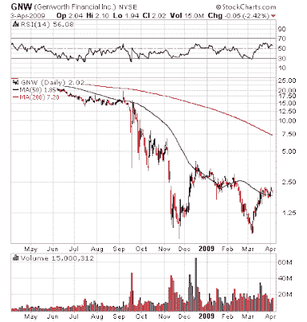

<!--yml
category: 未分类
date: 2024-05-18 00:56:02
-->

# Humble Student of the Markets: April Phoenix update

> 来源：[https://humblestudentofthemarkets.blogspot.com/2009/04/april-phoenix-update.html#0001-01-01](https://humblestudentofthemarkets.blogspot.com/2009/04/april-phoenix-update.html#0001-01-01)

By popular demand, here is the latest list of

[Phoenix](http://humblestudentofthemarkets.blogspot.com/2008/05/waiting-for-ride-on-phoenix.html)

candidates:

> Brandywine Realty Trust (BDN), CapitalSource Inc (CSE), CBL & Associates Properties Inc (CBL), Century Aluminum Co (CENX), Citizens Republic Bancorp Inc (CRBC), Colonial Properties Trust (CLP), Complete Production Services Inc (CPX), Conseco Inc (CNO), Delta Petroleum Corp (DPTR), Developers Diversified Realty Corp (DDR), Domtar Corp (UFS), First Industrial Realty Trust Inc (FR), First Marblehead Corp/The (FMD), Furniture Brands International Inc (FBN), Gannett Co Inc (GCI), Genworth Financial Inc (GNW), Hercules Offshore Inc (HERO), Hovnanian Enterprises Inc (HOV), Huntsman Corp (HUN), ION Geophysical Corp (IO), iStar Financial Inc (SFI), Liz Claiborne Inc (LIZ), Manitowoc Co Inc/The (MTW), MCG Capital Corp (MCGC), MGIC Investment Corp (MTG), MGM Mirage (MGM), Pacific Sunwear Of California (PSUN), Patriot Coal Corp (PCX), Pennsylvania Real Estate Investment Trus (PEI), Petroquest Energy Inc (PQ), Popular Inc (BPOP), Quiksilver Inc (ZQK), Rex Energy Corp (REXX), Saks Inc (SKS), Sterling Financial Corp/WA (STSA), Sunstone Hotel Investors Inc (SHO), THQ Inc (THQI), Webster Financial Corp (WBS) and Zale Corp (ZLC).

There are 39 stocks on the list, compared to 58 stocks in the

[last update on March 11](http://humblestudentofthemarkets.blogspot.com/2009/03/phoenix-strategy-update.html)

. As a reminder, the Phoenix stock list consists stocks that pass the following criteria:

*   Stock price between $1 and $5 (low-priced stocks)
*   Down at least 80% from a year ago (beaten up)
*   Market cap of $100 million or more (were once "real" companies)
*   Net insider buying in the last six months (some downside protection from insider activity)

Of the 39 stocks on the list, 18 stocks, or 46%, show a bottoming technical pattern, an [indicator](http://humblestudentofthemarkets.blogspot.com/2009/03/how-to-spot-bottom.html) that I watch for as a measure of overall market's technical condition. Genworth Financial (GNW), which is showing a double bottom, is a good example:

The portion showing the bottoming pattern is largely unchanged from my

[last update](http://humblestudentofthemarkets.blogspot.com/2009/03/how-to-spot-bottom.html)

, which had 43% of the list showing this pattern.

**Still too early to buy Phoenix** 

Given these readings and the fact that the major market averages appear to be

[overbought](http://bespokeinvest.typepad.com/bespoke/2009/04/sp-500-near-overbought-levels.html)

, my best guess is that we are witnessing a bear market rally that is on its last legs. I would be very cautious about committing funds to a Phoenix strategy in the short term.