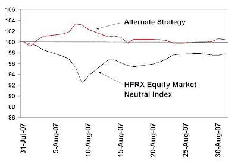

<!--yml
category: 未分类
date: 2024-05-18 01:14:02
-->

# Humble Student of the Markets: Are Quants victims of their own success?

> 来源：[https://humblestudentofthemarkets.blogspot.com/2008/01/are-quants-victims-of-their-own-success.html#0001-01-01](https://humblestudentofthemarkets.blogspot.com/2008/01/are-quants-victims-of-their-own-success.html#0001-01-01)

***Are there too many quants?***

In the past few months I have repeatedly heard similar versions of the same complaint:

> You guys are all using Compustat, IBES, First Call, Barra, etc. and building the same models and coming to the same solutions….

In August 2007, equity quant fund performance blew up to what were then called 10 and 20 sigma (standard deviation) events. I call it being in a

***crowded trade***

. Andy Lo wrote a

[paper](http://web.mit.edu/alo/www/Papers/august07_2.pdf)

suggesting that it was:

> ...initiated by the rapid unwind of one or more sizable quantitative equity market-neutral portfolios…likely the result of a forced liquidation by a multi-strategy fund or proprietary-trading desk.

in other words, they were was in a crowded trade and tried to get out at the same time.

**Be an Architect, not an Engineer**

The easy availability tools such as MarketQA, Barra and Matlab, just to name a few, have vastly brought down the cost of entry into quantitative investing. The price of that low cost of entry is that many quants are framing the problem of alpha generation and risk control in similar ways. Given the large allocation of funds to quantitative equity investing, the events of August 2007 were inevitable.

Recently a career ad for a quant asked for an “architect, not an engineer”. I have referred to this in the past as

[combining quantitative skills with market knowledge and experience](http://humblestudentofthemarkets.blogspot.com/2007/12/surviving-and-prospering-as-quant.html)

, others have called it “domain knowledge”.

The advantage of quantitative investing is the ability of a computer to systematically process a large amount of information. Your advantage as a human being and an experienced investor is your knowledge of the markets. A smart way of being a good quant is to combine those two elements by using the computer to model the way fundamental investors think about the markets.

As an example, the chart below shows the returns of an alternate quantitatively driven US equity market neutral portfolio during August 2007\. The underlying model is not the Holy Grail and has its limitations, but it is still possible to build quant models that don’t put you in a crowded trade.

