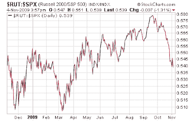
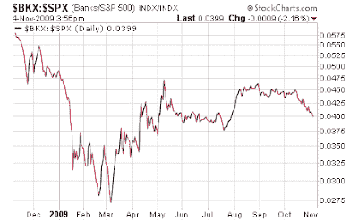

<!--yml
category: 未分类
date: 2024-05-18 00:43:35
-->

# Humble Student of the Markets: Are the bulls exhausted?

> 来源：[https://humblestudentofthemarkets.blogspot.com/2009/11/are-bulls-exhausted.html#0001-01-01](https://humblestudentofthemarkets.blogspot.com/2009/11/are-bulls-exhausted.html#0001-01-01)

What more do the stock market bulls want? The latest statement is dovish as you can possibly ask from the Fed [emphasis mine]:

> The Committee will maintain the target range for the federal funds rate at 0 to 1/4 percent and continues to anticipate that economic conditions, including low rates of resource utilization, subdued inflation trends, and stable inflation expectations, are ***likely to warrant exceptionally low levels of the federal funds rate for an extended period*.**

Despite the tone of the FOMC statement, the stock market rolled over in the last hour of trading. The leaders of this rally, such as small caps, are now leading the charge to the downside relative to the S&P 500:

Similarly, the banks, as measured by BKX, is showing a similar pattern:

You can tell the tone of a market in the way it reacts to news. This reaction tells me that the bulls are exhausted and the path of least resistance is down.