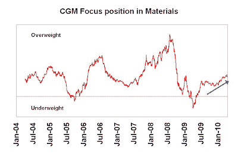
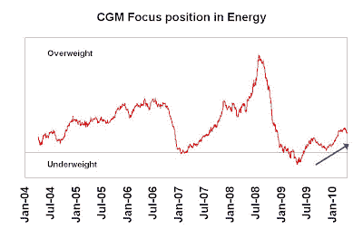
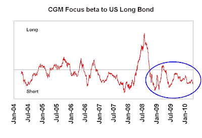

<!--yml
category: 未分类
date: 2024-05-18 00:33:54
-->

# Humble Student of the Markets: Back to an inflation bet

> 来源：[https://humblestudentofthemarkets.blogspot.com/2010/04/back-to-inflation-bet.html#0001-01-01](https://humblestudentofthemarkets.blogspot.com/2010/04/back-to-inflation-bet.html#0001-01-01)

I recently

[pointed out](http://humblestudentofthemarkets.blogspot.com/2010/04/too-hot-too-cold-or-just-right.html)

that real-time indicators are showing that the economy is rebounding. As the markets have rallied from the reflation trade, my

[inflation-deflation timer model](http://www.qwestfunds.com/publications/newsletters_pdf/newsletter_november_2009.pdf)

moved from a "neutral" reading to an "inflation" reading last week, which would move the model portfolio from equities to a basket of commodities (see report

[here](http://www.qwestfunds.com/publications/trend_watch_pdf/april_9_issue.pdf)

).

**Ken Heebner buying inflation too**

The model appears to be in good company as I see that

[Ken Heebner](http://performance.morningstar.com/fund/performance-return.action?Country=USA&Symbol=CGMFX)

has also put on an inflation bet in his portfolio. Heebner is a portfolio manager with a terrific long term record (though he has struggled in the last couple of years). He has a "swing for the fences" style and tends to make big top-down bets.

I reverse engineered his macro bets and my analysis shows that Heebner has positioned his CGM Focus Fund portfolio for a commodity inflation environment. He is at an overweight position in Materials:

...and Energy:

By contrast, he is underweight in Utilities:

...and has an implicit short position in the US long bond:

Long commodities, short bonds and interest sensitives - that sounds like a commodity inflation bet to me.