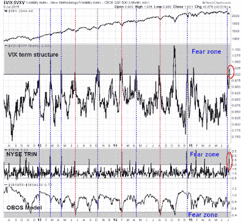

<!--yml
category: 未分类
date: 2024-05-18 03:18:37
-->

# Humble Student of the Markets: Back to our regular programming (of 2011)

> 来源：[https://humblestudentofthemarkets.blogspot.com/2015/07/back-to-our-regular-programming-of-2011.html#0001-01-01](https://humblestudentofthemarkets.blogspot.com/2015/07/back-to-our-regular-programming-of-2011.html#0001-01-01)

**Trend Model signal summary**

Trend Model signal: Risk-off

Trading model: Bullish (upgrade)

The Trend Model is an asset allocation model which applies trend following principles based on the inputs of global stock and commodity price. In essence, it seeks to answer the question, "Is the trend in the global economy expansion (bullish) or contraction (bearish)?"

My inner trader uses the trading model component of the Trend Model seeks to answer the question, "Is the trend getting better (bullish) or worse (bearish)?" The history of actual out-of-sample (not backtested) signals of the trading model are shown by the arrows in the chart below. In addition, I have a trading account which uses the signals of the Trend Model. The last report card of that account can be found

[here](http://humblestudentofthemarkets.blogspot.com/2015/07/june-trend-model-report-card-back-on.html)

.

**Trend Model signal history**

**Update schedule**

: I generally update Trend Model readings on

[my blog](http://humblestudentofthemarkets.blogspot.com/)

on weekends and tweet any changes during the week at @humblestudent.

**Short term bullish, but...**

Last week, I suggested that 2011 served as a template for near-term market action, but I wasn't sure what part of 2011 we were in. Were we in the initial stages of the decline (the SPX is only down -4% peak-to-trough in 2015), or in the choppy part after the fall in the summer of 2011? Whatever the outcome, the stock market is likely to be volatile going forward (see

[Getting set for the market of 2011](http://humblestudentofthemarkets.blogspot.com/2015/07/getting-set-for-market-of-2011.html)

).

Indeed, we saw more volatility last week, but at the end of the day it appeared that the US equity market had seen the conditions for a short-term bottom (see my last post

[Another short-term bottom?](http://humblestudentofthemarkets.blogspot.com/2015/07/another-short-term-bottom.html)

). While I am cautiously optimistic about the upward near-term path for stock prices and the trading model flipped from "bearish" to "bullish", I am less certain about the duration and magnitude of the next bull move. Depending on how the markets react to events, the trading signal could easily change back to "bearish" next week.

Let me summarize the bull and bear cases.

**Bull case: Falling tail-risk + Continued US economic growth**

The bull case can be summarized quite easily this way. Tail-risk is diminishing and the US economy looks fine. So chill!

In the last couple of weeks, the market has been mesmerized by the market crash in China and the drama over Greece. In both cases, tail-risk has been falling, though the underlying problems aren't fixed yet.

Despite Beijing's rather heavy-handed attempts at intervention, 

[Bloomberg](http://www.bloomberg.com/news/articles/2015-07-09/the-chinese-stock-meltdown-that-makes-the-greece-saga-look-trivial)

has a great summary of what has been happening in the Chinese stock market:

*   $3.9 trillion in wealth destruction;
*   Over 1400 companies had their trading halted;
*   Shanghai is 5X more volatile than the SPX;
*   $232 billion in margin loans outstanding (and [the market is falling faster than margin loans](http://www.bloomberg.com/news/articles/2015-07-05/china-stock-plunge-leaves-market-more-leveraged-than-ever-before), which indicates further margin selling pressure ahead);
*   $19 billion committed to support the market; 
*   Dual-listed shares are 33% cheaper in Hong Kong, which indicates that market equilibrium prices are below Mainland quoted prices; and
*   90 million retail investors in China feeling the heat.

I had been concerned about two effects of the Chinese stock market crash on US equities. First, could contagion risk leak into global market? The second was the effects of slowing growth on the Chinese and global economy. An examination of the dim sum bond ETF, which are RMB bonds issued in Hong Kong, show that the credit markets were not overly disturbed by what was happening the Chinese stock market. This suggests that contagion risk remains relatively low.

In addition, the immediate economic economic effects of the stock market crash appears to be limited. Here is

[Marketwatch](http://www.marketwatch.com/story/why-the-wealth-effect-from-chinas-market-plunge-is-likely-to-be-limited-2015-07-10)

:

> Although an estimated 80% of Chinese shares are owned by retail investors — ordinary Chinese — less than 7% of the country’s overall population own stocks, based on government figures. And a study by Charles Schwab estimates that just 20% of Chinese household wealth is tied up in stocks. More than half of their wealth is in more liquid cash or bank deposits.
> 
> By contrast, the Federal Reserve estimates that nearly 14% of individual Americans own stocks directly, while a Gallup survey calculates that 55% of Americans own stocks through a variety of investment vehicles such as 401(k)s, pension plans or mutual funds.

No doubt, the household sector will get hurt. However, attempts to quantify the effects amount to no more than 0.5% of GDP growth in a worst case analysis:

> Using common economic assumptions related to the wealth effect and taking into account the smaller influence of the Chinese stock market on the Asian economy as a whole, Barclays estimates that a more severe contraction in equity prices would trim a few tenths off gross domestic product.
> 
> But with China growing about 7% a year it wouldn’t amount to much.
> 
> “This looks to us like an unwelcome but far from insuperable headwind, not a knockout blow,” wrote Michael Gapen, senior economist at Barclays.
> 
> Another study by Bank of America Merrill Lynch predicts up to a 1/2-point reduction in Chinese growth in a worst-case scenario. The firm also pointed out, however, that “cratering Chinese stocks in 2007-08 had little discernible impact” on its own growth or the economies of other countries such as the United States.

As for Greece, events are fast changing even as I write these words. We went into the weekend believing that this would be a make-or-break 48-hours for Greece. Either the creditors accept the latest Greek proposals or there would be an EU-wide discussion of how to effect Grexit in an orderly fashion. In hindsight, such an expectation would have be way too easy for European theatre.

Without going into more excruciating details about what happened on the weekend, consider the motivations of the major players:

*   Alexis Tsipras has capitulated to the creditors' demands and, it would be unthinkable that he would backtrack despite the [additional demands placed on Greece](http://s.kathimerini.gr/resources/article-files/draft1600_final.pdf) after expended the political capital to make the post-referendum U-turn.
*   Angela Merkel does not want to go down in history as the Chancellor to dismantle not only the eurozone and fracture the EU over French and Italian objections about how Greece is being treated. It would therefore be unthinkable that she would push Schaeuble's temporary Grexit plan in the end.
*   The ECB well understands the limits to its political role in the eurozone. With active discussions going on and a possible deal in sight, it would be unthinkable that the ECB Governing Council would take the political decision to pull the plug on the Greek banking system on Monday.

It appears that we will have another typical kick the can down the road European solution, with more drama and summit meetings in the week ahead.

In conclusion, we have seen much bad news endured by the markets in the last couple of weeks and the SPX has reacted by falling and then bouncing off its 200 dma. As  tail-risk from Greece and Chinese stock market related events is diminishing, any downside risk to US equities from these sources of tail-risk is therefore likely to be limited in the near future.

**US fundamental supportive of gains**

The other key ingredient of the bull case is the continued growth seen in the US economy. JP Morgan Asset Management recently wrote that past bear markets had these common features (with my comments in parenthesis):

*   Recession (no sign of a full-blown recession ahead)
*   Commodity spike (you have got to be kidding, commodity spike?)
*   Aggressive Fed tightening (instead we have an ultra cautious Fed)
*   Extreme valuation (valuations are elevated, but not stupidly high)

The latest update from

[John Butters](http://www.factset.com/websitefiles/PDFs/earningsinsight/earningsinsight_7.10.15)

of Factset indicates that, as we stand at the start of another earnings season, forward 12-month EPS estimates continue to rise. As the chart below shows, rising forward EPS has historically been highly correlated with high stock prices (annotations in red are mine):

At the same time, the markets have freaked out and sentiment and breadth readings are at extreme fear levels, which are consistent with short-term bottoms (see 

[Another short-term bottom?](http://humblestudentofthemarkets.blogspot.com/2015/07/another-short-term-bottom.html)

). Two of the components of my Trifecta Bottom Model flashed another buy signal last week and this model has been 100% accurate in the last three years (though less so in more serious bearish episodes of 2010 and 2011).

Looking out the next few weeks, the

[Summation Index](http://www.investopedia.com/terms/m/mcclellansummation.asp)

, a key measure of market breadth, is oversold and at levels that has seen the market rally in the past six years. I have shown the NYSE Common Stock only Summation Index, which my preferred metric, in the middle panel and the more commonly used NYSE Summation Index in the bottom panel. Both indices at about the -400 level and I have highlighted past instances when the respective indices have become oversold, as defined by the slow stochastic shown, and reached the current level of -400\. If the past is any guide, current conditions should be good for a rally of at least 2-3 weeks.

So what are you so worried about?

**Bear case: Unfinished downside business**

I'll tell you what I'm worried about - the bear case for stocks consists of a poor technical outlook and signs of flagging global growth which could spook the markets after an oversold rally.

The technical damage done by the recent market swoon is evident worldwide. I thought that I would switch gears a little bit this week and show some

[point and figure charts](http://www.investopedia.com/articles/technical/03/081303.asp)

of selected indices as the technique eliminates the noise of day-to-day volatility. For the sake of consistency across different charts, I have defined the box size as 0.5% with a 3-box reversal. Here is the SPX, which has rolled over and violated an uptrend line that began last October:

The technical breakdown in the more broadly based Wiltshire 5000 is more pronounced and looks more serious.

The Dow doesn't look any better. The key takeaway here is that we are seeing signs of a broad based technical breakdown across many US equity averages, which suggests that the intermediate term trend has changed from up to down.

As we look across the Atlantic, the Euro STOXX 50 peaked in April and has been rolling over. Despite the reflex rally we saw last week from a possible Greek deal, this index remains in a downtrend.

The decline in European stocks is a concern from an inter-market perspective. I continue to see broadly based weakness in global stock markets and commodities, which is a sign of falling global growth. 

Here is a chart of the "Greater China" markets, which consists of the stock markets of China's major Asian trading partners. Every single market is struggling with its 200 day moving average (dma), which is often used to delineates bull and bear markets, and, with the except of the Korean KOSPI, below its 200 dma. Investors have been overly focused on the gyrations of the Chinese stock market, which is divorced from the Chinese economy. If you want to really watch what is happening with Chinese growth, watch the "Greater China" markets - and they don't look healthy at all.

Commodity prices, which is a key barometer of Chinese demand, has been falling. In particular, the cyclically sensitive industrial metals have been weak in both euros and Australian Dollars during a period when the US Dollar Index has been flat.

My key takeaway from the charts of "Greater China" and commodity markets is the Chinese economy is slowing. As China is one of the major engines of global growth, a Chinese slowdown could see global repercussions.

Indeed, the IMF cut to its growth outlook in its July

[WEF update](http://www.imf.org/external/pubs/ft/weo/2015/update/02/)

. What was surprising was the weakness did not come from China or the eurozone, whose growth estimates was left unchanged, but the US and emerging market economies. The IMF's estimated 2015 US growth rate fell from 3.1% in April to 2.5% in July. There were also significant 2015 growth downgrades in southeast Asian EM economies and Latin America.

A recent

[CNN Money](http://money.cnn.com/2015/07/09/news/economy/warning-sign-latin-america-economy/index.html)

report indicates that Latin America is especially vulnerable to a China slowdown:

> The three "C's" are weighing down Latin America: China, commodities, and currency.
> 
> The region boomed last decade when its commodities, like iron, copper and food, were in high demand.
> 
> But China drove that demand. Now Chinese construction companies are pumping the brakes while the government tries to stop its bleeding stock market. That means less Chinese cash is coming to Latin American countries. Oil's tanking prices have hurt the region too.
> 
> And then comes currency. The U.S. dollar's strong rise this year has helped it gain a lot of ground on Latin American currencies. That makes it more expensive for Latin Americans to buy imports and, for some companies, more expensive to pay debt that's in U.S. dollars.
> 
> Colombia's currency has lost 13% of its value this year against the dollar. Brazil's real has lost 21% and Mexico's peso continues to slide too.
> 
> There's likely one more punch to Latin America from the U.S. this year: the Federal Reserve's long-awaited rate hike.

Indeed, credit market risk appetite as measured by HY bonds, which has been my most reliable short-term (2-4 week) indicator of market direction in 2015, continues to show a pattern of lower highs and lower lows.

The lack of enthusiasm by the credit market for risk has to be a cause for concern. However, Friday's rebound in HY vs. UST relative returns was quite dramatic and the pattern of falling risk appetite could improve significantly in the near future. I will be monitoring this very closely.

**The week ahead: The bulls have much to prove**

In a way, forecasting the market action last week was easy compared to next week. The grossly oversold conditions last week made the market ripe for a bounce, as shown by this chart from

[IndexIndicators](http://www.indexindicators.com/indicators/breadth/)

 of the average RSI(14) of SPX stocks.

This chart is somewhat more constructive for European equities, at least in the near-term. Note the positive divergence - the DAX Index is falling, but the average RSI(14) remains range-bound. These readings, in both cases, suggests that equities are oversold and the path of least near-term resistance is up.

Next week will be more challenging. My base case scenario calls for a rally of unknown magnitude lasting at least 2-3 weeks, which would be followed by a decline into the ultimate low for the year. As the chart below shows, the SPX bounced off its 200 dma, which acted as technical support. The next logical resistance level will be the 50 dma at about the 2100 level. Depending on the strength of the rally, we could see further strength that conceivably test the old highs.

On the other hand, the markets are never that simple. Despite a reduction of tail-risk as both the Greek and Chinese stock market situations appear to have stabilized, event risk continues to haunt the markets. An alternative scenario could see the SPX descend back to test the 200 dma and, depending on sentiment and technical conditions, fall through those support levels.

My inner trader got long when the crowded short readings appeared last week and he remains nervously long. Volatility has returned to the markets and he plans on defining his risk carefully, having a plan with different scenarios and reacting as necessary.

I wrote before that we are likely to see 2011-like volatility and it appears that scenario is more or less coming to pass. So I turn you back to our regular programming of 2011\. Note that under 2011 scenario, that trading model "buy" signal flashed this week may turn out to be very short-lived, depending on how the market action develops.

My inner investor is keeping some powder dry in anticipation of buying stocks at better prices. The fundamentals for US equities remain positive and there is little to be afraid of.

**Disclosure:**

Long SPXL