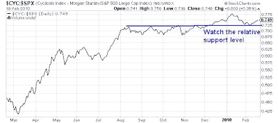

<!--yml
category: 未分类
date: 2024-05-18 00:37:59
-->

# Humble Student of the Markets: Bearish tripwires

> 来源：[https://humblestudentofthemarkets.blogspot.com/2010/02/bearish-tripwires.html#0001-01-01](https://humblestudentofthemarkets.blogspot.com/2010/02/bearish-tripwires.html#0001-01-01)

S&P 500 500 futures are down around 1% as I write this in the wake of the Fed's surprise

[discount rate hike](http://www.federalreserve.gov/newsevents/press/monetary/20100218a.htm)

.

Despite the negative news, it's important to take deep breath, step back and analyze the market with some perspective. In the framework outlined in my post

[bulls are losing control](http://humblestudentofthemarkets.blogspot.com/2010/02/bulls-are-losing-control.html)

, here are some impotant relative performance charts that I am watching as signs that the bears may have taken control of the market.

**Cyclicals are still holding up**

The chart below shows the relative performance of the Morgan Stanley Cyclical Index (CYC) relative to the S&P 500\. CYC staged a relative breakout in early December and continues to lead the market. Should it break down below its relative support line, it would be a sign that the bears have the wind at their backs.

**Financials are on the verge of a breakdown**

The chart below shows the relative performance of the Financials compared to the S&P 500\. Financials have two unique characteristics in this cycle. First, they are where the stresses in the system show up and therefore a good canary in the mine as to the health of the market.

The sector is in a relative downtrend and it's on the verge of a breakdown and I expect that it would decline further at the open. Should it decline below its relative support zone, it is another signal that the end of a

[brief period of ursine hiberation](http://humblestudentofthemarkets.blogspot.com/2010/02/too-bearish-too-quickly.html)

is at hand.

Stay tuned!