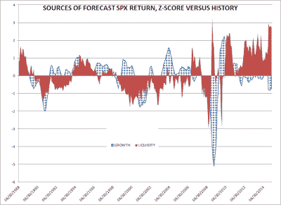
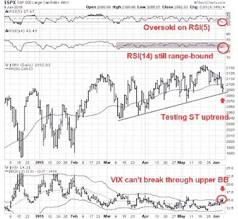
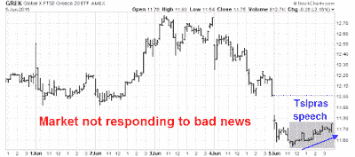

<!--yml
category: 未分类
date: 2024-05-18 03:20:14
-->

# Humble Student of the Markets: Bears wake up, but they`re not out of the woods

> 来源：[https://humblestudentofthemarkets.blogspot.com/2015/06/bears-wake-up-but-theyre-not-out-of.html#0001-01-01](https://humblestudentofthemarkets.blogspot.com/2015/06/bears-wake-up-but-theyre-not-out-of.html#0001-01-01)

**Trend Model signal summary**

Trend Model signal: Risk-off (downgrade)

Trading model: Bearish

The Trend Model is an asset allocation model which applies trend following principles based on the inputs of global stock and commodity price. In essence, it seeks to answer the question, "Is the trend in the global economy expansion (bullish) or contraction (bearish)?"

My inner trader uses the trading model component of the Trend Model seeks to answer the question, "Is the trend getting better (bullish) or worse (bearish)?" The history of actual out-of-sample (not backtested) signals of the trading model are shown by the arrows in the chart below. In addition, I have a trading account which uses the signals of the Trend Model. The last report card of that account can be found 

[here](http://humblestudentofthemarkets.blogspot.com/2015/06/trend-model-report-card-lessons-learned.html)

.

**Update schedule**

: I generally update Trend Model readings on

[my blog](http://humblestudentofthemarkets.blogspot.com/)

on weekends and tweet any changes during the week at @humblestudent.

**Rising rates = Equity sell-off**

Last week, I wrote that from a technical perspective, the US equity market was ready to fall but it lacked a fundamental or macro trigger (see

[In search of a major bearish trigger](http://humblestudentofthemarkets.blogspot.com/2015/05/in-search-of-major-bearish-trigger.html)

). I went on to speculate on possible bearish triggers, namely a growth scare combined with the fear of Fed tightening, Greek default and rising geopolitical tensions in the South China Sea.

I was wrong. Equity markets declined because of rising interest rates. It began when Europe saw higher than expected inflation, which pushed up bund yields. The next day, Mario Draghi didn`t help matters when he said in the post ECB decision press conference that the markets should get used to higher bond market volatility.

[William Dudley](http://www.newyorkfed.org/newsevents/speeches/2015/dud150605.html)

of the New York Fed also more or less said the same thing in a speech on Friday (emphasis added):

> When the FOMC begins to raise short-term interest rates, this will occur in a very different environment than in the past. Reserves in the banking system are very plentiful, reflecting the large increase in the Federal Reserve’s balance sheet over the past few years. But this circumstance should not adversely affect our ability to push the federal funds rate into a higher target range. We have the appropriate tools to push up short-term interest rates. ***However, lift-off may not go so smoothly in terms of the impact on financial asset prices. After all, lift-off will represent a regime shift after more than six years at the zero lower bound.***
> 
> More important for financial market asset prices than the precise timing of lift-off is the expected trajectory of short-term rates over the next few years following lift-off. Most likely, this will be a shallow, upward path. Because of the persistent headwinds associated with the recent financial crisis, the level of real short-term interest rates consistent with a neutral monetary policy seems considerably lower now than in the past. And, if potential GDP growth is much lower—due to slower labor force growth and productivity growth—the long-run equilibrium real short-term rate is also likely to remain lower than normal in the future even after those headwinds fully dissipate.
> 
> ***But there must be considerable uncertainty about the path for short-term interest rates. After all, the economic outlook is uncertain.*** Moreover, the appropriate stance of monetary policy will be influenced by how financial market conditions respond to the Federal Reserve’s actions. All else equal, if financial conditions tighten sharply, then we are likely to proceed more slowly. In contrast, if financial conditions were not to tighten at all or only very little, then—assuming the economic outlook hadn’t changed significantly—we would likely have to move more quickly. In the end, we will adjust the policy stance to support the financial market conditions that we deem are most consistent with our employment and inflation objectives.

As a consequence, 10-year German rates rose to levels above the last Bundegeddon episode and US rates followed. The chart below shows that both US and German rates have risen above a downtrend that went all the way back to January 2014\. Both recent rising rate periods, which are shown by the shaded regions, stock prices fell.

An article in the

[FT](http://www.ft.com/cms/s/0/e7277214-0ac4-11e5-98d3-00144feabdc0.html)

suggested that a reversal of the QE trade, in which investors buy risk and search for yield, hasn`t happened yet and there could be a sudden rush for the exits. That`s a recipe for volatility in the bond markets:

> “Investors remain trapped in the twilight zone, the transition period between the end of QE and the first rate hike, the start of policy normalisation,” noted one recent research report from Bank of America Merrill Lynch. “The investment backdrop will probably continue to be cursed by mediocre returns, volatile trading rotation, correlation breakdowns and flash crashes.” In addition to that sobering message, Merrill warned of this year’s’ “liquidity paradox”.
> 
> “In a world of infinite central bank liquidity, asset markets can suddenly turn extremely illiquid. Reducing risk rather than maximising return is the smarter mid-2015 strategy,” Merrill’s strategists add.
> 
> Merrill is right to sound the alarm. Since it is QE that has driven the markets up, it is reasonable to assume that the end of QE and zero rates will trigger a downdraft in the markets in the absence of any fundamental reason to be optimistic about either economic prospects or corporate earnings, especially given the elevated levels at which shares and corporate debt now trade.

So what happens when too many investors try to de-risk at the same time, especially in an era of reduced bond market liquidity?

> The combination of a swollen buy side and a shallow sell side could be a formula for a meltdown when managers try to unwind riskier positions. “A sell-off triggered by an unwinding of leverage and magnified by poor liquidity could sink many boats,” BlackRock adds.
> 
> A few weeks before the crisis in 1998, it was not clear that Long Term Capital Management was about to blow up either. It is high time for greed to yield to fear.

**Global risk-off**

The technical damage done by the current rising rates has been widespread. I am seeing a synchronized risk-off across virtually all stock markets around the world and asset classes. The implications of this global move in asset prices is worrisome from an inter-market analytical perspective.

The chart below shows the charts of the SPX, DJ Global Index, Euro STOXX 50 (eurozone) and FTSE 100 (UK). Each and every one of those indices have fallen below its 50 day moving average (dma), indicating a loss of price momentum. In some cases, such as the Euro STOXX 50, the weakness has been more pronounced.

Moving to Asia, the only standout has been the Shanghai market, which seems to exist in its own bubble. The stock markets of China's Asian trading are all struggling. As the chart below shows, most market indices have violated their 50 dma and uptrends. The only exception is the HK Hang Seng Index, which is now testing a key support area and its own 50 dma.

Commodity prices have weakened as well. The charts below show the prices of the cyclically sensitive industrial metals (top panel) and CRB Index (second panel), both of which are weakening. Commodity prices are inversely correlated to USD (bottom panel), so I have shown industrial metals in EUR and AUD. Both of these charts are indicating weakness net of currency effects.

In the US, market internals are tilted bearishly. We are seeing negative divergences in breadth in the form of the equal vs. float weighted SPX (green, top panel) and

[On Balance Volume](http://stockcharts.com/school/doku.php?id=chart_school:technical_indicators:on_balance_volume_obv)

 (blue, top panel). As well, credit risk appetite continues to roll over (second panel) as I pointed out last week.

However, there are some indications that the bears haven't totally taken control of the tape  The bottom two panels show two breadth metrics, % bullish and % above the 200 dma, as weak but they haven't decisively broken downwards indicating overwhelming bearish momentum.

The Trend Model uses a combination of global equity prices and commodity prices as inputs. The coordinated weakness across all asset classes have caused the Trend Model signal to be downgraded from a "neutral" to a "risk-off" reading.

**The bulls fight back**

Despite these negatives, the bulls are fighting back. Sector internals have started to improve. In particular, the performance of high-beta groups and cyclically sensitive groups like semiconductors were all in relative uptrends.

That said,

[Dana Lyons](http://jlfmi.tumblr.com/post/120792233595/traders-back-up-the-truck-to-buy-dip-in-tech)

pointed out that the Rydex data showed a rush into the high beta tech sector, which could be interpreted as the last hurrah of the bulls - and that could be contrarian bearish.

Fortunately, there are other bullish signs to consider. One of the most likely bearish triggers that I had mentioned before was a possible growth scare. The macro data last week started to show a turnaround, starting with

[much better than expected auto sales](http://www.businessinsider.com/us-auto-sales-may-2015-2015-6)

, generally upbeat

[Beige Book](http://www.federalreserve.gov/monetarypolicy/beigebook/beigebook201506.htm)

and ending with the

[unambiguously positive Jobs Report](http://blogs.wsj.com/economics/2015/06/05/economists-react-to-the-may-jobs-report-unambiguously-positive/)

on Friday. As a result, the Citigroup ESI has started to turn up.

Ed Yardeni found that forward 12 month EPS was rising again across all market cap bands, in large caps:

Mid caps:

And small caps:

Better growth is equity bullish, right?

**Interest rate volatility rears its ugly head**

Well, yes - to a certain extent. It depends on the interplay between growth and PE multiples. Everything else being equal, a 50bp rise in bond yields would amount to chopping roughly 1.3 multiple points off the PE multiple right now*. It then becomes a question of whether rising EPS growth can offset PE compression headwinds.

[Macro Man](http://macro-man.blogspot.com/2015/06/another-look-at-us-equities.html)

wrote about the recent bout of interest rate volatility last week. His linear regression model is unambiguously bullish on equities, but there is a big caveat:

> A linear regression is, by definition, linear, thereby assuming a constant proportional change in output for each change in the inputs. In normal circumstances, this is perfectly fine. When there are outliers and extremes, however, things can get quite messy when working with factors that are in reality asymptotic rather than truly linear. Such is the case with this model, where the extremely low readings of headline CPI have perhaps exerted an "overly bullish" influence on the output.
> 
> To be sure, when dis-aggregating the model's output into "growth" and "liquidity" dynamics, we can see that the former has actually been quite bearish while the latter has been close to an all-time high. As this model sees it, low oil prices have provided more financial market accommodation than QE ever did!

In other words, linear regression models may not perform well when some inputs are asymptotic, such as what happens when interest rates and inflation rates are near the zero-bound. He concluded that once he did a "sanity check" on his model, he wasn't so sure of its results because of the non-linear nature of interest rate changes on expected returns (emphasis added):

> So how are we left? If one believes that markets are linear and that liquidity trumps all (call it the 'Funny Money' model), then by all means, buy with both hands, particularly on dips. A more pragmatic (and, dare your author opine, realistic) viewpoint is that while the wheels haven't fallen off, neither is the equity market trucking along with the same momentum (both price and fundamental) that has characterized the last several years.
> 
> Much like the case for the US economic rebound, Macro Man at this juncture can neither confirm nor deny that "sell in May" will be a wise call in 2015\. ***What he does know, however, that any legitimate rebound in economic activity will be met with renewed speculation of Fed tightening, which could push growth and liquidity drivers of equities in ways not observed for a number of years. It therefore behooves him to continue to assess these factors from a number of different perspectives as he attempts to tease out the trajectory of equities and other asset markets.***

Wise words indeed from a street smart

***and***

book smart quant!

**Greece: The second bearish catalyst**

I believe that interest rate volatility can take stock prices down maybe 10%, but not much more. Let me explain why.

Imagine that if the market were to correct 10% and your broker called you up and said, "We had been somewhat cautious and raised 30% for such an occasion. Let's put the money to work now." If you got that call and macro and fundamental conditions were unchanged from today, chances are that you would have little hesitation about buying.

In order for stock prices to fall further, we need a second bearish catalyst to change investor psychology so that if a typical investor got that call, he would be hesitant about buying.

At this point, the most likely second bearish catalyst is Greece. To recap the latest Greek drama, Angela Merkel hurried convened a meeting Monday night with French President Francois Hollande, ECB President Mario Draghi and the head of the International Monetary Fund Christine Lagarde in Berlin. Together they agreed to present a united front and a last ditch aid-for-reform plan to Greece. On Wednesday, EC President Jean-Claude Juncker and Eurogroup head Jeroen Dijsselbloem formally presented Greek PM Alexis Tsipras with the creditors' plan to resolve the Greek crisis.

There is little point in going through all the details of the plan, but the reaction from the Greek side was overwhelmingly negative. Instead of paying €305 million due to the IMF on Friday, Athens made a surprise last-minute request to bundle all of its IMF payments at month end, which would total about €1.6 billion, an amount that they don't have unless there was an agreement. In a defiant speech to the Greek Parliament on Friday, Tsipras made a number of inflammatory and odd remarks:

*   He called the creditors' demands "absurd" and vowed that "they won't humiliate us".
*   He would not accept an agreement without debt re-structuring, or debt relief, which the creditors have long stated would be a non-starter.
*   Before tabling a counter-offer, he wanted to hear from the opposition parties so that he knows where they stand. This was an astute political move to put his opponents on the record in case he has to either call a referendum or election.

How much of what has been said, on both sides, is grandstanding and how much is the real negotiating position? In the end, what is the actual likelihood of a deal? 

First of all, a glance at the chart of the Athens General Index shows that the bad news may already be in the market. The index appears to be trying to bottom and briefly staged a rally out of a downtrend. The rally occurred during a period of tough negotiations. Such price action is often indicative that the bears have become exhausted and moved into a crowded short position.

However, a crowded short doesn't mean that events can't go south. There are four key issues  to consider:

1.  There may be some room for negotiation on the level of primary budget surplus, which is the budget balance before debt service.
2.  Debt write-offs, which the ECB and Eurogroup have refused to consider, have been a key plank of the Syriza electoral platform.
3.  What happens with reforms of the Greek tax and spending regime? Greece has a complex VAT system that needs to be reformed, which is up for negotiation. The creditors also want pension reform, which is one of Syriza's "red lines", reform of the public service, another possible "red line" and privatization.
4.  Finally, there is the "soft" matter of trust. After many years, both sides don't trust each other. In particular, past Greek governments have dragged their feet on reform initiatives that the creditor institutions cannot trust future governments to carry out their promises. Hence the need for supervision, which the Greeks have interpreted as outside interference.

Here is my take. On the first matter of primary budget surplus,

[Benn Steil](http://blogs.cfr.org/geographics/2015/06/05/greecetroika/)

pointed out that, by the numbers, the two sides aren't that far apart and therefore there may be room for convergence in order to make a deal.

However, the two sides diverge considerably on the key issues of reform and trust. On one hand, Greek finance minister

[Yanis Varoufakis](https://www.project-syndicate.org/commentary/speech-of-hope-for-greece-by-yanis-varoufakis-2015-06)

has written eloquently and rhetorically about how Greece needs

[growth instead of just austerity](http://www.project-syndicate.org/commentary/greece-government-reforms-by-yanis-varoufakis-2015-05)

and

[hope](https://www.project-syndicate.org/commentary/speech-of-hope-for-greece-by-yanis-varoufakis-2015-06)

, such an approach appears to have fallen on deaf ears as his entreaties are philosophically foreign to core Europe.

More importantly, I have been watching Angela Merkel very carefully throughout these negotiations. Merkel is an astute politician and she has had a record of being silent. She has allowed others like Dijsselbloem and Schäuble to speak, but preferred to have the last word. She does not speak until she makes up her mind as to where to invest her political capital.  So when in the wake of the late night emergency meeting with Hollande, Draghi and Lagarde that she spoke up to say that the Greeks had to undergo reforms, I sat up and listened (via

[CNN](http://money.cnn.com/2015/06/04/news/economy/greece-reforms-merkel/index.html)

, emphasis added):

> ***Greece needs to return to the path of tough economic reforms to secure its future in the eurozone, German Chancellor Angela Merkel said Thursday.***
> 
> Speaking to CNN after hours of talks Wednesday between Greece and its creditors failed to produce a breakthrough, Merkel said a solution to the current crisis needed "big efforts" by both sides.
> 
> ***But she made clear that Greece should look to the example of other countries in the eurozone -- such as Ireland -- that had implemented painful changes to their economies in response to the financial crisis.***
> 
> "They went through such a program and now have the best growth in the eurozone," she said.
> 
> "That is the kind of course Greece needs to get on. And that is why the negotiations are tough, but they are clearly aimed at keeping Greece in the eurozone."

I interpreted these remarks as the EU`s last words on the topic and the "red lines" that Europe will not cross. It's implement the outlined reforms or it's no deal. In effect, Merkel has made the calculation that she has to hold the line because of the Eurozone Domino Theory. Give in to Greece and you will have to give in to Spain, Portugal, Ireland and Italy, not to mention the kind of message it sends to poor countries that have not received bailouts, such as Slovenia, Slovakia and Lithuania.. The price is too high. Plan B is a Greek default. At the time of the Cypriot crisis, Eurogroup President Dijsselbloem stated that the blueprint for dealing with eurozone bank crises was to have large depositors take haircuts along with bank shareholders, bondholders and holders of subordinated debt. That will most likely be part of the Plan B for Greece - a default within the eurozone.

As for Alexis Tsipras, it is unclear how far he will go. On one hand, one of Syriza's platforms was to make a humane deal and that Greece stays in the eurozone. On the hand hand, if Tsipras goes to far he faces a possible revolt by the left wing of his own party, which flexed its muscle by torpedoing the appointment of an economist who was part of the previous regime to be the Greek IMF representative. According to

[FT Alphaville](http://ftalphaville.ft.com/2015/06/03/2130881/why-greece-might-still-choose-to-leave-the-euro/)

, a recent poll indicated that 58% of Syriza supporters would prefer bring back the drachma over implementing the hated Memorandum of Understanding. Moreover, analysis from

[Oxford Economics](http://ftalphaville.ft.com/2015/06/03/2130881/why-greece-might-still-choose-to-leave-the-euro/)

indicate that the cost of Grexit may not be that bad.

*   A devaluation would make Greece more competitive
*   Greek businesses and households could repatriate their euro-denominated savings back into devalued Drahmas and provide a much need boost to the economy.

From that perspective, it is difficult to know the how endgame plays out as there are incentives to default and Grexit. The latest bookmaker odds from

[PaddyPower](http://www.paddypower.com/bet/novelty-betting/other-politics/european-politics/Greece-2015-Specials-8269924.html?force_racing_css=N)

indicate that the payoff to a Greek default before year-end has moved from 11/8 to 6/4 since the last update (see

[Ode to a Grecian Deal, or Acropolis Now?](http://humblestudentofthemarkets.blogspot.com/2015/06/ode-to-grecian-deal-or-acropolis-now.html)

). The probability of default, despite the slightly lengthened odds, still amount to about 38%. My own estimates, based on the price of a at-the-money CBOE-listed put option on the National Bank of Greece on the theory that NBG shareholders would get wiped out in a Greek default came to about 40% - still a significant risk.

**The week ahead: Sell the rip!**

As we approach the week ahead, the US stock market has descended to levels that approach support and it is unclear whether the bears, though re-invigorated, have totally seized control of the tape. Short-term momentum measures like RSI(5), which is useful for short-term swing trading, have become oversold. Medium-term momentum indicators like RSI(14) are still stubbornly range-bound, indicating that the bears haven't been able to exert sufficient downside pressure to push the market into a series of "bad" oversold readings indicating sustained selling pressure. As well, the VIX Index touched its upper Bollinger Band late last week but was unable to close above those levels, indicating possible bearish exhaustion. Moreover, the equity market was unable to sell off on Friday in the face of bad news (a strong NFP release indicating pressure on the Fed to raise interest rates and a defiant message from Greek PM Tsipras).

In particular, the market reaction to the Tsipras speech was revealing. While he made his speech to the Greek Parliament after the European markets had closed, they were not closed in the US. Here is a 15-minute tick chart of GREK, the Greek stock ETF. The ability of the market to rally in the face of bad news is bullish and indicate that the bears are exhausted.

In light of the market action on Friday,

[my inner trader reduced his short positions](https://twitter.com/HumbleStudent/status/606870899266981888)

 in anticipation of a possible counter-trend rally early next week. The intermediate term trend remains down, but the market is likely to see a short-term rally. It seems that the bears have finally woken up from their hibernation, but they aren't out of the woods yet. My lines in the sand of the full onset of a bear phase haven't been crossed yet. I continue to watch for signs of downside momentum in the form greater follow-through on bearish moves and more "bad" oversold readings where the market gets oversold and stays oversold.

This chart from

[Index Indicators](http://www.indexindicators.com/indicators/breadth/)

show the magnitude of the difference. The market is currently mildly oversold (blue circle) by the wimpy standards of 2015, but readings could get much more extreme (red circles).

My inner investor remains cautious. He is neutrally weighted and he is waiting for a correction in order to buy stocks are lower levels.

**Disclosure:** Long SPXU

* The stock market is trading at roughly 17x forward earnings, which is an earnings yield of 5.9%. Supposing we raise the earnings yield to 6.4% because rates have moved have moved 0.5%, forward earnings would then become 15.7x, or a difference of 1.3 PE multiple points.