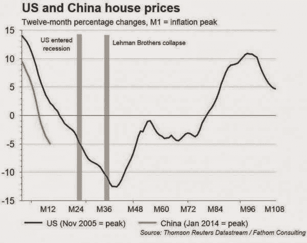

<!--yml
category: 未分类
date: 2024-05-18 03:24:06
-->

# Humble Student of the Markets: Behold the tsunami of liquidity from China

> 来源：[https://humblestudentofthemarkets.blogspot.com/2015/03/behold-tsunami-of-liquidity-from-china.html#0001-01-01](https://humblestudentofthemarkets.blogspot.com/2015/03/behold-tsunami-of-liquidity-from-china.html#0001-01-01)

I generally don't write about the local real estate market, but this analysis pertains to a more global investment issue - the internationalization of the RMB, but in a way that Beijing may not have intended.

Prices of Vancouver property have been very high and deemed to be unaffordable by most price to income metrics for quite some time. A recent study indicated that

[Vancouver is the second least affordability city in the world, after Hong Kong](http://www.cbc.ca/news/canada/british-columbia/vancouver-s-housing-2nd-least-affordable-in-world-1.2505524)

. Anecdotal evidence suggests that money from Mainland China has pushed up prices, which has made the locals rather upset because they are being priced out of the market.

An article in the local newspaper,

[The Province](http://www.theprovince.com/touch/story.html?id=10861987)

, tells the story of the flood of money coming in from Mainland China (emphasis added):

> Kirk Kuester, executive managing director of Colliers International Vancouver, said the pool of money from Mainland China seeking investments in Metro Vancouver is so vast right now that he has to turn away potential clients.
> 
> “The money is staggering, quite honestly,” Kuester said.
> 
> “It is essentially from Mainland China. They were looking at private houses in residential developments in Vancouver, and it really seemed to accelerate in mid-2013\. It’s a security play, and a diversification play.
> 
> “But now we are seeing them look for cash flow from commercial sites. The biggest challenge we face is scale and process.”
> 
> Kuester said a range of Chinese investors — from state-backed funds to smaller players with just tens of millions — expect to quickly ink deals for land by offering sky-high bids. But they are sometimes frustrated by the politicized nature of development deals in Vancouver, and multi-bid processes.
> 
> ***Kuester said, for example, that on Wednesday he had two or three potential clients with “half-a-billion” in private funds ready to put to work, but there are simply not big enough deals to satisfy them.***
> ***“Some of these groups want to buy the biggest sites in the city and do developments that are comparable to projects in China, but would be on the upper end of anything ever done here,” Kuester said.***

In addition, a study by the

[Conference Board of Canada](http://www.conferenceboard.ca/economics/hot_eco_topics/default/13-03-11/vancouver_housing_markets_cannot_fully_escape_the_chinese_dragon.aspx)

shows a high degree of correlation between Chinese GDP growth and Vancouver real estate prices:

> Statistical analysis confirms the importance of China’s economic health to Vancouver’s housing markets. Standard tests find significant correlations between the country’s real GDP growth and three important market yardsticks: existing home sales, existing home price growth and total housing starts. By contrast, local employment growth is significantly correlated to none of these and the five-year rate related to only the resale variables. This could mean that a substantial proportion of Vancouver real estate purchasers do not need local jobs to buy any home (new or existing) and that many do not need a mortgage to buy a new home. On the other hand, better economic health in China gives its residents wealth to spend on Vancouver housing.

The anecdotal and statistical evidence in intriguing, but the flow of funds effects are hard to quantify. Sure, Vancouver is a nice place to live. The climate on the west coast is mild compared to the rest of Canada. Here is just a sample from my tweet on February 17:

No doubt Vancouver real estate deserves to trade at a slight premium, but how much? How much of the elevated prices can be attributable to the Mainland China effect?

**The Vancouver-Victoria premium**

One way of measuring the foreign money effect is to analyze the relationship between property prices between Vancouver and nearby Victoria, which is located on Vancouver Island. Victoria is a smaller city, also on the coast. The main sources of employment in Victoria are government, as it is provincial capital, tourism and the local university (in that order). While Vancouver Island has seem some retirement emigration from Boomers from the rest of Canada seeking a better climate and slower lifestyle, it has seen little overseas investment compared to Vancouver, which is the major Canadian metropolis on the west coast.

Using data from the

[University of British Columbia](https://connect.ubc.ca/webapps/cmsmain/webui/institution/UBC_Vancouver/Sauder/Sauder_Events/CUERE_2013/CUERE%202013%20Q1/Residential%20Real%20Estate/Housing%20Prices?action=frameset&subaction=view&uniq=f2rmn8&mask=%2Finstitution%2FUBC_Vancouver%2FSauder%2FSauder_Events%2FCUERE_2013)

, here are the quarterly real estate prices from each city starting in 1975:

Here is the Vancouver-Victoria house price ratio for the same period, smoothed by a rolling four quarter average as quarterly figures can be volatile.

We can observe the effects of foreign money on Vancouver property prices by measuring the Vancouver-Victoria premium. Vancouver has seen three waves of Chinese money coming in over the past few decades. First, there was a wave of Taiwanese immigration in the late 1980s. Ahead of the 1997 British handover of Hong Kong to China, there was an additional flood of money flooding into the Vancouver property market. Today, we are seeing the effects of Mainland Chinese funds flooding into Vancouver, as per the comments from real estate agents in the story quoted above.

Further, this analysis suggests that Vancouver is roughly 15% overvalued relative to Victoria. A correction could see prices plunge further as downturns often overshoot the fair value estimate. Both the Taiwan and Hong Kong buying episodes saw prices rise to a premium and a correction afterwards. Does this mean that Vancouver property prices are on the verge of collapse?

**Correction, or buying panic?**

There are two possible scenarios at play here. The current price surge episode in the Vancouver-Victoria premium that is similar in magnitude and duration as the previous two buying frenzies. The simplistic conclusion is that we could see a run of the mill correction in Vancouver property prices of 15% or more.

On the other hand, prices could melt-up for several reasons. First of all, the scale of the Chinese economy is an order of magnitude bigger than either Taiwan or Hong Kong, especially in light of a

[2013 Bain study indicating that 60% of Chinese multi-millionaires would like to obtain either a foreign passport or residency status](http://qz.com/82284/three-out-of-five-of-chinese-multi-millionaires-want-to-emigrate-out-of-china/)

. Put the relative scales of population of China compared to Taiwan or Hong Kong into context, it suggests that the liquidity flood effect from China may not be over.

As a consequence, Chinese capital flight is occurring and flooding into places like the Vancouver real estate market. The chart below shows that the USD Index is in an extended, but secular uptrend. USD strength therefore puts tremendous downward pressure on the RMB, what happens if China were to devalue the RMB. Could that flood of money turn into a panic driven tsunami? Add to the mix the fact that as the USD strengthens, the CAD weakens and makes the CADCNY exchange rate more attractive for Chinese buyers of Canadian property.

Indeed, charts from

[Business Insider](http://www.businessinsider.com/bi-most-important-charts-in-the-world-2015-2?op=1)

of the most important charts in the world show that the market is starting to price in a devaluation in the RMB-USD exchange rate:

David Cui of BoAML believes that pressures are building and Beijing will be forced to choose between devaluation or unemployment:

Martin Enlund of Nordea Markets more or less said the same thing. The RMB is overvalued compared to EUR and JPY, which puts pressure on Beijing to devalue:

[FT Alphaville](http://ftalphaville.ft.com/2015/02/17/2119277/so-you-still-yuan-out/)

reports that we are already seeing signs of Chinese capital flight:

> Charts from Nomura showing, on the left, China’s largest cumulative two-month decline in FX purchase positions on record occurring despite a record trade surplus over the same period and, on the right, the probable hoarding of foreign currency as reflected in a sharp monthly rise in foreign-currency deposits in January.

> Or to paraphrase a bit further: more [signs of capital flight](http://ftalphaville.ft.com/2015/01/20/2093822/the-great-china-fx-outflow/) and depreciation pressure in China.

In short, capital flight seems to be increasing and there are reports of

[ingenious ways of getting around Chinese capital control regulations](http://blogs.ft.com/beyond-brics/2015/03/06/guest-post-uncovering-the-conduits-for-chinas-capital-flight/)

. I have no idea of how this all plays out, but we can always depend on

[Zero Hedge](http://www.zerohedge.com/node/502961)

for the Apocalyptic view of a global currency war:

> What all of the above means is that China is suddenly finding itself in an unprecedented position: it is losing the global currency war, and in a "zero-sum trade" world, in which global commerce and trade is slowly (at first) declining, and in which everyone is desperate to preserve or grow their piece of the pie through currency devaluation, China has almost no options.
> 
> Well, that's not true. Because if China wants to enter the global currency wars, and it will soon have no choice, it has - according to Cornerstone - several options with which to stabilize its economy, but really all of which, due to the size of China's epic credit and investment bubbles, and keep in mind that China's housing bubble has not only burst, but is now deflating at a faster pace than what happened in the US after Lehman...

> ... boil down to just one: **QE**.
> 
> From Cornerstone:
> 
> > Do you remember that from 2007 to late 2008, U.S. fed funds dropped 500 bp, and then the Fed still needed to do QE? The backdrop for China looks a bit similar. We had a credit bubble, they have a credit bubble. We had a housing bubble, they have a housing/investment bubble. Will China eventually have to go down the same path as the U.S., and the Eurozone? ***Roberto Perli believes the PBoC will first cut rates to 0%, before contemplating QE.***
> 
> Do you remember that from 2007 to late 2008, U.S. fed funds dropped 500 bp, and then the Fed still needed to do QE? The backdrop for China looks a bit similar. We had a credit bubble, they have a credit bubble. We had a housing bubble, they have a housing/investment bubble. Will China eventually have to go down the same path as the U.S., and the Eurozone? Roberto Perli believes the PBoC will first cut rates to 0%, before contemplating QE.
> 
> There you have it: the flowchart for what is in store for the world for the next 12-24 months - an ongoing deterioration in Chinese economic conditions, coupled with a weaker, but **not weak enough**, currency, before the PBOC first go to ZIRP, and then engages in outright QE.
> 
> And once China, that final quasi-Western nation, proceeds to engage in outright monetization of its debt, then and only then will the terminal phase of the global currency wars start: a phase which will, because global economic growth and that all important lifeblood of a globalized economy - trade - at that point will be zero if not negatve, will see an unprecedented crescendo of money printing by **absolutely everyone**, before coordinated devaluations mutate into uncoordinated, and when central bank actions morph from "all for one" to "each man for himself."

**A blow-off top?**

Should China choose the RMB devaluation route - and there are some very compelling reasons to do so, we could see a further surge of funds out of China from the johnnies-come-lately who missed the boat on the initial wave of capital flight. While I am not predicting that this is my base case scenario, such a turn of events would likely result in a final blow-off wave of liquidity which buoys property prices in places like Vancouver and Sydney to insane levels.

In that case, I leave the last word to David Woo of BoAML. FX volatility would skyrocket to levels last seen in past financial crises.

You can imagine what might happen to global asset prices were that to occur.