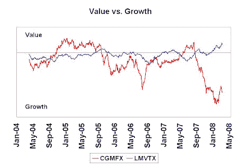
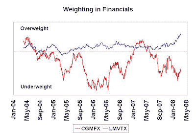
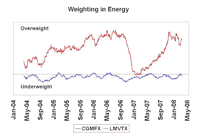
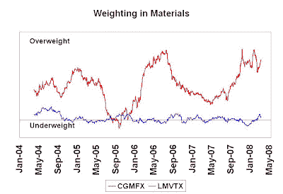
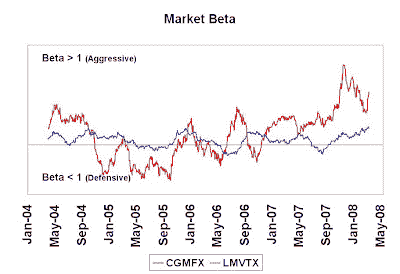

<!--yml
category: 未分类
date: 2024-05-18 01:09:11
-->

# Humble Student of the Markets: Bill Miller & Ken Heebner: A study in contrasts

> 来源：[https://humblestudentofthemarkets.blogspot.com/2008/06/bill-miller-ken-heebner-study-in.html#0001-01-01](https://humblestudentofthemarkets.blogspot.com/2008/06/bill-miller-ken-heebner-study-in.html#0001-01-01)

Both Bill Miller’s Legg Mason Value Trust (LMVTX) and Ken Heebner’s CGM Focus Fund (CGMFX) have great long-term track record that would be the envy of most equity fund managers. While Miller has underperformed recently, he is still sticking to his guns in his latest

[commentary](http://www.leggmason.com/individualinvestors/documents/insights/D6053-Miller_shareholder_1Q08_report.pdf)

and he continues to focus on long-term value and a low-turnover philosophy. By contrast, Heebner has the hot hand right now (see Fortune article

[here](http://money.cnn.com/2008/05/23/magazines/fortune/birger_americas_hottest_investor.fortune/index.htm)

) and runs a high-turnover portfolio.

Using the techniques shown in the sidebar titled Reverse engineering a manager's macro exposures, I estimated both Miller and Heebner’s sector and other exposures.

**Miller is Value and Heebner Growth**

I pointed out

[before](http://humblestudentofthemarkets.blogspot.com/2007/12/is-bill-miller-becoming-gasp-value.html)

that Bill Miller started to tilt towards Value in a significant way back in December 2007 and his bias is unchanged. As shown by the chart below, Bill Miller’s portfolio remains tilted towards Value, while Heebner is tilted towards Growth.

     ********Miller buying Financials and Heebner owns Resources** Much of their style differences are attributable to sector weightings as the Russell 1000 Value Index is significantly overweight Financials compared to the Russell 1000 Growth. Bill Miller main overweight is in the beaten down financial sector of the market, while Heebner is underweight the sector.**** 

****

Heebner, on the other hand, is still devoted to the resources sector with overweight positions in Energy…

…and Materials:

 **Both hold high beta portfolios** 

When considering these two managers one might be tempted to conclude that they are polar opposites of each other, they do agree on some points. Both managers’ portfolios have above average market betas, indicating that they expect the market to rise. Moreover, they are both underweight the traditional defensive sectors of the market such as Health Care and Consumer Staples.

**Investment thesis and risks**

Not to put words into each manager’s mouth, it seems that Bill Miller believes that despite the financial stresses evident in the system, the large financial franchises remain intact and have real lasting value. Miller’s investment thesis depends on no other hidden landmines blowing up in the financial sector.

By contrast, Ken Heebner believes that the commodity cycle is not over and is betting big on their continued rise. His thesis depends on continued US Dollar weakness and, to a lesser extent, that a US slowdown will not significantly drag down world growth. So far, he has been right, as evidenced by the new recovery high seen in the

[Baltic Dry Index](http://investmenttools.com/futures/bdi_baltic_dry_index.htm)

. However, Heebner’s portfolio is a high-turnover portfolio and Heebner has shown himself to be flexible to reverse himself should the situation change.

The views of both of these investors deserve our respect.******