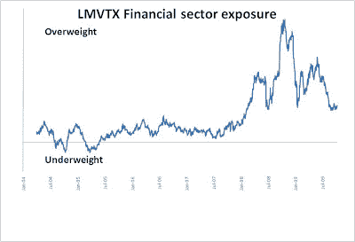
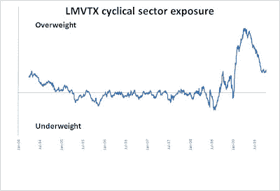

<!--yml
category: 未分类
date: 2024-05-18 00:45:17
-->

# Humble Student of the Markets: Bill Miller’s big bet

> 来源：[https://humblestudentofthemarkets.blogspot.com/2009/10/bill-millers-big-bet.html#0001-01-01](https://humblestudentofthemarkets.blogspot.com/2009/10/bill-millers-big-bet.html#0001-01-01)

I see that Bill Miller made it to the

[cover of Barrons](http://online.barrons.com/article/SB125513241806577275.html?mod=BOL_hps_highlight)

this week. His fund,

[LMVTX](http://quicktake.morningstar.com/FundNet/TotalReturns.aspx?symbol=LMVTX&country=USA)

, has made a remarkable comeback after several years of poor performance.

**Miller sticks to his guns**

Given the headlines I thought that it would be a useful exercise to analyze Miller’s macro bets and see what he did to achieve his returns this year. The chart below shows the fund’s exposure to the Financial sector. Miller had known to be a big believer in Financials and had been overweight the sector going into the Lehman crisis and out. The bet in the sector was responsible for the freefall in returns but the recovery of the sector also contributed to his turnaround in 2009.

Miller’s critics might accuse him of being a stopped clock, but the next chart, which shows his fund’s exposure to the cyclical sector, indicates that he was prescient in his timing. LMVTX began to increase its cyclical exposure in mid-2008, pulled back and then went all-in with its pro-cyclical bet in early 2009\. That bet has paid off handsomely in 2009\. The timing of the cyclical bet was remarkable given the low level of turnover the fund has historically exhibited.

Is Miller a genius or just lucky? You tell me.