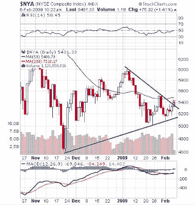
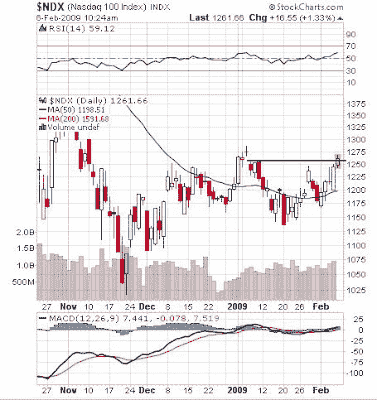

<!--yml
category: 未分类
date: 2024-05-18 00:58:50
-->

# Humble Student of the Markets: Breakout or fake-out?

> 来源：[https://humblestudentofthemarkets.blogspot.com/2009/02/breakout-or-fake-out.html#0001-01-01](https://humblestudentofthemarkets.blogspot.com/2009/02/breakout-or-fake-out.html#0001-01-01)

Technicians characterize triangular patterns as a “coiled spring”. Triangles represent consolidation and indecision. Breakouts from triangles are considered significant as they tend to forecast the next major direction of the underlying index or stock.

As I write this, the non-farm payroll figure came in slightly worse than expected but the market rallied anyhow. More importantly for technicians, the S&P 500 staged an upside breakout from a triangular pattern.

A similar breakout can also be seen in the broader NYSE Composite:

The NASDAQ 100, which had been the leadership recently, is also staging a good old-fashioned upside breakout:

**This bear market rally is for traders only**

At these levels, valuations look reasonable, even by

[Warren Buffett](http://money.cnn.com/2009/02/04/magazines/fortune/buffett_metric.fortune/index.htm)

’s standards. I have

[blogged](http://humblestudentofthemarkets.blogspot.com/2009/02/dont-panic-real-time-data-points-to.html)

before that we are seeing signs of healing in the markets. Is this the start of a new bull?

Not so fast.

[Mark Hulbert](http://www.marketwatch.com/news/story/Still-eagerness-call-bottom/story.aspx?guid=%7B38CD6BFF%2D6D06%2D4EDC%2DBDE0%2DF46556A0B041%7D)

reports that newsletter writer sentiment seems to be too bullish.

Bear markets take price and time to resolve. We have seen the price move but it needs more time. This is probably still a bear market rally. We are likely still in a basing/consolidation/trading range period until this summer. The S&P 500 has seen resistance at the 900-920 level and it will likely pause there again in this rally before come back down to test the old lows set in November 2008.