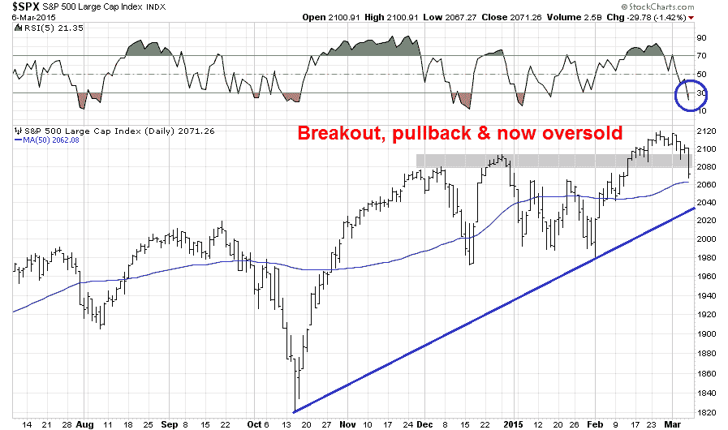

<!--yml
category: 未分类
date: 2024-05-18 03:24:27
-->

# Humble Student of the Markets: Bullish, but "data dependent"

> 来源：[https://humblestudentofthemarkets.blogspot.com/2015/03/bullish-but-data-dependent.html#0001-01-01](https://humblestudentofthemarkets.blogspot.com/2015/03/bullish-but-data-dependent.html#0001-01-01)

**Trend Model signal summary**

Trend Model signal: Risk-on

Trading model: Bullish

The Trend Model is an asset allocation model which applies trend following principles based on the inputs of global stock and commodity price. In essence, it seeks to answer the question, "Is the trend in the global economy expansion (bullish) or contraction (bearish)?"

My inner trader uses the trading model component of the Trend Model seeks to answer the question, "Is the trend getting better (bullish) or worse (bearish)?" The history of actual (not backtested) signals of the trading model are shown by the arrows in the chart below. In addition, I have a trading account which uses the signals of the Trend Model. The last report card of that account can be found 

[here](http://humblestudentofthemarkets.blogspot.com/2015/03/trend-model-feb-2015-report-card-40.html)

.

**Update schedule**

: I generally update Trend Model readings on 

[my blog](http://humblestudentofthemarkets.blogspot.com/)

 on weekends and tweet any changes during the week at @humblestudent.

**Breakout, consolidation and pullback**

I have written before that 2011 may be a good template for the current market (see

[2011 all over again?](http://humblestudentofthemarkets.blogspot.com/2015/02/2011-all-over-again.html)

and

[The 2011 pattern continues](http://humblestudentofthemarkets.blogspot.com/2015/02/the-2011-pattern-continues.html)

).

As shown by the 2011 chart of the SPX below, the 2011 market was saw much up and down choppy action, which moved the market to an oversold reading on the 5-day RSI (blue vertical lines). It then staged an upside breakout, consolidated sideways and then pulled back below the breakout level. It finally resolved itself by staging a sustained rally after the pullback test (red vertical line).

Today, we see a similar pattern in the US and European markets. The SPX staged an upside breakout to all-time highs and it is now in the process of pulling back to test the breakout. What is comforting to the bull case is that the European averages have held their strength above the breakout lines. As well, Asian equity markets and commodity prices are not showing any significant signs of weakness, which also bolsters the bull case for equities from an inter-market analytical viewpoint.

The market in 2012 also saw a similar breakout, consolidation and pullback episode. Note the instances of short-term oversold readings marked by the vertical lines. In some cases, the market rebounded right away. In another, it required a final flush before seeing a durable bottom.

My main takeaway from 2011 and 2012 is that near-term downside risk is limited to 1-2% from current levels. Today's SPX chart shows that the market is oversold on RSI-5\. There is technical support at the 50 day moving average (2062) and further support at the uptrend line drawn from the October low (about 2040), which is roughly 1.5% below Friday's closing levels.

**A Goldilocks market?**

From a fundamental viewpoint, the bull case is supported by a not-too-hot, not-too-cold economic environment of non-inflationary growth. Take, for example, the February Employment Report released Friday that spooked the market. The headline NFP figure of 295K was well ahead of expectations and represented an excellent growth outlook.

On the other hand, there was little sign of inflationary pressures. Average hourly earnings came in at 0.2%, a muted level and consistent with expectations. There is no sign of wage inflation:

The

[Beige Book release](http://www.federalreserve.gov/monetarypolicy/beigebook/beigebook20150304.htm)

last week told a similar story of rising employment and little wage inflation:

> Payrolls remained stable or expanded across the Districts, and contacts noted employment gains in a broad range of sectors. Wage pressures remained moderate and were limited largely to workers in skilled occupations. Most District contacts cited only flat to slightly increasing prices.

In addition, Core PCE, which is the Fed's favorite inflation metric, and Trimmed Mean PCE, a similar series compiled by the Dallas Fed, shows that inflationary pressures are decelerating, not accelerating:

In the meantime, consensus forward EPS estimates compiled by

[John Butters of Factset](http://www.factset.com/websitefiles/PDFs/earningsinsight/earningsinsight_3.6.15)

is starting to rise again, indicating improving growth expectations:

In summary, we are seeing rising growth and muted inflationary pressures, which will help to keep the Fed rate increase on hold. What more could an equity investor ask for?

**Key risks, a.k.a "Data Dependence"**

Nevertheless, there are a number of key risks to the bullish forecast. Most notably, the US could see a growth scare in 1Q. The latest nowcast from the

[Atlanta Fed](https://www.frbatlanta.org/cqer/researchcq/gdpnow.cfm)

of GDP growth continues to decelerate:

The latest weekly commentary of high frequency economic releases from

[New Deal democrat](http://community.xe.com/blog/xe-market-analysis/weekly-indicators-negativity-spreads-coincident-short-leading-indicators)

pretty much said the same thing (emphasis added):

> ***Negative coincident indicators have continued for the last three weeks, with the intensification last week probably primarily due to the now-settled West Coast ports strike appearing to abate somewhat.***
> 
> Among long leading indicators, yields on corporate bonds and treasuries are still positive although less so. Money supply is even more positive. Real estate loans, and house sales as reported by DataQuick were positive. Only mortgage applications remain in negative territory.
> 
> ***For the first time in a long time, the short leading indicators were generally negative***. Oil prices fell slightly, while industrial metal prices fell more, almost to a new low. Spreads between corporate bonds and treasuries increased slightly and I am now scoring them slightly negative again. Temporary staffing turned negative for the first time in many months (as did temporary jobs as reported in yesterday's jobs report). Gas prices and usage remained positive, and initial jobless claims, although significantly higher, remain within a positive range.
> 
> As indicated above, coincident readings were much more negative. Rail was again awful, although less awful than last week. Consumer spending as measured by Gallup was negative yet again, and Johnson Redbook was only weakly positive. Steel production was even more negative. The TED spread and LIBOR have increased enough that both are now negatives. On the bright side, shipping was positive, as was tax withholding.
> 
> ***The weakness in the high frequency data has spread from coincident to short leading indicators. While some of the effects are probably transitory, that we are seeing YoY negative comparisons with some of the worst readings last year does not bode well for Q1 GDP.***
> 
> The long leading indicators remain positive, and it will take more than one week of negativity in the short leading indicators to cause me to become more concerned. I will be paying particular attention to rail and to Gallup consumer spending to see if they turn positive in the next several weeks, and to see if the temporary staffing downturn was just one week of noise.

However, I am reluctant to jump on the weakening growth scenario as my base case, largely because the Citigroup US Economic Surprise Index (gold line in chart below) is at levels that have seen rebounds in the past:

**My lines in the sand**

Bottom line: I am giving the bull case the benefit of the doubt, but my outlook is highly "data dependent".

From a fundamental viewpoint, should the growth outlook start to falter, either in the form of falling EPS estimates, a deteriorating US macro outlook, or signs of faltering growth from overseas or commodity prices, the Trend Model would then start to turn more cautious.

From a technical viewpoint, should the SPX decisively break the 50 dma and further violate the uptrend that began last October, which is currently at about 2040, my inner trader would turn negative on the market. I would note that while US equity prices are poised to bounce at current levels, a scenario where stock prices rally and then suffer a final wash-out is well within the realm of possibility. As long as the SPX doesn't breach those technical lines in the sand, the bull case is still intact.

In the meantime, US equities are oversold and setting up for a bounce next week. The key test is how it behaves after the oversold rally, both from a fundamental and technical point of view.

**Disclosure:**

Long SPXL, TNA